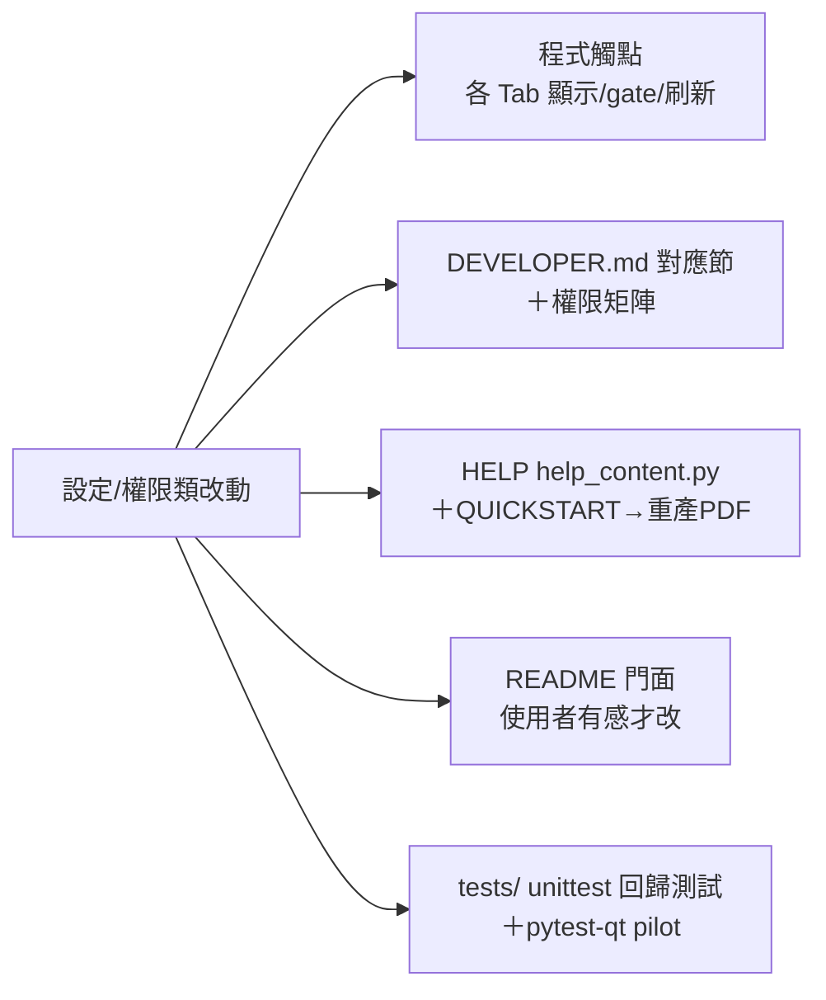

# 公文管理系統

Windows 桌面應用，PySide6 + SQLite，管理警察單位公文（交辦單、刑案陳報、一般陳報）。

---

## 0. 給接手者

協作規定與偏好見 [CLAUDE.md](CLAUDE.md)（Claude 開新對話時會自動載入）。本檔為技術文件、按需查閱，每節開頭點明用途。

---

## 1. 架構心智模型

### 進入點與流程

```
main.py
  └─ loading_screen（載入 .ui、註冊 qrc）
      └─ MainMenu（主選單，選要進哪個 Tab）
          └─ DocumentManager（主視窗，建立 8 個 Tab）
```

- `DocumentManager.TAB_CLASSES`＝`{index: TabClass}`，新增 Tab 在此登記
- 每個 Tab 繼承 `BaseTab`，必須實作 `setup(tab_index)`；可 override `get_tables()`／`get_focus_widget()`／`on_activated()`
- **8 個大 Tab（index 0–7）**：交辦發文／交辦收文／公文陳報／簽收單列印／資料庫瀏覽／檔案歸檔／資料庫設定／操作紀錄；類別見 `tabs/`，各對應一個 `layouts/LayoutN.ui`
- **主選單**（`main_menu.ui`）為 2 欄圖示磚格（QToolButton），圖示 `res/buttons/menu_*.svg`（qrc 別名 `:/menu/`）於 `main.py` 以 `QIcon` 套用（避開 QUiLoader 解析 .qrc 的問題）
- ⚠️ **主選單拉到最前**：打包版偶因 Windows 前景鎖，`MainMenu` 的 `exec()` dialog 被壓到別視窗後。修法 `QTimer.singleShot(0, …)` 在 exec 進事件迴圈後 `raise_()`＋`activateWindow()`＋清最小化（`main.py` `_on_data_ready`）
- ⚠️ **LOADING 畫面不掛 `WindowStaysOnTopHint`**：splash 若置頂，會把載入/建表階段冒出的 modal 錯誤視窗（excepthook 或各 Tab setup 的 DB 錯誤）壓在後面、使用者看不到也點不到。故 `LoadingScreen` 只用 `FramelessWindowHint`，開機前景改由 `main.py` `loading.show()` 後 `raise_()`＋`activateWindow()` 保證（與上一條主選單同招）。全專案不再有 always-on-top 視窗。**勿再加回置頂旗標。**

### 資料流

- **三張主表**：`Document_Task`（交辦）、`Document_Criminal`（刑案）、`Document_General`（一般）
- **三個 View**：`View_Task_Full` 等，JOIN 參照表＋算狀態，給預覽／列印／瀏覽用
- **參照表**：人員／部門／案類／案件狀態／一般分類（見 §6）
- 主表存參照表的 **ID**（VARCHAR 字串，非真外鍵），顯示時 JOIN 出名稱

### Tab 切換與刷新（`main.py` `_onTabChanged`）

切換**後**做三件事：①從設定 Tab 切走→ `settings_tab._promptUnsaved(context="leave")` 處理未存排序，若 `_ref_dirty` 則對其他所有 Tab 設 `_ref_changed=True` 並 `on_activated()` 刷新下拉；②切到設定 Tab → `on_activated()` 重載當前子頁；③autoresize 表格＋設焦點。

> ⚠️ **Qt 限制**：`QTabWidget.currentChanged` 是「切換**後**」才發出，無法切換前攔截。離開大 Tab 的未存提醒只能「切過去後補跳」；設定 Tab 內部子頁切換（按鈕觸發）才攔得住、可「取消＝回原狀」。

### 瀏覽／歸檔頁的三層刷新（避免大表頓挫）

兩頁各約 700+ 列，重建 cellWidget 是成本所在。依「變動性質」分三條路徑：

1. **參照改名（人員／部門／案類）→ 就地輕量更新**：設定頁改參照表時 `_ref_changed=True`，`on_activated` 走 `_refreshRefCells`（瀏覽）／重載小清單（歸檔），只對標記欄 `setText`、不重建列（700 列 ~20ms）。⚠️ 指紋只看 `last_modified`、碰不到改名，故必走此旗標路徑（見 PITFALLS SQL 組）
2. **跨頁增／修／刪 → 指紋差異更新**：比對 `(COUNT, MAX(last_modified))`，變了才 `_diffUpdate`／`_diffDocs` 重建變動列；變動列數 `>= _BUSY_ROW_THRESHOLD`（預設 100）才跳「更新中」
3. **手動「重載」鈕**：強制整表重建（瀏覽）／重掃資料夾＋重比對（歸檔），是面對外部變動（外部新增／改名 PDF）的逃生口

> **啟動預載**：載入畫面期間 `LoadWorker` 背景預讀三表完整資料（`queryBrowseRows`，純 SQL 可跨執行緒），主執行緒於 `DocumentManager.__init__` 以 `buildInitial` 分段建好主視窗（進度條 `LOAD_STEPS`／`BUILD_STEPS`，見 `lib/loading_screen.py`），主選單出現時主視窗已就緒，建完設 `_loaded=True`，之後沿用上述指紋／diff 機制。
> **建表成本**：刪除欄（✕）、編號欄、無 PDF 的主旨欄一律純 `QTableWidgetItem`，點擊以 `cellClicked` 攔（`_onDeleteCell`／`_onLinkCell`）；只有刑案／一般「有真實 PDF 檔名」的主旨列保留 cellWidget（PDF 圖示鈕）。交辦單每列 0 個 cellWidget。⚠️ 建表在主視窗 show 之前（viewport 寬=0），欄寬靠 `autoResizeTable` 重試補正。
> 「更新中」提示走 `ui_utils.runWithBusy`（同步阻塞前 `show + repaint` 強制畫出，有最短顯示時間避免一閃即逝）。

---

## 2. 踩雷速查表（動手前必掃）

九組症狀→解法條目已拆至 [PITFALLS.md](PITFALLS.md)（群組代號 UI／QSS／QTW／LAY／TAB／SVG／SQL／ARC／PKG，任務對照索引見 CLAUDE.md）。

### 跨功能影響對照表（動到左欄主題＝右欄逐項檢查）

牽一髮動全身的主題集中在此，防「改了 A 漏了 B」。**維護規則：新增設定 key／權限限制／系統設定面板時，必須同步補一列**，否則本表腐爛即失效。詳細技術說明在本檔對應章節，本表只列「要記得去看的地方」。



| 主題 | 程式觸點 | 文件／測試同步 |
|------|----------|----------------|
| **歸檔資料夾設定**（`archive_root`／子夾） | `ArchiveRootPanel`（settings_panels）；歸檔頁 `_updateArchWarn` 警示＋資料夾定位；瀏覽頁 `_refreshArchWarn` 警示＋PDF 連結；設定頁登入彈窗 `_maybeWarnArchiveRoot`；Reset 會清空（`performYearEndReset`）；`clearPdfIndexCache` | §5「系統設定子頁」＋「歸檔根目錄未設定警示」；HELP 歸檔/設定頁；QUICKSTART；README 部署段＋`07-archive-folder` 截圖 |
| **簽收表標題**（`print_title_*` 五 key） | `PrintTitlePanel`；`printTitle`/`printTitlesUnset`（db_utils）；列印頁警示 `_refresh_title_warn`＋過期指紋 `_titles_sig`；Reset 不清 | §5「簽收表標題自訂」；HELP 列印/設定頁；QUICKSTART；`tests/test_print_titles` |
| **敘獎登錄／發文**（`Document_Reward`／`print_title_reward`，v1.1.11） | `tabs/tab_reward.py`（Tab3 登錄頁，三身分皆可登錄／改／刪本次登錄清單；INSERT 自動帶 `create_date=今天`、`register_date=''`、`sender_id=NULL`，不受 `report_input_mode` 影響）；`tabs/tab_reward_issue.py`（Tab4 敘獎發文頁，三身分皆可輸入編號建立清單並批次覆寫發文日期／人員，UPDATE 以 `register_date IS NOT NULL` 防並行軟刪除）；瀏覽頁 reward 子頁（`TABLE_META` raw/active_where＋登錄日期／發文日期兩欄＋發文人員欄 JOIN `Ref_Personnel`；**編輯僅 admin**——`tab_dbbrowse._canEditKey('reward')=is_admin()`，歸檔管理者不可改；刪除 `is_admin()`）；`tab_print` `REWARD_COLUMNS`＋`_build_sections`（簽收表敘獎 section）；`softDeleteDoc`/`_DELETE_META`（軟刪除清 `create_date`/`register_date`/`sender_id`/`reason`/`recipients`）；`trash_panel`（回收筒可還原）；`backup_doc_counts`（備份筆數統計）；`performYearEndReset`（跨年度重置） | §10「權限」權限矩陣＋§6＋§5「簽收表標題自訂」；HELP 3/4/6 頁；QUICKSTART；`tests/test_reward_*` |
| **閒置逾時**（`idle_logout_min`/`idle_close_min`） | `IdleTimeoutPanel`；`getIdleTimeoutsMs`/`parseIdleMinutes`；main.py 兩計時器 `>0` guard；main.py `_onIdleTimeout`/`_onIdleClose` 訊息帶實際分鐘數（`{mins:g}`，勿寫死）；「低於鎖螢幕時間」約束（維護者默契、不放 UI）；Reset 不清 | §10「閒置處理與多人使用（main.py）」；HELP/QUICKSTART 內寫死的分鐘數字；`tests/test_idle_timeouts` |
| **唯讀設定**（`input_lock_*` 四 key） | `InputLockPanel`；`isInputLocked`/`INPUT_LOCK_KEYS`；四硬 gate（`handleDispatch`/`tab_receive._submit`/`_submitCriminal`/`_submitGeneral`）；三頁 `_applyInputLock` 反灰＋橫幅＋`_onShown`＋`_onRoleClearList`；tab_report `_currentLockKind`/`_switchFormType` 重套 | §10「三表新增鎖」＋權限矩陣＋§5 面板表；HELP/QUICKSTART；`tests/test_input_lock` |
| **自動備份／備份還原**（`backup_second_dir`／異地／quick_check／還原子頁） | `run_auto_backup(extra_dirs=)`＋`_run_gfs`＋`quick_check`／`list_backups`／`verify_backup`／`restore_backup`（db_backup）；`main.py` 啟動 quick_check→備份；`BackupPanel`（settings_panels）；`BackupRestorePanel`（backup_restore_panel）；tab_settings nav 第 6 子頁四處掛載（`_nav_btns`／兩份 loaders／`_applyRolePermissions`）；Reset 不清 `backup_second_dir` | §10「平時自動備份（`lib/db_backup.py`）」＋§5 面板表＋「備份還原子頁」＋§6 App_Settings 列；HELP 設定頁；QUICKSTART；README FAQ 資料安全段；`tests/test_db_backup` |
| **陳報模式**（`report_input_mode`／自助取號） | `isSelfServiceMode`（db_utils）；`InputModePanel`（settings_panels）；陳報頁 `_applyInputLock`→`_applySelfServiceMode`＋`_submit`／`_submitCriminal`／`_submitGeneral` 帶 NULL 與放行發文人員；**刑案／一般編輯彈窗 `_BaseEditDialog._lockReportFieldsIfSelfService()`**（自助模式且非管理身分才反灰陳報日期／發文人員，涵蓋陳報／瀏覽／歸檔三處開啟點）；列印頁 `_settle_group`／`_refresh_settle_group`／`_on_settle`＋`SettleDialog`／`count_unissued`（settle_dialog 的 `SETTLE_META` 僅含刑案／一般）；歸檔 `_queryUnarchived`／`_tableSignature` 排除 `report_date IS NULL`；瀏覽頁陳報日期欄 NULL→橘字「未發文」；Reset 不清。敘獎登錄／發文流程不受此設定影響 | §5「自助取號模式」＋§5 面板表＋§6 App_Settings 列；HELP 陳報/列印/設定頁；QUICKSTART；README 功能段＋陳報模式 TIP；`tests/test_report_input_mode` |
| **權限／角色**（新增任何「受限身分不可做」） | **每條觸發路徑 guard**（按鈕/雙擊/行內編輯/Enter/右鍵/拖拉，見 CLAUDE.md 協作偏好 B）；`role_changed`→`_onRolePerm`/`_applyRolePermissions`；遮罩頁（歸檔/稽核）；閒置登出後的行為 | **§10「權限」權限矩陣必更新**；HELP 各頁的權限描述；QUICKSTART 權限段；上機以受限身分逐路徑驗證 |
| **新增 App_Settings key**（通用步驟） | db_utils 常數＋讀取 helper（含 fallback 預設）；`db_seed` 要不要播種；Reset 清不清（`performYearEndReset`）；生效時機（即時讀 vs 重啟） | §6 App_Settings 那一列；對應 tests |
| **系統設定新面板** | `settings_panels.py` 新類別＋`ui_utils/__init__` 匯出；tab_settings **四份清單**（建立/`_applyRolePermissions`/`_loadSystem`/`_dirtyPanels`）；`_save()` 開頭權限 guard；儲存鈕 dirty UX（亮/灰/clearFocus） | §5 面板表；HELP 設定頁；QUICKSTART |
| **參照表結構／改名行為** | `_ref_changed` 旗標路徑（PITFALLS SQL 組）；預覽表 `_refreshPreviewNames`；歸檔比對 `_loadNameDict`；`RefItemDialog` 三份 config | §10「參照項對話框」；HELP 設定頁 |

> **發版前固定檢查**：HELP（`help_content.py` 的 `HELP_PAGES`）與速查卡（同檔 `QUICKSTART`，改後跑 `gen_quickstart.py` 重產 PDF）是歷來最常漏的兩處；發布流程第 1 步寫文件時，對照本表右欄逐列確認。

---

## 3. 慣例與設計決策

大型功能詳解在 §10，依任務對照表按需查閱。

### 軟刪除（is_active）

- **人員／部門／案類**用 `is_active` 軟刪除（停用不真刪），保留 ID 對應（歷史資料仍引用得到）、只是不出現在下拉
- 詞彙：人員「在職／離職」，部門／案類「啟用／停用」
- 設定 Tab 列表顯示停用項目（**灰字 `#aeaeb2`**），下拉排除（`WHERE is_active=1`）
- 停用／啟用一律進「修改」Dialog 勾 checkbox 切換，無獨立停用按鈕
- **敘獎主表為三態，不用 `is_active`**：`Document_Reward.register_date` 一欄承載三種業務語意——`NULL`＝軟刪除哨兵、`''`＝有效未發文、非空日期＝有效已發文。因此發文／瀏覽的「有效列」條件是 `register_date IS NOT NULL`（**不可寫成 `IS NOT NULL AND != ''` 之類**，否則把未發文濾掉），這同時是並行刪除保護（他機刪除後 rowcount=0 自然跳過）。⚠️ 三態條件集中在 `lib/db_utils.py`：`REWARD_ACTIVE_SQL`／`REWARD_PENDING_SQL`／`REWARD_DELETED_SQL` 與 `rewardState()`／`rewardActiveSql(col)`，**勿再各頁寫魔法字串**；判斷單筆狀態用 `rewardState()`，勿寫 `if not register_date`（會把未發文與已刪除混為一談）。

### 排序（sort_order）

- 人員／部門／案類三表有 `sort_order`，**下拉與列表一律 `ORDER BY sort_order`**（非 ID），讓顯示順序跟 ID 脫鉤、可手調
- 設定 Tab 以**拖拉列**調整（`_RowDragFilter` 攔 `QEvent.Drop`、手動換列），hint label 提示可拖。⚠️ `QTableWidget.InternalMove` 只移 cell 不移 row，不可用
- **暫存模式**：排序在記憶體操作，「儲存排序」鈕初始 disabled、拖拉後才亮；儲存才寫回 DB（連續整數重編）並設 `_ref_dirty=True`
- 未存排序時切子頁／切大 Tab／按修改會跳確認；取消行為：按鈕觸發的（修改、子頁）回原狀，大 Tab（攔不住）放棄
- 新增項目放最前（`MIN-1`）
- 「儲存排序」成功不跳提示，按鈕反灰即代表已存

指定位置與 RefItemDialog 詳見 §10。

### 全域錯誤處理與白話化訊息

未預期例外由 `main.py` 全域 handler（`sys.excepthook`）統一接手：①寫 `error.log`（含完整 traceback）②寫 Windows 事件檢視器（有 pywin32 時，無則靜默）③彈白話錯誤視窗（`db_utils.friendlyErrorMessage(exc_type, exc_value)` 把例外轉成承辦看得懂、可行動的提示——技術細節只進 error.log）。

`friendlyErrorMessage` 依例外型別分類（純邏輯可單測 `tests/test_error_msg.py`）：

- **SQLite**：忙線鎖（locked/busy）→「資料庫忙線中…請關閉其他視窗」；損毀（malformed 等）→「檔案可能損毀…請提供 error.log 與備份」
- **檔案／權限／網路碟**：`PermissionError`／`FileNotFoundError`（導向設定頁）／`OSError`（網路碟可能斷線）
- 對照不到 → 泛用訊息（已記錄、請提供維護人員）

> ⚠️ **被 `except` 接住的例外要用 `ui_common.reportError(title, exc, parent=None)`**（門面 `from ui_utils import reportError`），別再寫 `msgCritical(title, str(e))`。`reportError` 同時①寫完整 traceback 進 error.log ②彈白話訊息（內部走 `friendlyErrorMessage`）。舊寫法既漏記 log、又把 SQLite 英文原文丟給使用者（如 `attempt to write a readonly database`）。全域 `excepthook` 只接「未被接住」的例外，caught 的不會自動進 log，故要靠 `reportError` 補。

### 其他慣例

- 所有彈窗加 Enter 確認（高風險如變更密碼除外）
- 跨年度 Reset 重編所有 ID，**不需要**流水號機制；`Seq_DocId` 等 Reset 一起歸零
- 主表「刪除」清空保留 doc_id，流水號永久佔用，彈窗提示「本文號（XXX）無法再被使用」
- **身分判斷**用 `AuthManager.instance()` 便捷方法，勿各處寫 `current_role == '…'` 字串比較
- **DB 連線**統一走 `db_utils.getConn(db_path)`（單一來源，要加 PRAGMA/timeout 集中改一處）；`base_tab._getConn`、`edit_dialog._get_conn` 皆委派它。內建 `PRAGMA busy_timeout=3000`（v1.1.11）：多機 SMB 併發下寫入鎖碰撞多為毫秒級，讓 SQLite 自行重試；**不開 WAL**（網路檔案系統上不安全）
- 三個編輯彈窗共同繼承 `_BaseEditDialog`，版面常數 `_LABEL_W/_FIELD_W/_MARGIN` 集中於基底

---

## 4. 目錄結構與路徑

```
專案根/
├── main.py          進入點（從專案根目錄啟動）
├── lib/             核心模組（package）：db_utils／base_tab／auth_manager／app_lock／
│                    db_backup／db_schema／db_seed／archive_text／theme／version／loading_screen
├── layouts/         所有 .ui（Layout1~7、main_menu）
├── res/             圖片／SVG／qrc（package）：resources.qrc／resources_rc.py／buttons／tabs
├── tabs/            各 Tab
├── ui_utils/        共用 UI 工具（table／widgets／status／sticky_scroll／edit_dialog／
│                    settings_dialogs／help_dialog／help_content／ui_common／button_imgs）
├── tools/           開發／維運工具（入庫，從專案根執行；不被核心模組 import）：
│                    bump_version／gen_buttons／gen_quickstart／gen_shell_db
└── tests/           既有 unittest 回歸測試＋兩個 pytest-qt offscreen pilot
```

- ⚠️ 一次性／現場交付腳本（`fix_audit_setup.py`／`fix_cat_status.py`／`seed_*.py`）刻意**不入庫、留根目錄**：`fix_*` 打包成 exe 發給現場放 `dbfile.db` 旁執行（靠「找腳本旁的 db」邏輯，不可改），`seed_*` 為本機壓測／塞假料丟棄腳本（git add 時跳過，見 CLAUDE）
- `lib/`、`res/` 都是 package（有 `__init__.py`）：用 `from lib.db_utils import …`／`from res import resources_rc`
- `tools/` 各腳本錨定 repo 根但**一律從專案根目錄執行**；皆不 import 核心模組

### 路徑解析（getResourcePath，打包相容）

- `db_utils.getResourcePath(rel)`：開發從當前目錄找，打包後從 `sys._MEIPASS`
- `dbfile.db` 特殊：永遠從 exe 所在目錄讀（真實資料，不打包進 exe）
- `.ui` 用 `getResourcePath("layouts/Layout1.ui")`、圖片用 `getResourcePath("res/buttons/banner.png")`；`arrow.svg` 走 qrc 虛擬路徑 `:/arrow.svg`，**不經** getResourcePath
- ⚠️ `getResourcePath` 用「當前工作目錄」找 dbfile.db、**不是** `__file__`，故**程式務必從專案根目錄啟動**（`python main.py`），打包後則 exe 所在目錄
- ⚠️ 改了 qrc 內任何 SVG，要重編：`pyside6-rcc res/resources.qrc -o res/resources_rc.py`

### 單元測試（tests/）

既有回歸套件以 **unittest** 為主，涵蓋純邏輯、資料庫與 offscreen Qt 元件；offscreen 測試會實例化元件，但不開互動式 GUI 視窗。另有兩個獨立的 **pytest/pytest-qt pilot**，用來驗證最小 Qt 點擊與敘獎 lifecycle，不取代 unittest 完整套件。

- **跑法**（專案根）：完整既有 suite 用 `python -m unittest discover -s tests`；檔名 `test_*.py`（探索預設，勿改名）。兩個 pytest/pytest-qt pilot（`test_pytest_qt_runtime.py`、`test_reward_gui_pilot.py`）在本次核准的 Codex 本機環境用：
  ```powershell
  $env:QT_QPA_PLATFORM = 'offscreen'
  C:\Users\user\.cache\codex-runtimes\codex-primary-runtime\dependencies\python\python.exe -m pytest tests/test_pytest_qt_runtime.py tests/test_reward_gui_pilot.py -q
  ```
  ⚠️ **Codex 本機專用**；Claude 或一般環境不可假設此路徑存在，應改用已安裝相同依賴的 Python。上列絕對路徑僅是本次已驗證的 Codex 本機 workflow／量測證據。
- **需 PySide6 的測試**（受測模組 import 時載入 PySide6）：`test_db_utils`／`test_status`／`test_auth_manager`／`test_error_msg`／`test_audit`／`test_ref_sort`；純 stdlib：`test_archive_text`／`test_app_lock`／`test_db_backup`
- **offscreen Qt 元件測試**（module 層設 `QT_QPA_PLATFORM=offscreen` 建 QApplication，實例化 widget 但不開視窗）：`test_nullable_date`／`test_ui_load`／`test_dialog_smoke`／`test_dbbrowse_sync`（整個瀏覽 Tab offscreen 實例化，驗 `_allRows`/`_docorder` 與表格列 1:1 不變式、`_diffUpdate` 增修刪、`setUpdatesEnabled` try/finally 防卡死、搜尋過濾一致性）
- **涵蓋**：歸檔解析（含 PK 撞號雷）、流水號／重置／設定／歸檔定位、逾期與狀態色、權限與密碼、錯誤白話化、稽核 helper、操作紀錄解析、軟性互斥、自動備份、閒置逾時解析（`test_idle_timeouts`，0＝停用／壞值退預設）；`.ui` 全檔載入與對話框建構 smoke（offscreen）；另 `test_no_pii` 防個資外洩（見 CLAUDE）
- **紀律**：動到可單測純邏輯時一併新增／更新測試；GUI 互動仍須上機驗證

---

## 5. 操作手冊（要改特定東西時查）

### 結構變更原則（schema 程式碼為唯一來源；附加式走 ensureSchema、破壞式才手動）

- **schema 唯一來源 = `lib/db_schema.py`**：全部資料表（`_TABLES`）、三 View（`_VIEWS`）、trigger（`_TRIGGERS`）、索引（`_INDEXES`，2026-07 起）的 DDL 都集中在此，皆 `CREATE … IF NOT EXISTS`。三方共用：①啟動 `ensureSchema`（既有庫＝no-op）②`tools/gen_shell_db.py` 產乾淨空殼 ③單元測試 `test_db_utils._build_schema` 直接 `applySchema(conn)` 建表。**不再有第二份手刻 schema**（舊測試假 schema 已移除），徹底消除走鐘
- **種子資料唯一來源 = `lib/db_seed.py`**：參照資料（人員佔位／部門／案類／案件狀態／一般分類）＋預設密碼 hash＋Seq 歸零＋簽收表四 key（空值）。`seedFreshDb()` 走 `INSERT OR IGNORE`，**只由 `gen_shell_db.py` 在建空殼時呼叫**，刻意不掛進啟動 `ensureSchema`（避免對既有庫重塞參照資料）
- **附加式（建表／加欄，只增不改）→ 登記進 `db_schema._TABLES`／`_COLUMNS`**：開程式時 `ensureSchema` 自動套用（`CREATE TABLE IF NOT EXISTS`／「缺欄才 `ADD COLUMN`」），各語句獨立 try、失敗只記 log、絕不擋開程式。在 `main.py`（鎖檔後、自動備份前）呼叫一次。**forward-only**：不回溯自愈
- **破壞式（改型別／改既有資料／改 View 定義）→ 一次性手動**：`IF NOT EXISTS` 不會更新既有 View／表，故改 View 定義要 `DROP VIEW…CREATE VIEW`、改型別要 `ALTER`／資料修補，走手動腳本對現場 `dbfile.db` 執行，不寫進啟動流程（同時也要更新 `db_schema.py` 的對應 DDL，讓新空殼一致）
- ⚠️ **動過 schema／種子後**：跑 `python tools/gen_shell_db.py` 重產空殼，並由維護者重新 commit 根目錄 `dbfile.db`（git HEAD 空殼是 no-pii 測試掃描對象，須與程式碼同步）
- 程式碼讀寫可能尚未存在的欄位前，用 **PRAGMA 缺欄退路**保護（現行 alias 欄即如此，見 `ui_utils/settings_dialogs.py` 的 `_has_alias_col`）

### 新增 Tab 的標準流程

1. 新增 `tabs/tab_xxx.py`，`class TabXxx(BaseTab)` 實作 `setup(tab_index)`
2. `tabs/__init__.py` 加 `from .tab_xxx import TabXxx`
3. `main.py` 的 `TAB_CLASSES` 登記一行
4. 新增對應 `layouts/LayoutN.ui`（**每個大 Tab 都必須有 .ui**；彈窗才用 code 動態建）
5. 若有人員/部門/案類下拉，override `on_activated()` 刷新（`refreshFilterCombo` 保留當前選值、值已不存在則清空）；觸發為從設定 Tab 切出＋`_ref_dirty=True`
6. **對照 §2「跨功能影響對照表」左欄逐列掃一遍**：只有陳報類輸入頁才依需求接 `report_input_mode`；敘獎登錄／發文是明確例外，與陳報模式完全脫鉤。有「受限身分不可做」要接權限 gate、有輸入表單要評估唯讀鎖……每列都問「這個新 Tab 沾不沾」
7. **新元件必套樣式**：所有程式建立的 QDialog/QWidget 明確設背景＋文字色（見「新增 UI 元件注意」的 setStyleSheet 樣板），別依賴預設——曾多次忘記套、上機才發現黑底黑字

> ⚠️ **預覽表名稱不會自動跟 rename 更新**：預覽表存「當下抓的字串」，rename 後顯示舊名。新 Tab 若預覽表有參照字串欄，須仿 `tab_dispatch._refreshPreviewNames()` 寫刷新方法並在 `on_activated()` 末尾呼叫

### .ui 撰寫規則

見 PITFALLS UI 組（margin 四獨立 property、centralwidget 全小寫）。

### 新增 UI 元件注意

- 所有新 `QDialog`/`QWidget` 明確設背景色＋文字色（見下）
- 字體 14pt、縮放 125%，寬度基準：全型字 `24×1.8=43px`、半型 `24×0.65=16px`、ComboBox/DateEdit 加 36px、CheckBox indicator 25px

```python
self.setStyleSheet("""
    QDialog, QWidget { background-color: #FFFFFF; color: #000000; }
    QLineEdit, QComboBox, QDateEdit {
        background-color: #FFFFFF; color: #000000;
        border: 1px solid #CCCCCC; border-radius: 4px; padding: 4px 8px;
    }
    QCheckBox, QRadioButton, QLabel { color: #000000; }
""")
```

> dialog 的 `QDateEdit` 是 `border-radius: 4px`，主視窗 theme.py 是 `8px`。

### ui_utils 擴充規則

| 需求 | 做法 |
|------|------|
| 新欄位固定寬度 | `table.py` 的 `FIXED_COL_WIDTHS` 加一行 |
| 同名欄位不同表格不同寬度 | `fixed_overrides` 參數 |
| 欄寬隨內容縮、卡上限 | `cap_mode=True` |
| 新狀態顏色 | `status.py` 的 `colorForStatus` 加條件，回 `QColor("#hex")` |
| 新元件行為 | `widgets.py` 新增函式＋`__init__.py` export |
| 身分變更重設刪除鈕 | `table.py` 的 `refreshDeleteBtns(table, enabled, col=0)` |
| 表格整排 hover 反白 | `widgets.py` 的 `RowHoverFilter` + `RowHoverDelegate` |
| 必填日期欄、月曆捲到今天 | `widgets.py` 的 `setupDateEditToToday`（QDateEdit，預設今天） |
| 可空白日期欄（手打／月曆／非法紅框） | `widgets.py` 的 `NullableDateEdit`（QLineEdit 子類，見下方「可空白日期框」） |
| 固定 N 行、超長尾端省略標籤 | `widgets.py` 的 `TwoLineElideLabel`（以 `actions.replaceWidget` 換掉 .ui 的 QLabel） |
| 預覽表黏底捲動 | `setupPreviewTable` 後 `attachStickyScroll(table)` |
| 重建/差異更新時保留捲動位置 | `widgets.py` 的 `preserveScroll(table, func)`（func 前記 `verticalScrollBar().value()`、func 後 `QTimer.singleShot(0,…)` 還原並 clamp）。輸入暫存預覽表刻意維持捲到底、不套此 helper |

### 可空白日期框（NullableDateEdit）

「查獲日期」這類**可留空、又要能鍵盤手打**的欄位，**不**用 QDateEdit。QDateEdit 是分段遮罩 spinbox，硬以 `minimumDate`＋`specialValueText` 假裝空白會反覆出包——史上踩過：①空白時鍵盤打不動；②滑鼠亂點冒 `1752/1753` 殘值（minimumDate 被步進）；③整格清空後手打半成品被 fixup 還原成舊值。每補一個哨兵的洞就冒下一個，**根因是拿 QDateEdit 當可空白欄**。

治本＝改用 **`ui_utils.widgets.NullableDateEdit(QLineEdit)`**：底層純文字框，天生支援「整格清空 → 自由手打 `2025-01-30`」，無哨兵、無殘值、無 fixup 還原。

- **輸入正規化** `normalizeDateText`：離開欄位時把 `20250130`／`2026-0125`／`2026/01/25`／`2026-1-5` 等寫法補成 `yyyy-MM-dd`（先試「年-月-日」三段補零，否則抽出全部數字、剛好 8 碼才拆）。
- **三態判定** `classifyNullableDate` → `empty`／`valid`／`invalid`（純函式，測試 `tests/test_nullable_date.py`）。空字串＝合法未填。
- **驗證時機**：`editingFinished`（離開欄位／Enter）即驗；非空但非法 → 亮紅框並擋送出（各頁送出前再 `validateNow()` 補驗一次）。編輯中（`textEdited`）收紅框、不嘮叨。
- **鍵盤鎖**：`QRegularExpressionValidator` 只放行數字與 `-`／`/`，英文字母與其他符號打不進來（只擋使用者按鍵；`setText`／月曆挑日不過 validator）。
- **月曆**：右側 `addAction` 箭頭開 `QCalendarWidget` popup（`Qt.Popup`）；不設格線、`NoVerticalHeader`（去掉週數欄），與其他 QDateEdit 月曆長相一致。
- **對外 API**：`getDate()→QDate|None`、`isBlank()`、`hasError()`、`setDate(QDate|None)`、`clear()`、`validateNow()`、`changed` 訊號。錯誤紅框與呼叫端注入的基底樣式（稽核頁 12pt）以 `setBaseCss` 共存、互不洗掉。
- **.ui 用法**：`<widget class="NullableDateEdit" name="...">`（`loadUi` 內 `registerCustomWidget` 註冊）；勿留 `calendarPopup`／`displayFormat` 等 QDateEdit 專屬 property（QLineEdit 子類無此屬性，QUiLoader 會報設不上）。
- `setupNullableDateEdit(widget, placeholder)` 退化成只設灰字提示（保留舊簽名相容呼叫端）。

用處：陳報頁查獲日期 `crim_occdate`、刑案編輯對話框 `w_occ_date`、稽核查詢頁 `_from`／`_to`。

> `setupDateEditToToday`／`setupDateEditCalendarOnly` 仍保留給**必填**的 QDateEdit（陳報日期 `rpt_date`、收文／期限日期等，預設帶今天、不需可空白）。

### 通用彈窗（ui_utils）

> ⚠️ v1.1.2 起通用 UI（訊息／確認彈窗、`.ui` 載入、按鈕樣式常數）已從 `db_utils` 搬到 **`ui_utils/ui_common.py`**，`db_utils` 回歸純資料層。外部走門面 `from ui_utils import …`；套件內部用相對匯入。搬出符號：`msgInfo`／`msgWarning`／`msgCritical`／`confirmBox`／`loadUi`／`BTN_CONFIRM`／`BTN_DANGER`／`BTN_CANCEL`。

```python
from ui_utils import msgInfo, msgWarning, msgCritical, confirmBox, loadUi
```

| 函式 | 按鈕 |
|------|------|
| `msgInfo / msgWarning / msgCritical(title, text)` | 確定 |
| `confirmBox(title, text, confirm_text, cancel_text, confirm_danger, default_confirm, informative, min_width)` | 自訂，回 True=確認 |

> `informative`：次要說明，Apple HIG 兩層式（主訊息深色＋次要灰字 `#6b6b6e`，同 14pt）。⚠️ Windows `QMessageBox` 不自動把 informativeText 縮小／變灰，故內部改用 rich text 自排版。`min_width`：撐長檔名用（grid 末列塞 spacer）；內容短的別設。

### 修改功能（EditDialog）

- 在 `ui_utils/edit_dialog.py`，動態產生表單，不用 .ui
- `TaskEditDialog`（Tab0/1）、`CriminalEditDialog`（Tab2 刑案）、`GeneralEditDialog`（Tab2 一般），共同繼承 `_BaseEditDialog`（`_LABEL_W=120`／`_FIELD_W=340`／`_MARGIN=40`，`setMinimumWidth=580`）
- 觸發：點預覽表編號欄超連結；刪除列後須重綁刪除鈕與編號 QLabel 的 row index（參考 `_rebindDocIdCell`）
- **歸檔狀態區塊（僅 admin）**：刑案/一般 dialog 末端「歸檔狀態」分組框（`_build_archive_group`；dbbrowse 與 archive 共用同 dialog，一改兩頁生效）。紙本 `is_reported` checkbox 雙向可勾消；電子檔 `is_electronic` 只能「清除」（popup 產不出 PDF，清空後該筆自動回待歸清單），不動實體 PDF（留孤兒檔，重歸時 rename 覆蓋）。清除為 pending，按「儲存」才真寫 `is_electronic=''`、取消則還原。非 admin 不建此區塊（`save` 跳過這兩欄）

> ⚠️ 歸檔頁 `_doArchive` 寫 PDF 檔名時**一併設 `is_reported=1`**（電子檔歸了紙本必然也歸，免使用者再手動補勾）

### 案類互轉（刑案 ↔ 一般，v1.1.8）

- **入口**：`CriminalEditDialog`／`GeneralEditDialog` 底部「⇄ 轉換類別」鈕（`_build_convert_btn`，`ui_utils/edit_dialog.py`），僅 `is_manager()` 建立與可點
- **核心邏輯** `lib/doc_convert.py`（純邏輯，無 Qt 依賴，單測見 `tests/test_doc_convert.py`）：
  - `mapGenToCrim`／`mapCrimToGen`：共通欄位映射（含主旨欄名互換 `subject`↔`subject_summary`）
  - `lostFields`：目的表沒有的來源欄位清單（顯示名經 `name_resolver` 轉換，空值省略）
  - `convertDoc`：目的表 `INSERT`（新號＝目的表 `Seq_DocId` 遞增，來源表 Seq 不動）＋來源列軟刪除清空＋一筆稽核（`action="轉換"`，`detail` 含雙號與丟失欄顯示名）；電子檔搬移／改名（`renamePdfWithNewPk`）由呼叫端（`ConvertDialog`）處理，不進 `Trash_Documents`
- **補填視窗** `ui_utils/convert_dialog.py`（`ConvertDialog`）：
  - 上半補目的案類必填欄位（刑案：案件分類／查獲日期／發文分類／受理人／報案人；一般：業務單位／分類）
  - 下半「以下欄位資訊將被捨棄」`QGroupBox`（紅色警示主題 `_LOST_GROUP_QSS`）列出來源表獨有欄位，`QFormLayout`＋`Qt.AlignRight` 對齊，標籤粗體＋淡色（`#a8604e`，比群組基底 `#7a3120` 淡兩階），值沿用群組基底色（不覆寫）
  - 電子檔：找不到原檔不再事前詢問，直接轉未歸檔，於完成訊息一併提示；找得到則歸檔時搬移＋改名到目的案類資料夾（落點防禦縱深比照 `_doArchive` 的 `os.path.commonpath`）
  - **無二次確認框**——按「確認轉換」直接執行（捨棄欄位已在補填視窗常駐提示，值得信任的刻意操作不需要再彈窗打斷）；成功後 `msgInfo` 顯示「已轉換至{目的案類}案類，新編號：{new_id}」
  - 呼叫端（`edit_dialog._on_convert_clicked`）成功後把 `dlg.converted=True`／`convert_new_id`／`convert_dst_kind` 掛回父 `EditDialog` 並 `accept()`（父視窗顯示的已是作廢舊號，留著無意義）
- **瀏覽頁刷新**：`tab_dbbrowse._afterConvert()` 對刑案／一般兩表各跑一次 `_diffUpdate`（觸發器已蓋 `last_modified`，只動被改的兩列），取代先前的兩次 `_forceReload` 整表重載（原本會造成數秒卡頓）；並呼叫 `_flagConvertReload(("crim","gen"))` 標記歸檔頁下次進入時整表重載
- ⚠️ 轉換不可逆（來源列作廢無法復原），僅 `is_manager()` 開放；本檔 `exec()` 前有保底 guard 防未來加快捷路徑繞過

### 程式內 HELP（各頁說明鈕）

- **內容單一來源** `ui_utils/help_content.py`：七頁說明以結構化 `HELP_PAGES` 描述，`_render_html()` 產彈窗 HTML、`render_review_text()` 產純文字校稿；tooltip 候選存 `HELP_TIPS`。改說明只動 `HELP_PAGES`
- **彈窗** `ui_utils/help_dialog.py`：`helpDialog(parent, tab_index)` 以 `QTextBrowser` 顯示；`attachHelpButton` 於 `main.py` tabs 建完後呼叫一次，掛分頁列右上角 `setCornerWidget` 說明鈕（依 `currentIndex()` 開對應頁）
- ⚠️ `QTextBrowser` 是 Qt rich-text 子集：**不吃 CSS `letter-spacing`**（設在 `QFont`，`_LETTER_SPACING`）、**不支援圓角／陰影／flex／懸掛縮排**（色塊用單格表格 `bgcolor`、懸掛縮排用兩欄表格）；`font-family` 須用裸字型名（逗號清單會被當不存在字型）
- **按鈕／子頁籤示意圖**：用預烤圓角 SVG（`` 內嵌），由 `python tools/gen_buttons.py` 依 `BUTTONS`／`TABS` 批次產至 `res/buttons/`（`:/btn/`）與 `res/tabs/`（`:/tab/`），對照表 `ui_utils/button_imgs.py`。**新增按鈕完整步驟見 PITFALLS SVG 組**（漏登記 qrc 會破圖）
- **速查卡**：母本 `QUICKSTART`（同檔），`python tools/gen_quickstart.py`（reportlab 嵌微軟正黑體、`_check_glyphs` 字形檢查）產 `docs/Quick_Start.pdf`（A4 直式 2 頁，`docs/` 未入庫）。改說明同時動到速查卡時 `QUICKSTART` 要一併同步

### tab_report.py 特殊架構

- 刑案／一般共用 `Layout3.ui` **單一 `mainGrid`**（row0 共用、row1-3 刑案、row4-5 一般），程式建獨立 `QTabBar` 切換：`_switchFormType` show/hide 兩組 widget＋`setRowMinimumHeight` 鎖兩模式同高（防抖細節見 PITFALLS LAY 組）
- **頂列 topbar（v1.1.10）**：「清除表單／確認陳報」鈕**不在 mainGrid**，由 `setup()` 程式建立（objectName 沿用 `btn_rpt_clear`/`btn_rpt_submit`——theme.py 套色與 findChild 綁定都靠它），與刑案/一般子頁籤同一 `QHBoxLayout` 靠右。⚠️ 預覽列因此改按 `previewLayout` objectName 定位（頂端多了 topbar，不能再拿「第一個 HBox」當預覽列）。欄寬：col1=300（.ui 鎖 min/max）、col4=242（code 錨點 `setColumnMinimumWidth`），表單最小寬約 1100 邏輯px
- 發文分類 radio：刑案 `radio_status_a/b/c`→CS01/CS02/CS03；一般 `radio_gen_cat_a/b/c`→GC01/GC03/GC02
- ⚠️ **部分預覽顯示 ≠ DB 值**（刷新時務必轉換）：人名 預覽`王小明`/DB`王小明-19.06`（去 `-` 後綴）；日期 預覽`MM-DD-YYYY`/DB`YYYY-MM-DD`
- 刑案發文分類／一般分類**已正規化**：`status_name`／`gen_cat_name` 直接存兩字顯示名（現行/到案/未到、業務/其他/相驗），View 撈出即顯示（舊 `_STATUS_MAP`／`_CAT_MAP` 已移除）。現行犯判斷改以 `case_status` ID（`CS01`）比對、與顯示名脫鉤（見 `tab_print._build_*`）

### 列印（tab_print.py）

- ⚠️ **簽收表產生走前景＋modal「產生中」popup**（`runWithBusy`），非背景執行緒：matplotlib 靠全域狀態，在背景 `QThread` 與主執行緒搶用會偶發崩潰／圖面錯亂，故 `generate_pages` 一律主執行緒同步畫（單機 1～2 秒可接受）。**勿改回背景執行緒跑 matplotlib**
- 用 **`QPrintPreviewDialog`** 跳原生預覽＋列印選項；不碰 PDF 檔案關聯（避 WinError 1155），頁面 **300 DPI 點陣化**送印（`_paint_pages` 把 PNG 畫到 QPrinter）。「儲存 PDF」走 matplotlib `backend_pdf`（向量），與列印獨立
- 跨版本相容：`setPageSize` 用 `QPageSize` 物件、頁面範圍用 `painter.viewport()`（避 6.x enum 命名空間差異）
- **預設彩色＋長邊雙面**：開預覽前對 `QPrinter` 設 `setColorMode(Color)`＋`setDuplex(DuplexLongSide)`，使用者仍可改（實際支援取決於印表機）
- **欄內換行用真實字型度量**（`_text_width_pt`，dpi=72 `RendererAgg`）：`_wrap_clamp` 不再用「中文當滿格＋0.86 係數」估算（偏窄，會害欄寬還夠的主旨／案類提早折行）。可用寬＝欄寬扣約 1.2×PAD。⚠️ 編號欄 `_fit_font` 仍用舊估算（單行縮字、影響小）
- **刑案類型欄固定 10pt**（`_draw_page` 中 `is_crim and cidx==2`）：案類名長短不一，固定避免參差又壓迫。一般「業務單位」與交辦不受影響、維持 12→10 自動縮

### 簽收表標題自訂（tab_print／tab_settings／settings_dialogs）

簽收表三張表標題與現行犯註記**可由管理者自訂**，免改 code、免重 build。

- **存** `App_Settings` 五 key：`print_title_task`／`_crim`／`_gen`／`_reward`（v1.1.11 新增，敘獎簽收表）／`print_note_current`。常數與預設集中在 `db_utils.PRINT_TITLE_KEYS`／`PRINT_TITLE_DEFAULTS`；列印走 `db_utils.printTitle(db_path, which)`，**未設定回 `○○…` 預設**（舊庫零升級、PDF 不空白）。預設機關名以 `○○` 佔位、不留真名
- **入口**：設定頁「系統設定」子頁的 `PrintTitlePanel`（多格整句＋即時字數＋「恢復預設」＋儲存，v1.1.11 加敘獎標題格；v1.1.6 前為 nav 鈕開 `PrintTitleDialog`），**僅 admin**（archive 整塊 `setEnabled(False)`，配 `:disabled` 樣式）。儲存有變寫一筆 `CONFIG` 稽核
- **字數上限**（`_TITLE_MAX=36`／`_NOTE_MAX=14`，實量 PDF 版面得出）
- **未設定警示**：列印頁頂部紅字「⚠ 簽收表標題未設定…」（`_refresh_title_warn`，`on_activated` 刷新），純勸導不擋產生
- **跨年度重置不清這四 key**（機關名是單位永久設定，`performYearEndReset` 只清 `archive_*`）。純邏輯測試 `tests/test_print_titles.py`

### 系統設定子頁（settings_panels.py，v1.1.6）

設定 Tab8 第 4 個 nav 子頁「系統設定」（`inner_stack` index 3，`_PAGE_SYSTEM`），QScrollArea 內直排六個嵌入面板（`ui_utils/settings_panels.py`，QGroupBox）。取代原 nav 兩顆鈕＋兩個 Dialog（`ArchiveRootDialog`／`PrintTitleDialog` 已刪，邏輯原樣搬入面板）。⚠️ **nav 排序（v1.1.7）**：archive 專屬（灰）項聚在底部＝人員／部門／案件類型／**系統設定**／資源回收筒／備份還原，避免灰項交錯在黑項間看似故障；`_PAGE_*` 常數＋`.ui` nav 按鈕序＋`inner_stack` 頁序＋兩份 loaders 清單四者須同序對齊：

| 面板 | 內容 | 權限 |
|------|------|------|
| `ArchiveRootPanel` | 年度層 UNC 路徑＋刑案/一般子夾（兩欄並排固定寬） | admin／archive 皆可改 |
| `PrintTitlePanel` | 簽收表四格（2×2 等寬撐滿）＋恢復預設 | 僅 admin，archive 整塊反灰 |
| `IdleTimeoutPanel` | 閒置自動登出／強制關閉（NoButtons spinbox，0＝停用） | 僅 admin，archive 整塊反灰 |
| `InputLockPanel` | 唯讀設定：四個勾選框停用一般使用者對交辦單發文／交辦單收文／刑案陳報／一般陳報的操作（發文為 UPDATE、餘為**新增**；存 `App_Settings`，即時生效） | 僅 admin，archive 整塊反灰 |
| `BackupPanel` | 自動備份：第二備份位置（異地副本）路徑＋選資料夾＋最近副本時間（逾 7 天紅字）。存 `backup_second_dir`，下次開啟程式生效（v1.1.7） | 僅 admin，archive 整塊反灰 |
| `InputModePanel` | 陳報模式：送文者輸入／自助取號二選一（QRadioButton＋段落說明）。存 `report_input_mode`（空／`0`／`1`），即時生效（v1.1.9） | 僅 admin，archive 整塊反灰 |

> `tab_settings` 掛載處（建立、`_applyRolePermissions` 反灰、`_loadSystem` reload、`_dirtyPanels` dirty）四份清單都要含新面板；面板由 `ui_utils/__init__.py` 匯出。

### 自助取號模式（v1.1.9）

單位可在「系統設定 → 陳報模式」二選一（`InputModePanel`，存 `App_Settings.report_input_mode`，空／`0`＝送文者輸入、`1`＝自助取號，即時生效、Reset 不清）。判定一律走 `db_utils.isSelfServiceMode(db_path)`（壞值 fallback False），勿字串比較。

- **送文者輸入模式（預設）**：原行為。陳報時填發文日期＋發文人員，送出即為已發文。
- **自助取號模式**：承辦人自行陳報僅取文號，`report_date`／`sender_id` 寫 NULL＝**未發文**；送文者事後於陳報日到列印頁批次「結算發文」補齊。

**核心設計：自助取號的未發文＝`report_date IS NULL`**（不加新欄位／新表），只適用刑案與一般陳報。敘獎流程與 `report_input_mode` 完全脫鉤：Tab3 登錄時固定寫入 `create_date=今天`、`register_date=''`、`sender_id=NULL`，再由 Tab4「敘獎發文」批次補上／覆蓋發文日期與發文人員；列印頁的「結算發文」不處理敘獎。牽動四處，動這功能逐一檢查：

1. **陳報頁（`tab_report`）**：覆寫 `_applyInputLock` → 先 `super()`（唯讀鎖）再 `_applySelfServiceMode`（自助模式下 `rpt_date`／`rpt_sender` 反灰＋tooltip）。`_submit` 自助模式帶 `report_date=None`／`sender_id=None`；`_submitCriminal`／`_submitGeneral` 驗證在自助模式**放行「發文人員」空值**（其餘必填不變）。反灰的陳報日期框以 `specialValueText(" ")` 哨兵**顯示空白**（v1.1.11；僅不可互動狀態使用，無鍵盤路徑、不踩可編輯空白欄的雷；切回送文者模式清哨兵並還原今天；`widgets` 的「日期空值補今天」邏輯對哨兵狀態放行）。
   - ⚠️ **編輯彈窗也要擋（曾漏）**：刑案／一般編輯彈窗（`CriminalEditDialog`／`GeneralEditDialog`）進入點不只陳報頁，還有瀏覽頁／歸檔頁。自助模式下**一般使用者**不可手動編輯陳報日期／發文人員（避免繞過結算），故 `_BaseEditDialog._lockReportFieldsIfSelfService()`（載入資料後於兩彈窗 `__init__` 呼叫）在「自助模式 **且** `not is_manager()`」時把 `w_report_date`／`w_sender` `setEnabled(False)`。**管理者／歸檔管理者不擋**（仍可手動補正）。停用欄位仍保留載入值，`_on_save` 讀回原值寫回為 no-op，未發文哨兵不變式維持，儲存邏輯不需改。測試 `tests/test_dialog_smoke.py`（一般使用者反灰／管理者不擋／非自助可編輯／反灰儲存保留原值四情境）。
2. **列印頁（`tab_print`）**：`_settle_group`（`insertWidget(1)`，僅自助模式 `setVisible`）含「結算發文」鈕＋未發文計數 `lbl_unissued`（`count_unissued` 回 `{key: n}` dict，v1.2.1 起）；`_onShown` 呼叫 `_refresh_settle_group`。按鈕開 `SettleDialog`，`settled()` 為真則自動設今日日期＋`_on_generate()`（結算→簽收表一條龍）。
3. **結算彈窗（`ui_utils/settle_dialog.py` 的 `SettleDialog`）**：v1.2.1 起改**單一表格＋`SETTLE_META` registry**；`SETTLE_META` 僅含刑案與一般，每型態各一筆 meta（label／色／未發文 query／結算 UPDATE／with_sender）。表格列出未發文的刑案／一般案件（類型色標欄、預設全勾、點列切換、類型 chip＋關鍵字過濾疊加、全選 checkbox 三態只作用於顯示中列、底部即時計數）。勾選案件時送文者必選；選取後以**同一 transaction** 批次 `UPDATE ... SET report_date=今日, sender_id=?`（僅勾選者），排除者維持 NULL。確認框只顯示「排除：N 筆」。**UPDATE 帶「仍未發文」防護條件**（刑案／一般皆為 `AND (report_date IS NULL OR report_date='')`）：彈窗開啟期間他機已補發或刪除的列 rowcount=0 自然跳過、不蓋寫；commit 後若實結筆數＜勾選數，`msgInfo` 提示「N 筆已由其他電腦處理」（跳過是正確行為，不 rollback、流程照走）。防護條件單測 `tests/test_report_input_mode.py` 的 `TestSettleConcurrencyGuard`。**結算不寫稽核 LOG**（v1.1.11 起；量大無查核意義，維護者決策——原「結算 N 筆＋排除清單」稽核已整段移除）。⚠️ **勾選狀態才是結算範圍**，關鍵字過濾（`isRowHidden`）只是找列輔助——隱藏但仍勾選者照結、照計數（v1.1.11 前曾把隱藏列靜默漏結，「將結算＋排除」必須恆等於總筆數）。⚠️ 表格 mouseover 反白須明寫 `QTableWidget::item:hover { background-color: transparent; }`（見 PITFALLS QSS 組）。
4. **歸檔頁（`tab_archive`）＋瀏覽頁（`tab_dbbrowse`）**：待歸清單／指紋查詢（`_queryUnarchived`／`_tableSignature`）加 `report_date IS NOT NULL AND != ''`＝**未發文不進歸檔**（未發文的公文流程尚未走完）。瀏覽頁陳報日期欄 NULL 顯示橘字「未發文」（`#e67e22`）；敘獎子頁則由 `register_date=''` 表示尚未發文。歸檔本就不含敘獎（無 PDF），免改。

> ⚠️ 切換模式**不回溯**既有資料：切成自助後既有已發文公文仍是已發文；切回送文者後已存在的未發文（NULL）公文仍需靠結算或手動補日期才會離開「未發文」狀態。這是刻意行為（模式是作業型態、非資料遷移）。

### 發文頁「已輸入未發文」提醒條（v1.1.11）

同事掃完文號忘按「確認發文」的防呆，純視覺、零彈窗（`tab_dispatch`）：

- `self._pending` set 記「掃入後尚未發文」的 doc_id（從未發文與將覆蓋皆算）：`_insertRow` 加入、X 刪除剔除、清除全部／發文成功清空
- 淺琥珀提醒條（`_PENDING_BANNER_CSS`）插在輸入列與預覽表之間（`setup()` 於 `_wrapLayoutWithBanner` **之前** `insertWidget(1)`，一併被搬進 inner 承接邊距）
- `_updatePendingBanner()` 更新前先 `_pending &= _tableDocIds()` 與表格現況對齊——表格可能被外部清空（登出降權時 `InputLockMixin` 的 `clear_tables`），防提示殘留；`on_activated` 亦補一次
- **已發文即時鎖修改**（同版修的權限漏洞）：`handleDispatch` 逐列更新後重算編號欄 `setDocIdLinkCell` 可點狀態（一般使用者發文後連結即鎖）；`_onEditRow` 進入點另有以 DB `dispatch_date` 為準的硬 gate（不信任畫面殘留的可點狀態，見 §2 權限雷）

### 備份還原子頁（backup_restore_panel.py，v1.1.7）

設定 Tab8 nav 第 6 子頁「備份還原」（`inner_stack` index 5＝`_PAGE_BACKUP`，`page_backup`；**僅 admin**，archive 可見但反灰、user 進不了設定頁）。內容全於程式建立（`ui_utils/backup_restore_panel.py` 的 `BackupRestorePanel`），掛進 `.ui` 的 `backup_content` 空容器；比照回收筒的 nav 掛法（`_nav_btns` 第 6 項、`_switchPage`／`on_activated` 兩份 loaders 清單各補 `_loadBackup`、`_applyRolePermissions` 補 visible＋enabled）。

- **來源彙整**：`list_backups` 掃三處合併成單一表（時間｜類型｜來源｜大小，最新在前）——主備份（`backups/`）／異地副本（第二位置）／db 旁重置留底＋還原前留底。另一顆「從其他位置選擇備份檔…」逃生口（`QFileDialog` 挑任意 `.db`）涵蓋隨身碟等清單掃不到的情境。EXE 存放端不設為獨立來源（單機時 = db 旁已涵蓋；多機時 exe 旁從不寫備份）
- **兩道防呆**：①選取列顯示該備份三主表筆數（`backup_doc_counts`）供確認選對份 ②`verify_backup`（存在＋`quick_check`）擋掉損毀／非資料庫檔
- **還原流程**：他機使用中即擋（`app_lock.read_lock`＋`is_mine`＋`is_stale`，best-effort）→ `confirmBox` danger → `restore_backup`（覆蓋前自動留底）→ 寫 `CONFIG`「還原」稽核 → `restart_cb`（＝`tab_settings._restartApp`，含 `PYINSTALLER_RESET_ENVIRONMENT`）重啟。成功訊息附提醒（v1.1.11，開機救援同）：備份時間點之後歸檔的電子檔，歸檔狀態可能與歸檔資料夾不符，請至歸檔頁核對
- ⚠️ 面板建構／`reload` 不需登入，但 `_doRestore` 開頭仍有 `is_admin()` 保底 guard（防替代觸發路徑）

- **儲存鈕 UX**：各面板獨立「儲存」（墨藍樣式）。**未變動反灰、改值即亮、存檔成功直接回灰**＝完成回饋，無成功彈窗。回灰前先 `clearFocus()`——Qt 停用「持有焦點的元件」時會把焦點塞給 tab 順序下一個輸入欄（游標亂跳、QScrollArea 跟著捲）
- **dirty 追蹤**：`reload()` 存值快照 `_loaded`，`isDirty()` 比對畫面值。切子頁／切出大 Tab 沿用 `_promptUnsaved`（併入面板 dirty，噪音字依來源顯示「排序／設定」）；按「儲存」批次呼叫 `panel._save()`（回 bool，被擋則留在頁面）；登出＝放棄（`_onRoleChanged` reload）
- **共用基底 `_SettingsPanel(QGroupBox)`（`settings_panels.py`）**：四面板的 `isDirty`／`_updateSaveBtn`（含回灰前 `clearFocus`）／`__init__`（套 `_PANEL_SS`＋`_build`＋`reload`）／`_markLoaded`（重設 dirty 基準）收斂於此，子類只實作 `_build()`／`_values()`（回傳當前畫面值供 `!=` 比較）／`reload()`（結尾呼叫 `self._markLoaded()`）
- **權限 gate**：面板整塊 `setEnabled` 之外，各 `_save()` 開頭都有 `is_admin()`／`is_manager()` guard 保底（防替代觸發路徑，見 CLAUDE.md 紀律）
- **下游刷新免處理**：列印頁（`_onShown` 重算紅字＋標題指紋）、歸檔頁（`_onShown` 重讀根目錄）、瀏覽頁（開檔時讀）皆顯示時重讀；PDF 索引快取由 `_save` 內 `clearPdfIndexCache()` 清

### 跨年度重置（Reset，tab_settings.py）

設定 Tab nav 底部「跨年度重置」（紅字，admin 才可操作）。**破壞性操作**。

流程（`_doReset()`）：① `ResetDialog` 列出將清除的停用項目、要求手輸 `RESET`、防誤按（確認鈕非 default、輸入框不綁 Enter）② 自動備份 `dbfile.db`→ 同目錄 `dbfile_backup_YYYYMMDD_HHMMSS.db`（失敗中止）③ 詢問是否另存一份至指定位置 ④ `performYearEndReset()`（單一 transaction，失敗 rollback）⑤ 完成訊息（提示重啟後至「系統設定」重設歸檔資料夾；v1.1.6 起不再於重置後直接開設定流程——重啟後首次登入設定頁的三層警示會導頁）→ `_restartApp()` 重啟。

`performYearEndReset()`：清三主表＋`Audit_Log`＋`Trash_Documents`；**刪除**停用（is_active=0）項目（dialog 事前列出讓使用者有機會先啟用保留）；依 sort_order **重編參照表 id**（連續，維持原前綴位數，如 P01/D01/CT01）；sort_order 重設連續整數；歸零 `Seq_DocId`；清空歸檔根目錄設定（`archive_*`，強制新年度重新指定）；**commit 後 `VACUUM`**。

> ⚠️ **重置必 VACUUM**：`DELETE` 只把資料頁列入 free-list、檔案不縮，且被刪的舊年度公文（含個資）實體殘留在空閒頁（`strings` 掃得到）。故 commit 後跑 `VACUUM` 重建整庫→ 縮檔並清除殘留。VACUUM **不可在 transaction 內執行**，置於 `conn.commit()` 之後。（`tools/gen_shell_db.py` 產空殼是全新建立、無 DELETE，本就乾淨且結尾亦 VACUUM，非同一問題。）

> ⚠️ 重編 id 採**兩段式**避撞 PK：先把所有列改成暫時前綴（`__TMP__P0001`…）再編回正式 id。**別改成單段直接 UPDATE**，舊新 id 集合有交集會撞 PRIMARY KEY

### 歸檔根目錄未設定警示

重置後／首次安裝歸檔根目錄為空，三層提醒：① 瀏覽 Tab6（`on_activated`）篩選列右側紅字 ② 歸檔 Tab7（`on_activated`/`_onShown`）資料夾列右側紅字 ③ 設定 Tab8（`on_activated`）每次登入首次進入彈一次確認框（`_arch_warn_shown` flag 控制，重新登入後重置），按「前往設定」導航到「系統設定」子頁（v1.1.6 前為直接開 `ArchiveRootDialog`）。

> **重啟（`_restartApp()`）**：⚠️ **打包版啟動新程序前必設 `PYINSTALLER_RESET_ENVIRONMENT=1`**（PyInstaller 6.10+ 官方機制），否則新程序沿用舊 `_MEI`、載入已刪 DLL 而崩潰（見 PITFALLS PKG 組）。重置後資料全變，故用整程序重啟取代逐一刷新 Tab，最乾淨

---

## 6. 資料庫結構

> 主表欄位以 `lib/db_schema.py` 與 `PRAGMA table_info` 為準（此處只記關係與關鍵語意，避免與 code 不同步）。

- **三主表**：`Document_Task`（交辦）／`Document_Criminal`（刑案）／`Document_General`（一般），PK `doc_id`（VARCHAR 流水號）。各參照欄存對應參照表 ID
- ⚠️ **關鍵語意**：`receive_date`／`report_date` 為 **NULL＝已刪除**（軟刪除空殼）；`is_reported`（紙本稽核用，預設 0）；`is_electronic`（**空字串＝未歸、填檔名＝已歸**，預設 `''`）
- **索引（2026-07）**：四主表 `last_modified` 各一（`idx_task/crim/gen/reward_lastmod`）＋`Audit_Log(ts)`（`idx_audit_ts`）——切 Tab 的指紋查詢（`COUNT`＋`MAX(last_modified)`）與 `_diffUpdate` 的 `last_modified >= ?` 免全表掃描（DB 在 SMB 網路碟時有感）。DDL 在 `db_schema._INDEXES`，`ensureSchema` 附加式、舊庫自動補
- **`Document_Reward`**（敘獎登錄，v1.1.11；`sender_id` v1.2.1、`create_date` 後續新增）：`doc_id`（PK）／`create_date`（登錄日期，Tab3 新增時自動帶今天）／`register_date`（發文日期；`''`＝未發文、NULL＝軟刪除）／`sender_id`（發文人員，參照 `Ref_Personnel.staff_id`，未發文與舊列為 NULL）／`reason`／`recipients`／`last_modified`。無歸檔／紙本欄位。軟刪除＝`create_date`／`register_date`／`sender_id`／`reason`／`recipients` 清 NULL、保留 `doc_id`；`last_modified` 由 `trg_reward_insert`／`trg_reward_update` trigger 自動維護。`Seq_DocId` 含 `Document_Reward` 流水號

### 參照表

| 資料表 | 欄位 |
|--------|------|
| Ref_Personnel | staff_id / staff_name / **alias** / is_active / **sort_order** |
| Ref_Departments | dept_id / dept_name / is_active / sort_order |
| Ref_CaseTypes | case_type_id / case_type_name / **alias**（v1.1.10，俗稱搜尋） / is_active / sort_order（52 種） |
| Ref_Case_Status | status_id / status_name（CS01~CS03，hardcode 不動） |
| Ref_General_Category | gen_cat_id / gen_cat_name（GC01~GC03，hardcode 不動） |
| Seq_DocId | table_name / last_id（nextDocId() 維護，Reset 歸零） |

### 其他表

| 資料表 | 說明 |
|--------|------|
| App_Settings | key / value。權限 key：`admin_password_hash`（預設 `admin`）／`archive_password_hash`（預設 `0000`，v1.1.0 起空殼內建）；另 `archive_root`／`archive_subdir_crim`／`archive_subdir_gen`（Reset 清空）、簽收表四 key（見 §5，`print_title_reward` v1.1.11 新增，敘獎簽收表標題、預設「○○派出所敘獎簽收表」、Reset 不清）、閒置逾時 `idle_logout_min`／`idle_close_min`（v1.1.6，分為單位、0＝停用、Reset 不清）、第二備份位置 `backup_second_dir`（v1.1.7，空＝停用異地備份、Reset 不清、下次開啟生效）、陳報輸入模式 `report_input_mode`（v1.1.9，空／`0`＝送文者輸入、`1`＝自助取號、即時生效、Reset 不清） |
| Audit_Log | log_id(PK AUTOINCREMENT) / ts / role / action / target_table / target_id / operator / detail。由 `ensureSchema` 建立，詳見 §10「稽核 log（操作紀錄）」 |
| Trash_Documents | trash_id(PK AUTOINCREMENT) / table_name / doc_id / payload(整列 JSON) / subject / doc_person / deleted_ts / deleted_role。由 `ensureSchema` 建立，詳見 §10「誤刪還原（資源回收筒）」 |

### Views

| View | 說明 |
|------|------|
| View_Task_Full | 含狀態判斷（剩餘天數/逾期/已發文，DB 端算） |
| View_Criminal_Full | JOIN 所有參照表，案類 COALESCE 舊資料 |
| View_General_Full | JOIN 所有參照表 |

---

## 7. 打包與發布（PyInstaller 6.20.0）

### 發布流程（維護者說「進版／發布版本／出一版」時走這裡）

**用語約定**：「進版」「發布版本」「出一版」＝下列 7 步走到底、**GitHub Release 上架（4 asset）才算結束**。其中「bump_version＋git tag `v{版號}`＋§8 補一列」這組機械動作另稱「**版號進版**」（第 4 步）。版本號定義於 `lib/version.py`、只進第三碼，進版一律 `python tools/bump_version.py <版號>`（同時改 version.py、產 version_info.txt、同步 README 版號），勿手改。

1. **寫文件內文**：技術章節補進 DEVELOPER.md；使用者有感的改動 README 也同步；HELP／QUICKSTART 對照 §2「跨功能影響對照表」逐列確認（歷來最常漏）
2. **寫 handover**（需跨對話交接才寫，`docs/handover.md` 不入庫）
3. **寫 release note**（`release_note_v{版號}.md`，不入庫；內容寫給使用者看，技術細節留 DEVELOPER.md）
4. **版號進版**
5. **推上去** + tag `v{版號}` + push tag（逐檔 add、PII 檢查等鐵則見 CLAUDE.md C 節）
6. **build**：onefile 全新 build（見下方指令），回報成功/失敗（失敗才貼錯誤末段）
7. **發 GitHub Release**：4 asset，指令與 asset 取得方式見本節末「發 GitHub Release」

> ⚠️ **順序鐵則**：文件／release note 要在「版號進版 commit」**之前**寫好，tag 才指向含完整文件的 commit；先打 tag 事後補文件＝退版重做。
> ⚠️ tag 已 push 後要移動：本地 `git tag -f` 後，遠端**先刪再推**（`git push origin :refs/tags/v{版號}` 再 push）。

### 打包指令

```cmd
del /q Police-Document-Manager.spec 2>nul & rmdir /s /q build dist 2>nul & pyinstaller --clean --onefile --windowed --icon=res/buttons/police_badge.ico ^
  --version-file version_info.txt ^
  --add-data "layouts/*.ui;layouts" ^
  --add-data "res/buttons/police_badge.svg;res/buttons" ^
  --add-data "res/buttons/banner.png;res/buttons" ^
  --hidden-import PySide6.QtPrintSupport ^
  --hidden-import lib.db_utils ^
  --hidden-import lib.base_tab ^
  --hidden-import lib.auth_manager ^
  --hidden-import lib.app_lock ^
  --hidden-import lib.db_backup ^
  --hidden-import lib.db_schema ^
  --hidden-import lib.theme ^
  --hidden-import lib.loading_screen ^
  --hidden-import lib.version ^
  --hidden-import lib.archive_text ^
  --hidden-import res.resources_rc ^
  --exclude-module matplotlib.backends.backend_cairo ^
  --exclude-module matplotlib.backends.backend_gtk3 ^
  --exclude-module matplotlib.backends.backend_gtk3agg ^
  --exclude-module matplotlib.backends.backend_gtk3cairo ^
  --exclude-module matplotlib.backends.backend_gtk4 ^
  --exclude-module matplotlib.backends.backend_gtk4agg ^
  --exclude-module matplotlib.backends.backend_gtk4cairo ^
  --exclude-module matplotlib.backends.backend_macosx ^
  --exclude-module matplotlib.backends.backend_nbagg ^
  --exclude-module matplotlib.backends.backend_pgf ^
  --exclude-module matplotlib.backends.backend_ps ^
  --exclude-module matplotlib.backends.backend_qt ^
  --exclude-module matplotlib.backends.backend_qt5 ^
  --exclude-module matplotlib.backends.backend_qt5agg ^
  --exclude-module matplotlib.backends.backend_qt5cairo ^
  --exclude-module matplotlib.backends.backend_qtagg ^
  --exclude-module matplotlib.backends.backend_qtcairo ^
  --exclude-module matplotlib.backends.backend_svg ^
  --exclude-module matplotlib.backends.backend_template ^
  --exclude-module matplotlib.backends.backend_tkagg ^
  --exclude-module matplotlib.backends.backend_tkcairo ^
  --exclude-module matplotlib.backends.backend_webagg ^
  --exclude-module matplotlib.backends.backend_webagg_core ^
  --exclude-module matplotlib.backends.backend_wx ^
  --exclude-module matplotlib.backends.backend_wxagg ^
  --exclude-module matplotlib.backends.backend_wxcairo ^
  --exclude-module tkinter ^
  --name Police-Document-Manager main.py
```

### 注意事項

- `dbfile.db` 不打包，與 exe 同資料夾（真實資料）
- 共用 icon（`arrow`／`icon_pdf`／`icon_archive`／`icon_paper`／`icon_help`）及 `res/buttons/*.svg`（`:/btn/`）、`res/tabs/*.svg`（`:/tab/`）已透過 `resources_rc.py` 內嵌、不需 `--add-data`；改了要重編 qrc（`pyside6-rcc res/resources.qrc -o res/resources_rc.py`）。`res/buttons/*.svg`／`res/tabs/*.svg` 由 `tools/gen_buttons.py` 產出
- matplotlib 只用 `backend_agg`（PNG）+ `backend_pdf`（存 PDF），其餘全排除
- 指令開頭 `del ...spec & rmdir build dist` 是刻意的（不信任殘留 spec 的過期設定，每次砍掉全新生成）；`2>nul` 讓首次執行不報錯。⚠️ **build 一律用 PowerShell tool 執行**：`del /q`／`rmdir /s /q` 是 CMD 語法，Git Bash 不識別會靜默失敗
- ⚠️ **跨年度重啟**：onefile 版重啟新程序前必設 `PYINSTALLER_RESET_ENVIRONMENT=1`（否則 `Failed to load Python DLL`／`unicodedata` 缺，`_restartApp()` 已處理，見 PITFALLS PKG 組）
- 打包報 `No module named res`／`lib.xxx` → 補對應 `--hidden-import`
- **exe 檔案資訊**由 `--version-file version_info.txt` 帶入；該檔由 `tools/bump_version.py` 進版時連同版號產生（已收進 git），改顯示文字改該腳本頂部常數
- GitHub release 上傳用英文檔名

### 發 GitHub Release（4 個 asset，比照歷版）

CLAUDE.md 發布流程第 7 步的執行細節。4 個 asset：

1. `Police-Document-Manager_v{版號}.exe`（本次 build 的 onefile；⚠️ **上傳前把 `dist/Police-Document-Manager.exe` 複製成帶版號的檔名**再傳，例：`Police-Document-Manager_v1.2.0.exe`，方便使用者辨識版本。`gh` 以本機檔名當 asset 名，故改檔名即改 asset 名。**PACKED.zip 內的 exe 維持不帶版號**（見下），只有 standalone exe asset 帶版號）
2. `dbfile.db`（**乾淨空殼**——⚠️ 自此**改用 `python tools/gen_shell_db.py <暫存路徑>` 產生**，不再從 git HEAD 取二進位。schema 來自 `lib/db_schema.py`、種子來自 `lib/db_seed.py`，兩者是唯一來源，產出即與程式碼一致。例：`python tools/gen_shell_db.py 暫存/dbfile.db --force`。**不要用工作區根目錄那份**（真實測試資料）。⚠️ 動過 schema／種子後，git HEAD 的 `dbfile.db` 也要由維護者用本腳本重產並重新 commit，讓 no-pii 測試掃描的空殼與程式碼同步）
3. `PACKED.zip`（= exe + dbfile.db **兩檔扁平放根目錄**，無子資料夾）
4. `Quick_Start.pdf`（速查卡）——⚠️ `docs/` 已 gitignore，發版前先跑 `python tools/gen_quickstart.py` 重產到 `docs/Quick_Start.pdf` 再上傳（內容單一來源 `ui_utils/help_content.py` 的 `QUICKSTART`）

- **打包 zip（PowerShell）**：`Compress-Archive -Path 暫存\dbfile.db,暫存\Police-Document-Manager.exe -DestinationPath 暫存\PACKED.zip -Force`（zip 內 exe 用**不帶版號**的原名，解壓後與 dbfile.db 並放即可執行）
- **standalone exe 帶版號**：`cp dist/Police-Document-Manager.exe 暫存/Police-Document-Manager_v{版號}.exe`
- **建 Release + 一次傳四檔**：
  ```
  gh release create v{版號} --title "v{版號}" --notes-file release_note_v{版號}.md \
    "暫存/Police-Document-Manager_v{版號}.exe" "暫存/dbfile.db" "暫存/PACKED.zip" "docs/Quick_Start.pdf"
  ```
  （asset 多於一個直接列在 create 後；或先 create 再 `gh release upload v{版號} <檔> --clobber`）。收尾刪暫存資料夾
- **gh 環境**：已裝（本機 `C:\Program Files\GitHub CLI\gh.exe`，新 shell PATH 沒帶到用全路徑），帳號 `jerrygskk` 已登入（token 存 keyring）。`gh auth login` 互動式、非互動 shell driver 不了——日後登出需重登由維護者本機自己跑

---

## 8. 版本記錄

> 版本號單一來源 `lib/version.py` 的 `__version__`。**進版用 `python tools/bump_version.py <版號>`**（版號自帶不自動進位；同時改 `version.py` 與產 `version_info.txt`）。本表與 git tag（`v{__version__}`）手動對齊。⚠️ 勿手改 `version.py`，否則 `version_info.txt` 不同步。

| 版本 | 摘要 |
|------|------|
| v1.2.4 | **測試基線盤點＋公開契約強化＋pytest-qt 敘獎生命週期 pilot（測試／驗證工程）**。①建立 35 個測試檔、470 tests 的逐檔基線與 DB 契約矩陣，記錄既知的 Quick_Start.pdf 缺檔與 SVG CRLF 差異，並將缺少發版產物／pytest 的情境改為可辨識 skip、SVG 資源比較忽略換行差異，使不同開發環境的 suite 結果穩定。②既有高耦合測試改以公開行為驗證：登入缺少密碼 hash 的拒絕路徑、案類 alias migration、瀏覽頁經 `on_activated()` 同步，以及敘獎三態的可觀察結果；同步記錄瀏覽 soft-delete 同秒 signature 限制，未改 production code。③新增 offscreen pytest-qt runtime smoke 與單一敘獎 GUI 生命週期 pilot，涵蓋登錄、發文、資料庫結果與畫面更新；10/10 重跑通過，受控 selector 破壞能在 DB mutation 前紅燈，且未新增 production seam。④新增並鎖定 `requirements-dev.txt`（PySide6／matplotlib／pypdf／reportlab／pytest／pytest-qt），文件化 unittest 與 pytest-qt 指令；其餘 GUI 流程擴充須另立核准計畫。無 production、schema 或使用者操作變更。 |
| v1.2.3 | **敘獎三態語意集中＋發文預查失敗改為停止（重構／穩定性）**。①敘獎發文頁預查原發文日期時，若 SQL 例外原本被吞掉（`already=0` 後照樣彈確認視窗），改為 `reportError` 後 `return`：DB 讀失敗不再進確認／更新，避免使用者在少了「將覆蓋原發文日期」提示的情況下誤覆蓋（`tab_reward_issue.py`）。②敘獎 `register_date` 三態語意集中定義於 `lib/db_utils.py`：`REWARD_ACTIVE_SQL`（`IS NOT NULL`，有效＝含已發文）／`REWARD_PENDING_SQL`（`= ''`，有效未發文）／`REWARD_DELETED_SQL`（`IS NULL`，軟刪除哨兵）＋ `rewardState()`／`rewardActiveSql()`；生產碼（`tab_reward`／`tab_reward_issue`／`tab_dbbrowse`／`tab_settings`／`db_backup`／`reward_dialog`）逐處以常數替換散落的魔法條件，語意與 `register_date IS NOT NULL` 並行刪除保護完全不變。③瀏覽頁「未發文」橘字顯示改由 `TABLE_META` 的 `pending_date_col` 宣告（刑案／一般＝`陳報日期`、敘獎＝`register_date`），移除散在 `_fillRow` 的類型判斷 if；新增公文型態只需在 meta 補欄。④新增預查 SQL 失敗測試（不彈確認、資料不變、走 reportError）與三態純邏輯測試。無 schema／文件面向使用者改動。 |
| v1.2.2 | **結算併發防護＋敘獎彈窗選人快照修正＋日期驗證抽共用**。①結算 UPDATE 加「仍未發文」防護條件（刑案/一般 `AND (report_date IS NULL OR report_date='')`、敘獎 `AND register_date=''`，不可用 `IS NULL`——NULL 是敘獎軟刪除哨兵）：彈窗開啟期間他機已補發或刪除的列 rowcount=0 自然跳過、不蓋寫；實結筆數＜勾選數時提示「N 筆已由其他電腦處理」，不 rollback、流程照走（`TestSettleConcurrencyGuard` 四測）。②敘獎修改彈窗敘獎人員欄：快照改 `showPopup` 張開瞬間抓取，修 completer 與下拉混用時洗掉已選人名（PITFALLS QTW-11）。③三編輯彈窗日期驗證收斂 `_BaseEditDialog._resolveReportDate`；結算彈窗送文者改 `loadActivePersonnel`（去後綴姓名，與敘獎頁一致）；tab_print 去多餘 try/except。 |
| v1.2.1 | **敘獎接入自助取號＋發文人員欄、結算彈窗重構、未發文日期治本、穩定性三項**。①敘獎登錄接入自助取號模式：`register_date` 未發文哨兵用 `''`（**不可用 NULL**，NULL 是敘獎軟刪除哨兵），自助模式下發文日期＋發文人員兩欄反灰；預覽／瀏覽空日期橘字「未發文」。②`Document_Reward` 加 `sender_id`（發文人員欄，登錄頁與發文日期同列，格式比照交辦發文頁）；瀏覽頁敘獎子頁加發文人員欄（JOIN `Ref_Personnel`）、排序改升冪（`TABLE_META` 旗標 `sort_numeric`，diff 依數字序插入）；軟刪除同步清 `sender_id`。③結算彈窗重構：單一表格＋`SETTLE_META` registry（新公文型態接結算＝加一筆 meta），類型 chip 過濾＋表頭三態全選（只作用顯示中列），勾選含刑案／一般或敘獎時送文者必填。④三編輯彈窗（敘獎／刑案／一般）發文日期改 `NullableDateEdit`（PITFALLS QTW-10）：空白＝未發文哨兵（敘獎 `''`、刑案／一般 NULL）、補填日期須一併選發文人員、清空退回未發文；刑案／一般不再開啟即填今日蓋哨兵。⑤敘獎彈窗敘獎人員改可編輯下拉（選取＝附加）；案類互轉沿用區未發文顯示「未發文」，轉換哨兵原樣帶到新單。⑥穩定性三項：三主表 `last_modified` 索引、每週深度完整性檢查（`PRAGMA integrity_check`）、瀏覽頁列同步測試。⑦HELP／QUICKSTART 同步（敘獎／陳報／列印／設定四頁）並重產速查卡 PDF。已知迴避：Windows 深色模式 tooltip 黑底無解（PITFALLS QSS-7），議定新功能不依賴 tooltip。 |
| v1.2.0 | **全新 repo 起點（`PoliceDocSys`）**：內容延續 v1.1.12，功能無變動；為徹底清除舊 git 歷史中殘留的真實人名，改以單一初始 commit 建立全新公開 repo（舊 `project_police` 轉私有封存）。版號自 1.2.0 起、第三碼歸零。以下 v1.1.x 及更早為文件保留的歷史技術記錄（該版 git 歷史已不在本 repo）。 |
| v1.1.12 | **敘獎登錄（Tab3）＋罰單登錄佔位頁（Tab4）**：全 Tab 重編號 0–9（原 Tab3~7 依序後移為 Tab5~9）。新增 `Document_Reward` 表（`doc_id`／`register_date`／`reason`／`recipients`／`last_modified`，`trg_reward_insert`/`_update` 維護 `last_modified`）與登錄頁 `tabs/tab_reward.py`（候選人員清單點選／多人姓名輸入解析／本次登錄預覽列可改可刪，三身分皆可操作，無角色 gate）；瀏覽頁新增 reward 子頁（沿用既有 `is_manager()`/`is_admin()` gate）；簽收單列印新增敘獎 section（`REWARD_COLUMNS`）＋新 `App_Settings` key `print_title_reward`（敘獎簽收表標題，`PrintTitlePanel` 補一格）；軟刪除／回收筒／備份筆數統計／跨年度重置皆已接入敘獎表。**罰單登錄**（`tabs/tab_ticket.py` `TabTicketPlaceholder`）：三身分皆僅顯示「本功能建置中，將於後續版本提供」提示，無實際功能。主選單改 2×5 圖示磚格容納新增兩顆入口。**主視窗可放大**：移除 `maximumSize` 鎖定，開啟預設 1320×768、可自由放大（`Layout1.ui`）。**敘獎頁 code review 修正**：修改彈窗改繼承 `_BaseEditDialog`，列被他機刪除時彈白話提示視同取消（不再拋未捕捉例外）、儲存 UPDATE 影響 0 列不再假成功；人員／名條計數改記憶體維護＋`_ref_changed` 旗標，免每次切頁全表重讀；瀏覽頁敘獎 `_diffUpdate` 移除多餘全表掃描；`loadActivePersonnel`／`formatDocCounts` 收斂重複程式碼。**敘獎預覽表**：首欄改空表頭（去「刪除」二字，比照其他頁）、移除空白 stretch 欄改由事由欄撐滿。**候選人員填入**：搜尋下拉與名條選取去尾逗號填乾淨姓名、姓名去 `-NN` 後綴（`loadActivePersonnel` 統一 `_trimName`，搜尋下拉與右側名單一致）。 |

完整歷史（v1.1.11 以前逐版詳記）見 [HISTORY.md](HISTORY.md)。

---

## 9. README 撰寫定義（使用者門面）

README 寫給**完全不懂程式、也不懂運作原理的新使用者**，純粹從介面「說故事」。改 README 一律遵守這五點：

1. **看畫面說故事**：假定讀者只看得懂介面、不懂技術與原理。用截圖＋情境帶過，不解釋程式怎麼運作。
2. **價值先行**：先讓使用者知道「這程式能做什麼」「幫他省下哪些時間成本」，而非先講功能清單。
3. **快速上手＋導流**：給得出能照做的使用情境，讓使用者快速部署；想深入的，導向 `Quick_Start` 速查卡或 User Manual（使用手冊）取得細節，README 本身不塞滿。
4. **白話功能說明＋術語 TIP**：功能說明淺顯易懂；非用術語不可時，**在該段落下方加 TIP／💡 註解**白話解釋，不讓術語擋路。
5. **精簡、列點、業界風**：別為了講一個功能長篇大論；**能列點就列點**，排版與口吻參考業界 README 慣例。

- **語調**：簡潔專業型（不口語、不浮誇、不過度親切；資訊密度高、句子短）。
- **截圖工作流**：Claude 在容器內**開不了 GUI、截不了圖**。需要畫面時，**列出明確截圖清單（畫面／要框的重點／檔名）請維護者截給**，存 `docs/img/`（`.gitignore` 已放行此夾）。現有截圖：`01-main-menu` / `02-browse-overdue` / `03-dispatch` / `04-archive` / `05-print-preview` / `06-recycle-bin` / `07-archive-folder`。

---

## 10. 功能詳解（依需查閱，各節自成一體）

#### 指定位置（三條路徑共用一套搬移邏輯）

長清單拖到遠處費力，且新增只能固定塞最前。除拖拉外，再開兩條「打數字」路徑，三條都收斂到同一個 `tab_settings._moveRow(key, src, dst)`（記憶體 list 重排＋設 dirty＋亮儲存排序鈕＋重繪＋選列）：

1. **既有列「序號」欄改可編輯**：**單擊**框中數字即進編輯（`_onCellClicked`→`editItem`；`_SeqEditDelegate` editor 限定只能打數字），Enter/離焦套用。名稱等其餘欄維持**雙擊**開修改對話框（`_onCellDoubleClicked`）。兩條路徑皆有 `_refEditable()` guard。合法範圍 1～N（N＝目前筆數）；**不合法不跳警告，安靜跳回原數字**。視覺上欄位常駐淺底色＋虛線框提示可編輯，呼應 ⠿ 拖拉把手欄的既有手感
2. **新增/修改對話框加「順序」欄位**：新增時選填（留空＝沿用 `MIN-1` 塞最前，邏輯不變），合法範圍 1～(N+1)；修改時必填、預填目前位置，合法範圍 1～N。**打錯紅框＋擋確認**（比照姓名必填的既有驗證手法），跟既有列「打錯安靜跳回」不同——新增/修改走的是一次性表單送出，紅框比靜默更明確。欄位右側標合法範圍提示（新增「（選填，1～N）」、修改「（1～N）」），N 於 `_build` 查 `COUNT(*)` 得出，數字對齊上述驗證範圍
3. 兩個驗證函式（純邏輯，`tests/test_ref_sort.py`）都放在 **`ui_utils/settings_dialogs.py`**（`_parseSeqMoveTarget`／`_parseAddPosition`），不是 `tabs/tab_settings.py`——`tabs/` 本來就依賴 `ui_utils/`，反過來會循環 import

#### 參照項對話框（RefItemDialog，設定表驅動）

人員／部門／案類的「新增／修改」原本是六個各自複製的類別（`PersonnelAddDialog` 等），已收斂成單一 **`RefItemDialog(cfg, db_path, existing=None, parent=None)`**：

- 差異全數資料化成三份 module 級 config（`REF_PERSONNEL`／`REF_DEPT`／`REF_CASETYPE`）：資料表、PK 欄、名稱欄、自動編號前綴、標籤文字、停用勾選框字（人員「離職」其餘「停用」）、稽核分類名、額外欄位
- **Add/Edit 軸靠 `existing` 參數**：`None`＝新增（自動編號＋INSERT＋範圍 1～N+1），帶 `(pk, seq, name, is_active)`＝修改（UPDATE＋範圍 1～N）
- **人員別名是唯一特例，走 `cfg["extra_fields"]` 資料驅動**（建欄／預填／寫入都遍歷這個 list），不是 `if is_personnel` 分支；別名讀寫仍受 `_has_alias_col` 缺欄退路保護。日後新增第 4 種參照表只要多一份 config，帶專屬欄位就填 `extra_fields`，不必再寫類別
- 對外 API `get_result()`／`get_target_position()` 與舊六類別相容，`tab_settings` 六處呼叫點只換建構參數

⚠️ **編輯框塞進固定列高格子，數字下緣被裁切**（雙擊序號欄進編輯時發生）→ 全域 `theme.py` 對所有 `QLineEdit` 套 `padding: 6px 10px`，疊上編輯時 focus 的 2px 邊框，在固定 36px 列高裡擠掉太多空間。`_SeqEditDelegate.createEditor()` 的 editor 要顯式 `padding: 0px; margin: 0px;`（border 不覆寫，沿用 theme.py 原值，否則編輯時邊框消失看起來不像輸入框）。離線（無 GUI）量測這類問題會失準——容器跑的 `QFontMetrics`/`sizeHint` 沒有套用真實 Windows 125% 縮放與全域 stylesheet，算出來「應該塞得下」不代表實機真的塞得下，這類視覺裁切問題最終仍要上機才能定案

### 權限（AuthManager，單例）

**三角色**：`user`（一般，預設）／`archive`（歸檔管理）／`admin`（最高）。

- SHA-256 密碼存 `App_Settings`：`admin_password_hash`（預設 `admin`）、`archive_password_hash`（預設 `0000`）。**兩組必須相異**——`login()` 先比 admin 再比 archive，同值則 archive 永遠登不進
- 登入比對兩組 hash：中 admin→`admin`、中 archive→`archive`、都不中→失敗（寫一筆登入失敗稽核，不記輸入的密碼）
- 標題列顯示三態；admin 與 archive 皆閒置自動登出（預設 **10 分鐘**，可於「系統設定」子頁調整、0＝停用；降回一般使用者，程式不關）
- **便捷判斷**（勿在各處寫字串比較）：`is_admin()`／`is_archive()`／`is_manager()`（admin or archive，給「歸檔管理也能做」用）／`actor_name()`（稽核 operator 用）
- **變更密碼**：`change_password()` 依當前登入身分改對應那組（admin→admin、archive→archive）；user 不得改。高風險，**Enter 不送出**（防誤按）、只能滑鼠點。**變更成功後即 `logout()` 降回一般使用者**（`tab_settings._changePassword`），要求以新密碼重新登入（避免舊 session 沿用、確認新密碼可用）

**權限矩陣**（歸檔管理＝一般使用者＋下列加項；空白＝同一般使用者）：

| Tab | admin | 歸檔管理 archive | 一般使用者 user |
|-----|-------|-----------------|----------------|
| 交辦發文 Tab0 | 全可改（編號恆可點） | 同一般 | 只能改承辦人；已發文禁編 |
| 交辦收文 Tab1 | 全可改 | 同一般 | 開放更正、開放刪除 |
| 公文陳報 Tab2 | 全可改 | 同一般 | 開放更正、開放刪除 |
| 敘獎登錄 Tab3 | 全可改（本次登錄清單可改可刪） | 同一般（本次登錄清單可改可刪） | 可登錄、本次登錄清單可改可刪 |
| 敘獎發文 Tab4 | 可輸入編號建立待發清單、批次發文或覆蓋既有發文資料 | 同左 | 同左 |
| 簽收單列印 Tab5 | 可用 | 可用 | 可用 |
| 資料庫瀏覽 Tab6 | 全可改（含刪除） | 刑案／一般可修改；**交辦／敘獎不可改**；一律無刪除（刪除鈕僅 admin） | 不開放編輯 |
| 檔案歸檔 Tab7 | 可用 | 可用 | 無法使用 |
| 設定 Tab8 | 全可用 | 可視：變更密碼／登出／系統設定子頁（僅歸檔資料夾面板可改，簽收表標題／閒置逾時面板整塊反灰）；參照維護＋跨年度重置 disable 灰掉 | 無法使用 |
| 操作紀錄 Tab9 | 可檢視（唯讀／篩選／匯出 CSV） | 無法使用（遮罩導引登入） | 無法使用（遮罩導引登入） |

> 敘獎登錄與敘獎發文本身不設角色 gate（三身分皆可登錄／改／刪本次登錄清單，並可輸入編號批次發文；`tabs/tab_reward.py`、`tabs/tab_reward_issue.py` 無 `is_manager`/`is_admin` 判斷）。**瀏覽頁編輯改為逐子頁判定**（`tab_dbbrowse._canEditKey(key)`）：**交辦（task）／敘獎（reward）僅 admin 可改**（歸檔管理者不可——這兩類走各自的收發文／敘獎發文流程，不由歸檔管理在瀏覽頁改動）；**刑案（crim）／一般（gen）** 維持 `is_manager()`（歸檔管理者可改）。刪除一律 `is_admin()`。編輯 gate 涵蓋四條進入點：`_onRolePerm`（身分切換重算編號連結可點）、`_fillRow`（建表時決定編號欄是否渲染成可點連結）、`_onLinkCell`（點編號 cellClicked 攔截）、`_onEdit`（開彈窗）；`RewardEditDialog` browse 儲存另有 `is_admin()` 內層防線。測試 `tests/test_reward_browse.py`（archive 對 task/reward 擋、對 crim/gen 放行的矩陣）。

> 一般使用者限制由 `TaskEditDialog(restricted=…)` 控制（鎖定欄顯示 DB 原值＋灰 `:disabled` 樣式，儲存只動承辦人）；身分變更時 `_onRolePerm` 重刷編號連結與刪除鈕。瀏覽頁已改純 item，`_onRolePerm` 只切編號欄 `setForeground`（藍＝可點）、`refreshDeleteBtns` 切 ✕ 字色，點擊走 `cellClicked`；收/發/陳報頁仍由 `setDocIdLinkCell(clickable=…)`（cellWidget）控制。
> 「歸檔管理也能做」用 `is_manager()`；「僅 admin」（Tab6 刪除、Tab6 交辦／敘獎編輯、Tab0 發文）維持 `is_admin()`。設定頁參照維護按鈕對 archive `setEnabled(False)`（需配 `:disabled` 樣式，見 PITFALLS QSS 組）；雙擊參照列會繞過按鈕 enabled，故 `_add*/_edit*`（現已收斂為 `_addRef`／`_editRef`）皆有 `_refEditable()`（僅 admin）guard。⚠️ **排序的替代路徑也要 gate**：拖拉在 `_applyRolePermissions` 以 `NoDragDrop` 關閉；**序號欄雙擊行內編輯**曾漏 gate（archive 可雙擊改序號→ `_moveRow` 把已反灰的「儲存排序」鈕重新點亮→ 存回 DB＝權限繞過），已於 `_onCellDoubleClicked` 開頭與 `_onSeqItemChanged` 補 `_refEditable()` guard。凡新增「受限身分不可做」的功能，務必檢查**每一條**觸發路徑（按鈕／雙擊／行內編輯／Enter／拖拉），見 CLAUDE.md 協作偏好 B。

#### 三表新增鎖（唯讀設定，v1.1.6）

單位級「跨年度後唯讀」開關：管理者於「系統設定 → 唯讀設定」（`InputLockPanel`）逐一停用三張公文主表的**新增**，被停用者一般使用者只能瀏覽。

- **儲存**：`App_Settings` 四 key `input_lock_dispatch`（發文）／`input_lock_task`（收文）／`input_lock_crim`／`input_lock_gen`（`"1"`＝鎖）；讀取端 fallback，預設不鎖。常數 `INPUT_LOCK_KEYS`＋便捷 `isInputLocked(db_path, kind)`（kind ∈ dispatch/task/crim/gen）皆在 `lib/db_utils.py`。純邏輯測試 `tests/test_input_lock.py`。發文與收文雖同動 `Document_Task`，但屬不同分頁、獨立開關。
- **只擋新增、只擋一般使用者**：不擋修改／刪除；admin／archive（`is_manager()`）不受限。跨年度重置不動這三 key（`performYearEndReset` 不清 `App_Settings`），重置後保留現值。
- **硬 gate（真正防線）**：`if not is_manager() and isInputLocked(...): return`——`tab_dispatch.handleDispatch`(dispatch／發文 UPDATE)／`tab_receive._submit`(task／收文 INSERT)／`tab_report._submitCriminal`(crim)／`_submitGeneral`(gen)。涵蓋送出鈕與 Enter。四頁各自獨立開關。
- **唯讀 UI（輔助提示）**：一般使用者進到被鎖分頁 → 該表單所有可填欄位＋送出/清除鈕 `setEnabled(False)`、頂端顯示紅色橫幅「唯讀模式：本功能目前無法使用，僅供瀏覽」；預覽表維持可讀。三頁（收文／發文／陳報）各有 `_applyInputLock()`。`tab_report` 依當前刑案/一般模式（`_currentLockKind()`）只鎖對應那種，`type_tabbar` 不反灰（可切到未鎖模式），`_switchFormType` 末尾亦重套。
- ⚠️ **刷新時機（易踩）**：`main._onTabChanged` **只對設定頁與瀏覽頁**呼叫 `on_activated`，切入收文/發文/陳報頁不會觸發。故這三頁各自 `setup()` 內自掛 `self.tab_widget.currentChanged.connect(self._onShown)`（比照 `tab_print`）來重套 `_applyInputLock`（切入分頁時反灰＋橫幅），不能只靠 `on_activated`。
- **登出處理**：三頁另掛 `AuthManager.role_changed → _onRoleClearList`，登出降回一般使用者時**清空該頁預覽/發文清單**（`setRowCount(0)`），刻意**不**在原頁做即時反灰（維持最小處理，反灰於下次切入分頁時由 `_onShown` 補上）。
- ⚠️ 即時生效（送出當下讀設定），不需重啟。
- **共用 `InputLockMixin`（`lib/base_tab.py`）**：上述橫幅／反灰／`_onShown`／`_onRoleClearList`／切入分頁與登出掛鉤原本三頁各抄一份（每份約 40 行、改一處易漏另兩處），已收斂成 mixin。三頁 `class Tab*(BaseTab, InputLockMixin)`，於 `setup()` 內 `_makeReadonlyBanner()`（發文頁改 `_wrapLayoutWithBanner(outer)` 讓橫幅滿版，且該迴圈補 `addItem` 保留 spacer/stretch）後呼叫 `_setupInputLock(tab_index, lock_kind=..., lock_widgets=..., clear_tables=...)`。`lock_kind` 傳字串（收文 `task`／發文 `dispatch`）或 callable（陳報頁 `self._currentLockKind`，依模式動態決定）；`lock_widgets` 傳 list 或 `{kind: list}` dict（陳報頁）。純邏輯測試 `tests/test_input_lock.py`（讀取層 isInputLocked＋mixin 行為：鎖種類解析／list 與 dict 反灰／僅鎖當前模式／登出清單）。

### 閒置處理與多人使用（main.py）

兩個獨立計時器（全域事件過濾器 `_IdleFilter` 監聽滑鼠/鍵盤/滾輪重設）。**兩值自 v1.1.6 起可由「系統設定」子頁調整**（存 `App_Settings`：`idle_logout_min`／`idle_close_min`，分為單位、**0＝停用該機制**；啟動時 `getIdleTimeoutsMs` 讀一次、改值重啟生效，讀不到／壞值退預設，見 `db_utils.parseIdleMinutes`）：

- **閒置自動登出** `_idle_timer`，預設 **10 分鐘**，僅 admin／archive 計時，到點 `logout()` 降回一般使用者（程式不關）
- **閒置自動關閉** `_close_timer`，預設 **14 分半**，不分身分一律計時，到點 `_onIdleClose` 以 **`os._exit(0)` 硬關**（靜默，僅 error.log 留一行）。**關閉前 `_CLOSE_WARN_MS`＝90 秒亮紅色倒數橫幅（v1.1.7）**：計時分兩段，前段 `_close_timer` 計到「開始警示」（`_onIdleWarn`）、後段 `_countdown_timer` 每秒更新橫幅並於歸零呼叫 `_onIdleClose`；**關閉總時限不變**（前段＋警示段＝原值），不影響搶在鎖螢幕前關閉的鐵則。橫幅是 `DocumentManager._buildIdleBanner` 插在 `centralwidget` 的 `mainVerticalLayout` 頂端（**QTabWidget 之外＝應用程式層級**，任何 Tab 都看得見，非各 Tab 各掛）；`_IdleFilter` 任何操作→`_resetCloseTimer()`（停倒數＋藏橫幅＋重計）。`_CLOSE_WARN_MS` 為技術參數不放 UI（強制關閉分鐘數本身已可設）。⚠️ **預設刻意設在 Windows（AD 部署）15 分鐘鎖螢幕之前**：DB／鎖檔在 SMB 網路碟，程式須趕在系統把畫面切回登入前先關並清 `dbfile.lock`；否則鎖螢幕後 A 的程式仍在背景續跑、續更新心跳，會一直卡住別台電腦的 B 登入（鎖螢幕≠暫停行程）。**現場調整（或設 0 停用）時務必維持低於該單位鎖螢幕時間——此約束是維護者層級默契，刻意不放 UI**；UI 只驗證「兩者皆非 0 時關閉 > 登出」
  - ⚠️ **為何用 `os._exit` 而非 `app.quit()`**：到點當下若有 modal `exec()` 開著（HELP／`confirmBox`／編輯彈窗／`QFileDialog`），`quit()` 只退最內層那個事件迴圈、關不掉主程式（且 `_close_timer` single-shot 已觸發＝自動關閉從此失效）。`os._exit` 不受巢狀事件迴圈影響、一定結束。代價是不走 Qt teardown（印無害收尾警告，`--windowed` 無 console 看不到），故**結束前先手動清鎖檔**

**APP 層軟性互斥（`lib/app_lock.py`）**：DB 放網路碟給多機同跑時 SQLite 檔案鎖不保證跨機生效、真同時寫入可能毀損。故在 `dbfile.db` 旁維護鎖檔 `dbfile.lock`（JSON：機器名/使用者/開啟時間/心跳/PID）：

- 偵測到「新」鎖檔（心跳未超 `STALE_SECONDS=5 分鐘`）→ 跳 `confirmBox`（「○○○（電腦 X）自 HH:MM 起正在使用本系統」＋灰字勸導「多人同時編輯可能造成資料毀損」「閒置約 15 分鐘程式將自動關閉」），按鈕**仍要開啟／取消**（純勸導，預設取消）。心跳過舊＝當機殘留可直接接管
- 開啟後寫自己的鎖檔、每 `HEARTBEAT_MS=60 秒`更新心跳。**清鎖檔三道**：`app.aboutToQuit`＋`atexit`（補蓋主選單離開、建表失敗等 `sys.exit` 不經 Qt quit 的路徑）＋`os._exit` 前手動呼叫（`mgr._cleanup_lock_cb`）；皆只刪屬於本實例者（機器名＋PID）、冪等靜默。當機／斷電蓋不到，靠心跳停後 `STALE_SECONDS` 失效自癒
- ⚠️ **是勸導不是保證**：可按「仍要開啟」硬上，corruption 風險仍在。不做唯讀模式、不擋 DB 寫入（併發由 SQLite 忙線鎖處理，對應「資料庫忙線中」訊息）。讀寫鎖檔失敗一律靜默退讓
- 純邏輯（parse/format/is_stale/is_mine/lock_file_path）有測試 `tests/test_app_lock.py`

### 平時自動備份（`lib/db_backup.py`）

單機平時零備份，硬碟外的損毀一旦發生即無救。故於**程式啟動時**（鎖檔後、建主視窗前，`main.py` 呼叫 `run_auto_backup`）做 **GFS 輪替備份**至 `dbfile.db` 同目錄 `backups/`：

- **每日** `dbfile_backup_day_YYYYMMDD.db`：每天第一次開啟建一份，保留最近 `DAILY_KEEP=7`
- **每週** `dbfile_backup_week_YYYYMMDD.db`：每 ISO 週第一次開啟建一份，保留最近 `WEEKLY_KEEP=4`（涵蓋約一個月）
- **每月** `dbfile_backup_month_YYYYMMDD.db`（v1.1.11）：每月第一次開啟建一份，保留最近 `MONTHLY_KEEP=12`（約一年）——毀損拖逾一個月才發現時的最後退路
- **方式**：sqlite3 backup API 取一致性快照（並發寫入也安全），先寫 `.tmp` 再 `os.replace` 原子換上（中途失敗不毀既有好檔）。保留份數常數在檔頂
- **容錯**：全程 try/except，失敗只記 `error.log`、絕不拋例外、絕不阻擋開程式
- **異地副本（第二備份位置，v1.1.7）**：`run_auto_backup(db_path, extra_dirs=...)` 除主備份（db 旁 `backups/`）外，對每個 `extra_dirs`（第二位置）跑同一套 GFS，各處獨立 `try`（斷線／權限不足不影響其他處與開程式）。核心抽成 `_run_gfs(db_path, bdir, today)`。第二位置存 `App_Settings` 的 `backup_second_dir`（`db_utils.getBackupSecondDir`，空＝停用、Reset 不清），由 `main.py` 讀後傳入。設定於「系統設定 → 自動備份」面板（`BackupPanel`，僅 admin），面板以 `latest_backup_date(bdir)` 顯示異地副本最近時間、逾 7 天紅字。第二位置可為另顆網路碟（自動轉 UNC）／本機碟（DB 在網路碟時的反向異地，不加橘框）／外接碟——一套 file copy 通吃，不做 FTP／雲端
- **啟動損毀早期偵測（`quick_check`，v1.1.7）**：`db_backup.quick_check(db_path)` 跑 `PRAGMA quick_check`，`main.py` **在備份之前**呼叫，**通過才 `run_auto_backup`**；偵測到損毀就**跳過當日備份**（避免壞檔輪替進 GFS、擠掉還好的舊備份）並進**開機救援對話框**（見下）。⚠️ 判定順序：`OperationalError`（鎖定／忙線，`DatabaseError` 子類）先攔並當「無法判定」放行（回 True），`DatabaseError`（malformed）才判損毀（回 False）；檔案不存在回 True（交建表流程）
  - ⚠️ **不再「警示後硬繼續」**：DB 壞到讀不動時，載入畫面 `LoadWorker` 讀 DB 會二次崩潰，且「備份還原」子頁在程式內、進不去。故 quick_check 失敗一律不載入。
- **每週深度檢查（`deep_check_if_due`，2026-07）**：quick_check 是淺層，深層 `PRAGMA integrity_check` 較慢、不宜每次開機跑。故搭「每週備份到期」訊號（既有 `parse_weekly_dates`＋`is_weekly_due`，以主 `backups/` 為準；資料夾不存在／讀不到＝視為到期保守跑）——本 ISO 週第一次開啟才跑深層檢查，**零新設定 key**：到期狀態由同次啟動稍後 `run_auto_backup` 建出週檔自然推進。錯誤分類完全比照 quick_check（鎖定／忙線＝無法判定放行、malformed＝損毀）。`main.py` 與 quick_check 短路串接（`quick_check(db) or deep_check_if_due(db)` 之否定），任一失敗共用同一條開機救援路徑。代價：每週第一次開啟載入多數秒（數 MB 庫）。測試在 `tests/test_db_backup.py`（`TestDeepCheckIfDue`）
- **開機救援對話框（`ui_utils/rescue_dialog.py`，v1.1.7）**：`runStartupRescue(db_path)` 於載入前（主視窗未建）處理 DB 損毀還原——把還原路徑前移到開機期，讓「DB 開不了」的極端災難也救得回（子頁只能救 DB 還開得了的邏輯性災難）。
  - **自動挑來源**：`find_latest_usable_backup` 從所有候選（`list_backups`，最新在前）逐份 `verify_backup`，取第一份完好的；最新那份也壞會自動跳下一份。全壞／找不到 → 手動選檔（`QFileDialog` 預設開 `backups/`），選的檔一樣要過 `verify_backup`。
  - **權限**：破壞性操作仍要管理者密碼，但本體已壞驗不了，改用 `verify_admin_password(backup_path, pw)` 驗「將還原的那份備份」內的 `admin_password_hash`（選到改密碼前的舊備份要輸當時的密碼）。**不做設定**（掃描來源固定三處＋GFS 份數；救援設定不能存在被救援的 DB 裡）。
  - 還原成功 → 往還原好的 DB 補一筆「開機還原」`CONFIG` 稽核（`role='admin'`）→ 提示「請重新開啟程式」→ `main.py` `sys.exit(0)`（**不自動重啟**，避免開機期依賴 `tab_settings._restartApp`）。取消／找不到 → 一樣 `sys.exit`（不載入壞 DB）。
  - 多機互斥不在此重複判斷：`main.py` 於本對話框之前已跑過 `app_lock` 使用中勸導。
- ⚠️ **仍救不了硬碟整顆故障**若未設第二位置或第二位置與本體同碟；異地副本設在**不同硬碟**才有防整碟故障的效果
- **還原 UI（「備份還原」子頁，v1.1.7，僅 admin）**：見 §5「備份還原子頁」。資料層 helper 皆在 `db_backup.py`：`list_backups`（彙整主備份／異地副本／db 旁重置留底 `dbfile_backup_*_*.db`＋還原前留底 `dbfile_prerestore_*.db`，最新在前）／`verify_backup`（存在＋`quick_check` 過才准還原）／`backup_doc_counts`（唯讀讀三主表未刪除筆數供預覽）／`restore_backup`（覆蓋前先另存 `dbfile_prerestore_*.db` 留底，再 `.tmp`→`os.replace` 原子覆蓋）
- 純邏輯＋backup/restore round-trip 有測試 `tests/test_db_backup.py`（含 extra_dirs、quick_check 好/壞/缺檔、list/verify/counts/restore）；`backups/` 已 gitignore

### 稽核 log（操作紀錄）

對關鍵操作寫操作紀錄（單機環境本質無法防 admin 直接改 DB，已接受；程式內不提供刪 log UI）。

- **表 `Audit_Log`**（log_id/ts/role/action/target_table/target_id/operator/detail），由 `ensureSchema` 啟動冪等建立。**自 v1.1.0 起入庫／Release 空殼已內建本表＋兩組密碼**，全新安裝免再跑；僅舊庫升級才需另跑 `fix_audit_setup.py` 補表
- **helper（`lib/db_utils.py`）**：`writeAudit(conn, *, role, action, detail, target_table, target_id, operator)`（用呼叫端同一 conn、同 transaction，缺表靜默跳過）；`buildDetail(類別, 動作, 內容)`→`[類別][動作]內容`（類別＝交辦／刑案／一般／人員／部門／案類／歸檔／系統）；`auditStaffName(conn, id)` 解析姓名快照；**`writeAuditSafe(db_path, *, role, action, detail, ...)`＝獨立稽核事件**（自開連線寫一筆→commit→close→吞例外），給 PWD／CONFIG／LOGIN_FAIL 這類「與業務操作不同 transaction、單獨記一筆」用（免各處重抄 getConn→writeAudit→commit→close→try/except）。需與業務操作同 transaction 者仍直接用 `writeAudit(conn, ...)`
- **operator 取值規則**（最終版）：admin 的刪除一律留空（admin 跨庫操作與資料列的人脫鉤）；非 admin 在業務頁刪除→記資料列的人（收文者／陳報人）；瀏覽頁刪除僅 admin→留空；參照表／系統類→記登入身分（`actor_name()`）。**刪除取值時機**：清空式 UPDATE **之前**先 SELECT operator＋主旨（清空後拿不到）
- **四處刪除共用 helper**：`db_utils.softDeleteDoc(conn, *, table, doc_id, role, is_admin, audit_operator=True)`（清空 SQL／主旨欄／對象人欄／operator 來源集中於 `_DELETE_CLEAR_SQL`／`_DELETE_META`）。業務頁照預設、瀏覽頁傳 `audit_operator=False` 讓 operator 恆留空。⚠️ 收文／陳報頁一般使用者可刪（更正剛輸入的錯列，符合權限矩陣）。測試 `tests/test_soft_delete.py`
- **Reset 與 log**：①先寫 Reset log（含清除筆數）②整庫自動備份（歷史 log 隨備份保存）③`performYearEndReset` 清主表時含 `Audit_Log`（當前庫歸零、歷史在備份）
- ⚠️ **DB 須含本表才寫稽核**：舊庫未跑 `fix_audit_setup.py` 則程式照跑但稽核一筆不寫（靜默退化成單一 admin、無 log）。`fix_audit_setup.py` 一次性、不入庫

**檢視 UI（Tab9，`tabs/tab_audit.py`）**：唯讀、**僅 admin**（非 admin 顯示遮罩導引設定頁登入，牆同歸檔頁 `outer_stack`、連 `role_changed`）。

- 全量載入（`ORDER BY log_id DESC`）後 `setRowHidden` 篩選；`detail` 經 `parseDetail` 拆「類別／動作／內容」三欄
- 欄位：時間｜身分｜類別｜動作｜內容｜對象人。刪除／重置／登入失敗動作紅字＋紅「●」（`setForeground`，勿用 `::item{color}`）；身分 admin 鋼藍、archive 灰藍、空白灰
- 樣式比照瀏覽頁（固定列高 30、不換行、完整入 tooltip、`NoSelection`+`NoFocus`）
- 篩選：期間起迄（哨兵 `minimumDate`=2000-01-01）／身分／類別／關鍵字＋底部計數；下拉首項自述「全部身分／類別」省版面；篩選列控件 12pt——含重整／CSV 兩鈕（v1.1.11 起，用 stylesheet `font-size`，勿用 `setFont`）。⚠️ 日期框寬須容 10 位日期＋右內距 32px，以 `QFontMetrics` 量測再設；身分／類別下拉 min 寬 170/155（125% 實機定案，離線量測會低估，見 PITFALLS QTW 組）
- 「重整」`btn_reload` 強制重查；「CSV」（v1.1.11 起原「匯出 CSV」縮短讓寬給搜尋框）匯目前篩選後可見列（`utf-8-sig`，動作欄不含「●」）；`on_activated` 比對指紋 `(COUNT, MAX(log_id))` 免重建、`preserveScroll` 保留捲動
- `parseDetail` 純邏輯有測試 `tests/test_audit.py`

### 誤刪還原（資源回收筒）

主表「刪除」是清空欄位保留 doc_id。為支援還原，**清空前先把整列快照存進回收筒**。

- **表 `Trash_Documents`**（見 §6）：`payload` 存整列 JSON 快照；由 `ensureSchema` 建立
- **helper（`lib/db_utils.py`，可單測 `tests/test_trash.py`）**：`snapshotRow(conn, table, doc_id)`（清空前抓整列，table 走三主表 allowlist）／`writeTrash(...)`（缺表靜默跳過）／`restoreFromTrash(conn, trash_id)`（寫回原列＋刪該 trash 列，table allowlist 防注入）
- **4 個刪除點**（瀏覽三表／收文／刑案／一般）清空前先 `snapshotRow`＋`writeTrash`，同一 transaction
- **入口（設定 Tab8 子頁「資源回收筒」，僅 admin）**：唯讀單選表（刪除時間／文號／類別／主旨／對象人／刪除身分）＋關鍵字過濾＋「⟳ 重整」「↩ 還原」。archive 看得到鈕但反灰（`setVisible(True)`＋`setEnabled(is_admin)`）；user 進不了設定頁。還原寫一筆「還原」稽核
- **保留**：永久，跨年度 Reset 一併清空。**還原保留歸檔狀態**（快照含 `is_reported`／`is_electronic`，原已歸檔者還原後仍為已歸檔、不回待歸清單）；清空式刪除不刪實體 PDF
- ⚠️ **還原後刷新**：`restoreFromTrash` **必須排除 `last_modified`**，讓 update trigger（`WHEN NEW.last_modified IS OLD.last_modified`）自己蓋成當下時間；若寫回快照舊值，trigger 不觸發、指紋偵測不到。另以 `_pending_reload_keys` 通知瀏覽／歸檔頁，切過去時 `on_activated` 走 `_forceReload`（`runWithBusy` popup→全量重建）

### 別名（alias）

- 別名存於參照表自身欄位：`Ref_Personnel.alias`（早期版本起）與 `Ref_CaseTypes.alias`（v1.1.10 起），分隔符**半形逗號**，多別名同欄（如 `王佐,所長,副座`）
- 否決新表 `Ref_Alias`：別名跟著該筆資料走，跨年度重編 id 時自動保留，無需額外關聯
- **人員別名**：歸檔比對（`lib/archive_text.py`）從 DB 讀別名與正名一同納入 `_loadNameDict`
- **案類別名＝俗稱搜尋（v1.1.10）**：三個案類下拉（陳報頁 `crim_casetype`／修改彈窗 `CriminalEditDialog.w_casetype`／互轉彈窗 `convert_dialog.w_casetype`）經 `setupFilterCombo(combo, data, alias_map=)` 在正式名之外加「別名 → 正式名」候選項，UserRole 存正式案類 id，選任一候選皆回填正式案類（**勿解析「 → 」字串**）。允許不同案類設相同別名、不做唯一性驗證；`db_seed` 不預播別名。歸檔比對 `tab_archive._docTokens` 把案類別名納入 token 計分（`_loadCaseTypeAliasMap` 快取，`_ref_changed` 時設 None 失效重載）。⚠️ completer 三雷（model 必掛 parent 防 GC、自訂 handler 先 connect 再 `setCompleter`、回填前先重建完整清單）見 PITFALLS QTW 組
- 欄位以 `ensureSchema` 附加式 `ALTER TABLE ADD COLUMN` 新增（`db_schema._COLUMNS`）；讀寫前 `_has_alias_col(conn, table=)` 做 PRAGMA 缺欄退路，避免舊 DB 報錯
- **案類改名不寫稽核（v1.1.10）**：`RefItemDialog` 設定表旗標 `audit_name_change`（省略＝True），`REF_CASETYPE` 設 False——案類名稱含俗稱／法條字樣會頻繁微調，維護者要求改名不記「修改：舊名 → 新名」；新增、停用/啟用照記，人員／部門改名照記

### 歸檔檔名解析的雷（`lib/archive_text.py`）

> ⚠️ 動斷詞／日期／主旨解析前先看這節（PITFALLS ARC 組為指標，詳述在此）。

- **斷詞漏字（日期黏主旨如 `1150101匿名竊盜案`）** → 用 `re.findall([^一-鿿]+)` 抽中文段再 2 字滑動切詞（`_tokenize` 含數字片段不符純中文判斷會整段漏切）
- **PK 為 1xx 時日期解析空白** → 日期 token 用 `(?<!\d)(1\d{2})(\d{2})(\d{2})(?!\d)`（舊正則把 PK「103」當民國年）
- **歸檔預覽主旨退回 DB 主旨（檔名無 `-`）** → `_parseSubject` 補「無 `-`」分支：去開頭日期＋從尾端剝人名，中間即主旨

### 資料庫瀏覽（Tab6）搜尋

**全量載入 + `setRowHidden`**（非搜尋重建表格）：

- `_reload(key)`：DB 全量抓取，所有非軟刪除列 `insertRow`、存入 `_allRows[key]`（row dict 列表）＋`_docorder[key]`（doc_id 列表），不做關鍵字過濾
- `_applyFilter(key)`：對每列算是否命中 kw/scope，結果存 `_matchedCols[key]`，呼叫 `_applyRowVisibility`
- `_applyRowVisibility(key)`：單一 pass 同時考慮搜尋 filter 與逾期篩選，`setRowHidden` 決定可見；最後 `_updateFooter`
- 搜尋框／範圍下拉只觸發 `_applyFilter`，**不觸發 `_reload`**（`_reload` 只在切 Tab 且指紋改變時呼叫）
- **比對**：`kw.lower() in str(值).lower()` 子字串、不分大小寫；選範圍只比該欄，否則比所有 `search:True` 欄
- **差異更新 `_diffUpdate`**：查 `last_modified > since` 維護 `_allRows`／`_docorder`／表格列，再 `_applyFilter`；變動列 `>= _BUSY_ROW_THRESHOLD` 時重建段以 `runWithBusy` 包
- **精簡/完整**：單顆「完整」切換鈕（預設精簡），`_applyMode` 做 `setColumnHidden` 再 `_applyRowVisibility`
- ⚠️ 兩個雷（`_allRows`/`_docorder` 1:1 對應、`setUpdatesEnabled` 須 try/finally）見 PITFALLS SQL 組

### 歸檔頁「檔名過濾」（Tab7）

候選 PDF 的關鍵字框（`{key}_kw`，標籤「檔名過濾」）做**檔名子字串過濾、不分大小寫**：`_rematch` 只保留 `os.path.basename(fp)` 含該串者（非重排、非斷詞）。關鍵字不混入評分；評分排序仍照 `match_cols` 斷詞交集。觸發為 Enter 或「比對」鈕。
