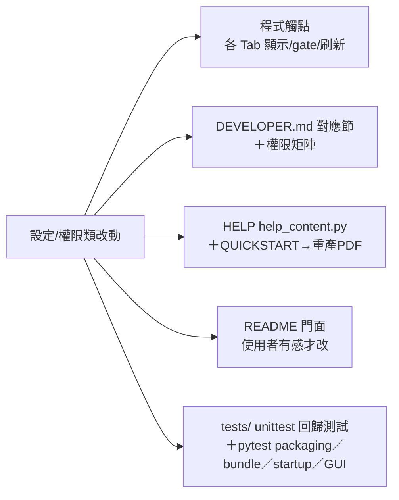

# 公文收發管理系統

Windows 桌面應用，PySide6 + SQLite，管理警察單位公文（交辦單、刑案陳報、一般陳報）。

---

## 0. 給接手者

協作規定與偏好見 [CLAUDE.md](CLAUDE.md)（Claude 開新對話時會自動載入）。本檔為技術文件、按需查閱，每節開頭點明用途。
踩雷速查表在 [PITFALLS.md](PITFALLS.md)；**簽收單列印**（引擎／版面／驗收網）已獨立成 [PRINTING.md](PRINTING.md)。

---

## 1. 架構心智模型

### 進入點與流程

```
main.py
  └─ loading_screen（載入 .ui、註冊 qrc）
      └─ MainMenu（主選單，選要進哪個 Tab）
          └─ DocumentManager（主視窗，依 Profile 建立 Tab）
```

- `DocumentManager.TAB_CLASSES`＝`{key: (模組路徑, 類別名)}`，新增 Tab 在此登記
- 每個 Tab 繼承 `BaseTab`，必須實作 `setup(tab_index)`；可 override `get_tables()`／`get_focus_widget()`／`on_activated()`
- **10 個大 Tab（index 0–9）**：交辦發文／交辦收文／公文陳報／敘獎登錄／罰單登錄／簽收單列印／資料庫瀏覽／檔案歸檔／資料庫設定／操作紀錄；類別見 `tabs/`，各對應一個 `layouts/LayoutN.ui`（`Layout10.ui` 為敘獎發文頁移除後的**空號**，其餘檔名不重編號）
- **主選單**（`main_menu.ui`）為圖示磚格（QToolButton；磚數依 `profile.menu_keys` 決定，`MainMenu` 以 `ceil(sqrt(n))` 欄重排——完整版 10 顆＝4 欄、獨立版 4 顆＝2 欄，`.ui` 內的 row/column 只是設計期擺放），圖示 `res/buttons/menu_*.svg`（qrc 別名 `:/menu/`）於 `main.py` 以 `QIcon` 套用（避開 QUiLoader 解析 .qrc 的問題）
- ⚠️ **主選單拉到最前**：打包版偶因 Windows 前景鎖，`MainMenu` 的 `exec()` dialog 被壓到別視窗後。修法 `QTimer.singleShot(0, …)` 在 exec 進事件迴圈後 `raise_()`＋`activateWindow()`＋清最小化（`main.py` `_on_data_ready`）
- ⚠️ **LOADING 畫面不掛 `WindowStaysOnTopHint`**：splash 若置頂，會把載入/建表階段冒出的 modal 錯誤視窗（excepthook 或各 Tab setup 的 DB 錯誤）壓在後面、使用者看不到也點不到。故 `LoadingScreen` 只用 `FramelessWindowHint`，開機前景改由 `main.py` `loading.show()` 後 `raise_()`＋`activateWindow()` 保證（與上一條主選單同招）。全專案不再有 always-on-top 視窗。**勿再加回置頂旗標。**

### 兩個進入點與 AppProfile

- **`main.py`（完整版）與 `standalone_main.py`（獨立版「公文快速登錄系統」）共用同一條 `runApplication(profile)`**：兩支入口都只是薄殼，各自帶自己的 `AppProfile` 呼叫它，流程本身不分支、不判斷是哪支 exe
- **能力差異全部集中在 `lib/app_profile.py` 的 `AppProfile`**（`FULL_PROFILE`／`ENTRY_PROFILE` 兩份設定）：`tab_keys`／`menu_keys`／`menu_labels`／`browse_keys`／`preload_keys`／`settings_pages`／`system_panels`／`input_lock_flows`／`input_mode_flows`／`preheat_keys`／`banner_path`／`allows_db_rescue`。**模組本身不判斷 EXE 名稱、不寫散落的 standalone 布林**——新增能力差異一律加 profile 欄位，不寫 `if is_entry` 之類分支。詳見 §10「獨立版：公文快速登錄系統」
- **Tab 由 `profile.tab_keys` 組裝**：`DocumentManager.TAB_CLASSES` 現為 `{key: (模組路徑, 類別名)}` 的**模組座標**，`create_tab()`／`_resolve_tab_class()` 在建立分頁當下才 `importlib` 動態載入並快取（避免獨立版僅因 import 就連帶付出完整版分頁的載入成本）；`TAB_FACTORIES` 只登記需要額外收 profile 能力設定的分頁（`browse` 傳 `allowed_keys=profile.browse_keys`、`settings` 傳 `profile=profile`），其餘分頁一律走預設路徑，不在建立迴圈散落 if 判斷
- **Profile 與角色顯隱是兩個階段**：啟動時可依 `profile.tab_keys` 對 `.ui` 的完整版頁籤由高到低 `removeTab()`，形成該程式固定的能力範圍；程式執行中角色切換只以 `setTabVisible()` 顯示／隱藏已建立頁籤，**不可再 `removeTab()` 或重排 index**。角色只能縮小目前 Profile 的可見集合，不能讓 Profile 未核准的頁籤出現

### 資料流

- **五張公文主表**：`Document_Task`（交辦）、`Document_Criminal`（刑案）、`Document_General`（一般）、`Document_Reward`（敘獎）、`Document_Ticket`（罰單）
- **四個 View**：`View_Task_Full`／`View_Criminal_Full`／`View_General_Full`／`Document_Ticket_Full`，JOIN 參照表＋算狀態，給預覽／列印／瀏覽用
- **參照表**：人員／部門／案類／案件狀態／一般分類（見 §6）
- 主表存參照表的 **ID**（VARCHAR 字串，非真外鍵），顯示時 JOIN 出名稱

### Tab 切換與刷新（`main.py` `_onTabChanged`）

切換**後**做三件事：①從設定 Tab 切走→ `settings_tab._promptUnsaved(context="leave")` 處理未存排序，若 `_ref_dirty` 則對其他所有 Tab 設 `_ref_changed=True` 並 `on_activated()` 刷新下拉；②切到設定 Tab → `on_activated()` 重載當前子頁；③autoresize 表格＋設焦點。

> ⚠️ **Qt 限制**：`QTabWidget.currentChanged` 是「切換**後**」才發出，無法切換前攔截。離開大 Tab 的未存提醒只能「切過去後補跳」；設定 Tab 內部子頁切換（按鈕觸發）才攔得住、可「取消＝回原狀」。

### 瀏覽／歸檔頁的三層刷新（避免大表頓挫）

兩頁各約 700+ 列，重建 cellWidget 是成本所在。依「變動性質」分三條路徑：

1. **參照改名（人員／部門／案類）→ 就地輕量更新**：設定頁改參照表時 `_ref_changed=True`，`on_activated` 走 `_refreshRefCells`（瀏覽）／重載小清單（歸檔），只對標記欄 `setText`、不重建列（700 列 ~20ms）。⚠️ 指紋只看 `last_modified`、碰不到改名，故必走此旗標路徑（見 PITFALLS SQL 組）
2. **跨頁增／修／刪 → 指紋差異更新**：比對 `(COUNT, MAX(last_modified))`，變了才 `_diffUpdate`／`_diffDocs` 重建變動列；變動列數 `>= _BUSY_ROW_THRESHOLD`（預設 100）才跳「更新中」
3. **手動「重載」鈕**：強制整表重建（瀏覽）／重掃資料夾＋重比對（歸檔），是面對外部變動（外部新增／改名 PDF）的逃生口

> **啟動預載**：載入畫面期間 `LoadWorker` 背景預讀三表完整資料（`queryBrowseRows`，純 SQL 可跨執行緒），主執行緒於 `DocumentManager.__init__` 以 `buildInitial` 分段建好主視窗（進度條 `LOAD_STEPS`／`BUILD_STEPS`，見 `lib/loading_screen.py`），主選單出現時主視窗已就緒，建完設 `_loaded=True`，之後沿用上述指紋／diff 機制。
> **建表成本**：刪除欄（✕）、編號欄、無 PDF 的主旨欄一律純 `QTableWidgetItem`，點擊以 `cellClicked` 攔（`_onDeleteCell`／`_onLinkCell`）；只有刑案／一般「有真實 PDF 檔名」的主旨列保留 cellWidget（PDF 圖示鈕）。交辦單每列 0 個 cellWidget。⚠️ 建表在主視窗 show 之前（viewport 寬=0），欄寬靠 `autoResizeTable` 重試補正。
> 「更新中」提示走 `ui_utils.runWithBusy`（同步阻塞前 `show + repaint` 強制畫出，有最短顯示時間避免一閃即逝）。

---

## 2. 踩雷速查表（動手前必掃）

九組症狀→解法條目已拆至 [PITFALLS.md](PITFALLS.md)（群組代號 UI／QSS／QTW／LAY／TAB／SVG／SQL／ARC／PKG，任務對照索引見 CLAUDE.md）。

### 跨功能影響對照表（動到左欄主題＝右欄逐項檢查）

牽一髮動全身的主題集中在此，防「改了 A 漏了 B」。**維護規則：新增設定 key／權限限制／系統設定面板時，必須同步補一列**，否則本表腐爛即失效。詳細技術說明在本檔對應章節，本表只列「要記得去看的地方」。


```mermaid
graph LR
    S[設定/權限類改動] --> C[程式觸點<br>各 Tab 顯示/gate/刷新]
    S --> D[DEVELOPER.md 對應節<br>＋權限矩陣]
    S --> H[HELP help_content.py<br>＋QUICKSTART→重產PDF]
    S --> R[README 門面<br>使用者有感才改]
    S --> T[tests/ unittest 回歸測試<br>＋pytest packaging／bundle／startup／GUI]
```

| 主題 | 程式觸點 | 文件／測試同步 |
|------|----------|----------------|
| v1.2.10 | **日期欄防呆：擋掉誤改途徑並在送出前確認，無 schema 變動**。起因是現場事故——某日刑案陳報登錄 12 筆，簽收表只印得出 4 筆；查出其中 8 筆的 `report_date` 年份被寫成隔年（`create_date` 正常），而簽收表只撈「陳報日期＝所選日期」，那 8 筆永遠印不出來。程式寫入的欄位與值都正確，是**日期欄的值在登錄當下被誤改**；送文者模式下日期欄連續登錄共用（送出後不重設），錯一次就一路錯到底，錯成連續的一整段。①**擋掉誤改途徑**：所有 `QDateEdit` 停用滾輪、上下／左右／PageUp／PageDown，**保留的改期路徑只剩「打數字」與「月曆挑」**；左右鍵一併擋是因為切完段落接著誤觸上下鍵就會改到別的段落。②**點擊那條的根因**（現場另回報「有些點擊會莫名讓年份 +1」）：`calendarPopup=True` 時 Qt 用下拉式月曆的幾何判斷點擊落在哪個子控制項，但 spin 箭頭仍存在，兩套座標對不起來，**點輸入區等同按到 spin 箭頭而步進目前選取的段落**；格式為 `yyyy-MM-dd`、預設選取年，症狀就是年份 ±1。300×36 實測：`calendarPopup=False` 只有 x=288～294 會改值，`True` 則 x=0～276 幾乎整條都會改。⚠️ 與全域樣式無關（拿掉 `APPLE_STYLE` 結果相同），是 Qt 本身行為。處置為全域強制 `NoButtons`，已驗證月曆照常開啟且**渲染前後逐像素 0 差異**，未動任何 `.ui`／`theme.py`／按鈕樣式。③**送出前確認**（`ui_utils/date_guard.py`）：發文／收文日期早於今天 1 天、或晚於今天 10 天以上即跳一次提示；查獲／受理日期只看往後、同樣 10 天。只提示不擋（補登舊案與跨年度作業都正常），**同一欄位＋同一日期本次執行只問一次**（連續登錄十幾筆時每筆都問會被無視）。接在六個送出點：刑案／一般陳報、敘獎登錄、交辦單發文、交辦單收文、結算發文視窗（一次寫多筆，誤改代價最大）；交辦單限辦日期與各編輯彈窗刻意不套。④⚠️ **加完提示後整條 gate 掛住不結束**——既有測試只要以非今日日期送出就會叫出真的確認框而無限等待（PITFALLS TST-4）；已在根 `conftest.py` 統一自動回「確認無誤」並清掉「本次已確認」的模組層狀態，防呆自己的測試則自行覆寫。⑤文件：DEVELOPER §10 新增「日期欄防呆」，PITFALLS **QTW-13** 改寫、新增 **QTW-14**；HELP 四頁與結算頁、速查卡、README FAQ 同步。完整套件 pytest 1022（非 shell）＋49（shell）＋9（PII gate，零 skip）。 |
| v1.2.9-v6 | **同版號重新發布（tag `v1.2.9-v6`，`lib/version.py` 仍為 1.2.9）：自動化驗收擴充，無功能／schema／UI 變動**。①**新增六支 GUI pilot**（連同既有敘獎 pilot 共八支），以真實版面與真實資料庫走完整條使用者流程，補的都是「兩端各自有測試、中間那段沒人看」的接縫：登出即關窗、檔案歸檔正名與 DB 同步、發文結算到結算發文（四種流程，含罰單 strict 併發衝突整批 rollback）、跨年度重置（確認→稽核→備份→重置）、備份還原、回收筒還原、系統設定六面板的 key 接線與髒值判斷。②**最有價值的兩條不變式**：其一，登錄端寫下的「未發文」哨兵各流程並不一致（陳報寫 NULL、敘獎與罰單寫空字串），而結算端另以 SQL 撈——兩邊分開維護，改壞了兩邊測試都綠、公文卻會從待結算清單無聲消失，故 pilot 一律用真實登錄分頁送出、不以 SQL 塞資料；其二，跨年度重置的稽核**必須寫在備份之前**，因為重置會清空當前庫的操作紀錄，順序顛倒該筆紀錄就永遠消失且無任何錯誤訊息。③**設定面板改以消費端自己的讀取函式斷言**，而非直接查 `App_Settings`：只查 key 的話，寫錯 key 名或正規化方式與讀取端不一致仍會漏，那正是「設定了但沒作用」的成因。④**每支交付前都做反證**——故意破壞被測機制、確認對應那支會紅；替身蓋得掉的機制（如「備份失敗要中止」的 `return`）則直接改原始碼那一行驗紅後還原。**pilot 的價值來自能抓到回歸，不是綠燈本身**。⑤文件：DEVELOPER §4 新增「GUI pilot」條目（八支清單＋三條規則），PITFALLS 新增 **TST-6**（測試建立的分頁沒拆掉 `AuthManager` 單例連線，會讓別的測試檔莫名紅燈；只有特定執行順序才炸，已踩過兩次、兩次都害到同一支罰單測試）。⚠️ 因版號未進位，exe 版本資訊仍顯示 1.2.9，只能靠 Release 頁與檔名區分。完整套件 pytest 995（非 shell）＋49（shell）＋9（PII gate，零 skip）。 |
| **歸檔資料夾設定**（`archive_root`／子夾） | `ArchiveRootPanel`（settings_panels）；歸檔頁 `_updateArchWarn` 警示＋資料夾定位；瀏覽頁 `_refreshArchWarn` 警示＋PDF 連結；設定頁登入彈窗 `_maybeWarnArchiveRoot`；Reset 會清空（`performYearEndReset`）；`clearPdfIndexCache` | §5「系統設定子頁」＋「歸檔根目錄未設定警示」；HELP 歸檔/設定頁；QUICKSTART；README 部署段＋`07-archive-folder` 截圖 |
| **簽收表標題**（`print_title_*` 六 key） | `PrintTitlePanel`；`printTitle`/`printTitlesUnset`（db_utils）；列印頁警示 `_refresh_title_warn`＋過期指紋 `_titles_sig`；Reset 不清 | §5「簽收表標題自訂」；HELP 列印/設定頁；QUICKSTART；`tests/test_print_titles` |
| **敘獎登錄／發文**（`Document_Reward`／`print_title_reward`，v1.1.11） | `tabs/tab_reward.py`（Tab3 登錄頁，三身分皆可登錄／改／刪本次登錄清單；INSERT 一律帶 `create_date=今天`，送文者模式帶所填 `register_date`＋`sender_id`（發文人員必填），發文結算模式帶 `register_date=''`、`sender_id=NULL` 待結算補值，依 `isSelfServiceMode(db, 'reward')`）；右側候選人員名條依 `Ref_Personnel.sort_order` 排，**不依使用次數**（與罰單登錄同規則，見 §5）；發文改由列印頁「結算發文」處理（`SETTLE_META` 的 reward entry，見 §5 陳報模式）；瀏覽頁 reward 子頁（`TABLE_META` raw/active_where＋登錄日期／發文日期兩欄＋發文人員欄 JOIN `Ref_Personnel`；**編輯僅 admin**——`tab_dbbrowse._canEditKey('reward')=is_admin()`，歸檔管理者不可改；刪除 `is_admin()`）；`tab_print` `REWARD_COLUMNS`＋`_build_sections`（簽收表敘獎 section）；`softDeleteDoc`/`_DELETE_META`（軟刪除清 `create_date`/`register_date`/`sender_id`/`reason`/`recipients`）；`trash_panel`（回收筒可還原）；`backup_doc_counts`（備份筆數統計）；`performYearEndReset`（跨年度重置） | §10「權限」權限矩陣＋§6＋§5「簽收表標題自訂」；HELP 3/5 頁；QUICKSTART；`tests/test_reward_*` |
| **罰單登錄**（`Document_Ticket`／`print_title_ticket`） | `tabs/tab_ticket.py`（Tab4；所有 CRUD 寫入唯一走 `lib/ticket_utils.py`；結算發文由 `SETTLE_META` 在共用 transaction 更新；編輯採五欄原值 CAS＋開窗快照（見 §10「多機無聲覆蓋防護」）；排序一律用 `ticketSortKey()`）；`Document_Ticket_Full` 供預覽／瀏覽／結算／列印共用；`settle_dialog.SETTLE_META` 的 ticket `strict=True`；`tab_print` Ticket renderer；瀏覽頁 ticket 子頁 `admin_only_edit`；`performYearEndReset`／`backup_doc_counts` 均含 ticket；**不進回收筒** | §10「權限」權限矩陣＋§6＋§5「簽收表標題自訂」；HELP 4/5/6 頁；QUICKSTART；`tests/test_ticket_*` |
| **閒置逾時**（`idle_logout_min`/`idle_close_min`） | `IdleTimeoutPanel`；`getIdleTimeoutsMs`/`parseIdleMinutes`；main.py 兩計時器 `>0` guard；main.py `_onIdleTimeout`/`_onIdleClose` 訊息帶實際分鐘數（`{mins:g}`，勿寫死）；「低於鎖螢幕時間」約束（維護者默契、不放 UI）；Reset 不清 | §10「閒置處理與多人使用（main.py）」；HELP/QUICKSTART 內寫死的分鐘數字；`tests/test_idle_timeouts` |
| **唯讀設定**（`input_lock_*` 六 key） | `InputLockPanel`；`isInputLocked`/`INPUT_LOCK_KEYS`；六種流程的硬 gate（`handleDispatch`/`tab_receive._submit`/`_submitCriminal`/`_submitGeneral`/`tab_reward._submit`/`tab_ticket._submit`）；五頁 `_applyInputLock` 反灰＋橫幅＋`_onShown`＋`_onRoleClearList`；tab_report `_currentLockKind`/`_switchFormType` 重套。敘獎發文結算模式下鎖 `reward` 即擋住發文源頭（不另設發文鎖） | §10「六種輸入流程唯讀鎖」＋權限矩陣＋§5 面板表；HELP/QUICKSTART；`tests/test_input_lock` |
| **自動備份／備份還原**（`backup_second_dir`／異地／quick_check／還原子頁） | `run_auto_backup(extra_dirs=)`＋`_run_gfs`＋`quick_check`／`list_backups`／`verify_backup`／`restore_backup`（db_backup）；`main.py` 啟動 quick_check→備份；`BackupPanel`（settings_panels）；`BackupRestorePanel`（backup_restore_panel）；tab_settings nav 第 6 子頁四處掛載（`_nav_btns`／兩份 loaders／`_applyRolePermissions`）；Reset 不清 `backup_second_dir` | §10「平時自動備份（`lib/db_backup.py`）」＋§5 面板表＋「備份還原子頁」＋§6 App_Settings 列；HELP 設定頁；QUICKSTART；README FAQ 資料安全段；`tests/test_db_backup` |
| **陳報模式**（`report_input_mode`／發文結算） | `isSelfServiceMode`（db_utils）；`InputModePanel`（settings_panels）；陳報頁、敘獎登錄頁與罰單頁 `_applyInputLock`→`_applySelfServiceMode`，提交帶 NULL 與放行發文人員（敘獎／罰單以可見 QLabel 提示條 `*_sender_hint` 說明免填，不用 tooltip，見 PITFALLS QSS-7）；**刑案／一般編輯彈窗 `_BaseEditDialog._lockReportFieldsIfSelfService()`**（發文結算模式且非管理身分才反灰陳報日期／發文人員，涵蓋陳報／瀏覽／歸檔三處開啟點）；列印頁 `_settle_group`／`_refresh_settle_group`／`_on_settle`＋`SettleDialog`／`count_unissued`（settle_dialog 的 `SETTLE_META` 含刑案／一般／敘獎／罰單，罰單衝突 strict rollback）；歸檔 `_queryUnarchived`／`_tableSignature` 排除未發文列；瀏覽頁未發文欄位橘字提示；Reset 不清。⚠️ `reward` **不吃**舊 `report_input_mode` 全域 fallback（見 `LEGACY_MODE_FALLBACK_KINDS`） | §5「發文結算模式」＋§5 面板表＋§6 App_Settings 列；HELP 陳報/列印/設定頁；QUICKSTART；README 功能段＋陳報模式 TIP；`tests/test_report_input_mode` |
| **權限／角色**（新增任何「受限身分不可做」） | **每條觸發路徑 guard**（按鈕/雙擊/行內編輯/Enter/右鍵/拖拉，見 CLAUDE.md 協作偏好 B）；`role_changed`→`_onRolePerm`/`_applyRolePermissions`；遮罩頁（歸檔/稽核）；閒置登出後的行為；**破壞性或動實體檔案的流程另加「modal 返回後再檢查一次」**（見 §10「執行時權限複核」） | **§10「權限」權限矩陣必更新**＋§10「執行時權限複核」；HELP 各頁的權限描述；QUICKSTART 權限段；上機以受限身分逐路徑驗證 |
| **角色 TAB 顯隱**（user／archive／admin） | `visibleTabKeys` 權限矩陣；`DocumentManager` 執行期顯隱與登出 fallback；`MainMenu` 全入口 `requestTab`；設定頁登入與待前往目標 | §10「權限」9／10／11 TAB 清單；HELP 固定 Profile index 映射；QUICKSTART 權限段；README 登入說明；角色切換、主選單導向、登出／閒置登出與 HELP mapping 測試 |
| **新增 App_Settings key**（通用步驟） | db_utils 常數＋讀取 helper（含 fallback 預設）；`db_seed` 要不要播種；Reset 清不清（`performYearEndReset`）；生效時機（即時讀 vs 重啟） | §6 App_Settings 那一列；對應 tests |
| **系統設定新面板** | `settings_panels.py` 新類別＋`ui_utils/__init__` 匯出；tab_settings **四份清單**（建立/`_applyRolePermissions`/`_loadSystem`/`_dirtyPanels`）；`_save()` 開頭權限 guard；儲存鈕 dirty UX（亮/灰/clearFocus） | §5 面板表；HELP 設定頁；QUICKSTART |
| **參照表結構／改名行為** | `_ref_changed` 旗標路徑（PITFALLS SQL 組）；預覽表 `_refreshPreviewNames`；歸檔比對 `_loadNameDict`；`RefItemDialog` 三份 config | §10「參照項對話框」；HELP 設定頁 |
| **應用 Profile／獨立版**（`lib/app_profile.py`） | `FULL_PROFILE`／`ENTRY_PROFILE` 兩份設定；`DocumentManager`（`tab_keys` 組裝分頁、`tab_index_by_key`、頁籤文字取 `menu_labels`）；`MainMenu`（`menu_keys`／`menu_labels`／磚格依允許數量重排）；`TabDBBrowse(allowed_keys=)`；`TabSettings(profile=)`；`InputLockPanel`／`InputModePanel` 的 `flow_keys`；`LoadingScreen(browse_preload_keys=, preheat_modules=, banner_path=)`；`main.handleCorruptDb`（`allows_db_rescue`） | §1「兩個進入點與 AppProfile」；§5「新增 Tab 標準流程」；§7 兩份 spec 的 hiddenimports；§10「獨立版：公文快速登錄系統」；`tests/test_app_profile`／`test_standalone_*`／`test_lazy_tab_loading` |

> **發版前固定檢查**：HELP（`help_content.py` 的 `HELP_PAGES`）與速查卡（同檔 `QUICKSTART`，改後跑 `gen_quickstart.py` 重產 PDF）是歷來最常漏的兩處；發布流程第 1 步寫文件時，對照本表右欄逐列確認。

---

## 3. 慣例與設計決策

大型功能詳解在 §10，依任務對照表按需查閱。

### 軟刪除（is_active）

- **人員／部門／案類**用 `is_active` 軟刪除（停用不真刪），保留 ID 對應（歷史資料仍引用得到）、只是不出現在下拉
- 詞彙：人員「在職／離職」，部門／案類「啟用／停用」
- 設定 Tab 列表顯示停用項目（**灰字 `#aeaeb2`**），下拉排除（`WHERE is_active=1`）
- 停用／啟用一律進「修改」Dialog 勾 checkbox 切換，無獨立停用按鈕
- **敘獎主表為三態，不用 `is_active`**：`Document_Reward.register_date` 一欄承載三種業務語意——`NULL`＝軟刪除哨兵、`''`＝有效未發文、非空日期＝有效已發文。因此發文／瀏覽的「有效列」條件是 `register_date IS NOT NULL`（**不可寫成 `IS NOT NULL AND != ''` 之類**，否則把未發文濾掉），這同時是並行刪除保護（他機刪除後 rowcount=0 自然跳過）。⚠️ 三態條件集中在 `lib/db_utils.py`：`REWARD_ACTIVE_SQL`／`REWARD_PENDING_SQL`／`REWARD_DELETED_SQL` 與 `rewardState()`／`rewardActiveSql(col)`，**勿再各頁寫魔法字串**；判斷單筆狀態用 `rewardState()`，勿寫 `if not register_date`（會把未發文與已刪除混為一談）。

### 排序（sort_order）

- 人員／部門／案類三表有 `sort_order`，**下拉與列表一律 `ORDER BY sort_order`**（非 ID），讓顯示順序跟 ID 脫鉤、可手調
- 設定 Tab 以**拖拉列**調整（`_RowDragFilter` 攔 `QEvent.Drop`、手動換列），hint label 提示可拖。⚠️ `QTableWidget.InternalMove` 只移 cell 不移 row，不可用
- **暫存模式**：排序在記憶體操作，「儲存排序」鈕初始 disabled、拖拉後才亮；儲存才寫回 DB（連續整數重編）並設 `_ref_dirty=True`
- 未存排序時切子頁／切大 Tab／按修改會跳確認；取消行為：按鈕觸發的（修改、子頁）回原狀，大 Tab（攔不住）放棄
- 新增項目放最前（`MIN-1`）
- 「儲存排序」成功不跳提示，按鈕反灰即代表已存

指定位置與 RefItemDialog 詳見 §10。

### 全域錯誤處理與白話化訊息

未預期例外由 `main.py` 全域 handler（`sys.excepthook`）統一接手：①寫 `error.log`（含完整 traceback）②寫 Windows 事件檢視器（有 pywin32 時，無則靜默）③彈白話錯誤視窗（`db_utils.friendlyErrorMessage(exc_type, exc_value)` 把例外轉成承辦看得懂、可行動的提示——技術細節只進 error.log）。

`friendlyErrorMessage` 依例外型別分類（純邏輯可單測 `tests/test_error_msg.py`）：

- **SQLite**：忙線鎖（locked/busy）→「資料庫忙線中…請關閉其他視窗」；損毀（malformed 等）→「檔案可能損毀…請提供 error.log 與備份」
- **檔案／權限／網路碟**：`PermissionError`／`FileNotFoundError`（導向設定頁）／`OSError`（網路碟可能斷線）
- 對照不到 → 泛用訊息（已記錄、請提供維護人員）

> ⚠️ **被 `except` 接住的例外要用 `ui_common.reportError(title, exc, parent=None)`**（門面 `from ui_utils import reportError`），別再寫 `msgCritical(title, str(e))`。`reportError` 同時①寫完整 traceback 進 error.log ②彈白話訊息（內部走 `friendlyErrorMessage`）。舊寫法既漏記 log、又把 SQLite 英文原文丟給使用者（如 `attempt to write a readonly database`）。全域 `excepthook` 只接「未被接住」的例外，caught 的不會自動進 log，故要靠 `reportError` 補。

### 其他慣例

- 所有彈窗加 Enter 確認（高風險如變更密碼除外）
- 跨年度 Reset 重編所有 ID，**不需要**流水號機制；`Seq_DocId` 等 Reset 一起歸零
- 主表「刪除」清空保留 doc_id，流水號永久佔用，彈窗提示「本文號（XXX）無法再被使用」
- **身分判斷**用 `AuthManager.instance()` 便捷方法，勿各處寫 `current_role == '…'` 字串比較
- **DB 連線**統一走 `db_utils.getConn(db_path)`（單一來源，要加 PRAGMA/timeout 集中改一處）；`base_tab._getConn`、`edit_dialog._get_conn` 皆委派它。內建 `PRAGMA busy_timeout=3000`（v1.1.11）：多機 SMB 併發下寫入鎖碰撞多為毫秒級，讓 SQLite 自行重試；**不開 WAL**（網路檔案系統上不安全）
- 三個編輯彈窗共同繼承 `_BaseEditDialog`，版面常數 `_LABEL_W/_FIELD_W/_MARGIN` 集中於基底

---

## 4. 目錄結構與路徑

```
專案根/
├── main.py          完整版進入點（從專案根目錄啟動）
├── standalone_main.py  獨立版「公文快速登錄系統」進入點（薄殼，帶 ENTRY_PROFILE 呼叫 main.runApplication）
├── lib/             核心模組（package）：db_utils／base_tab／auth_manager／app_lock／
│                    db_backup／db_schema／db_seed／archive_text／theme／version／loading_screen／
│                    app_profile（完整版／獨立版能力設定唯一來源，見 §1）／
│                    ticket_utils（罰單 domain 層，唯一寫入入口）／window_geometry（開窗尺寸收斂）
├── layouts/         所有 .ui（Layout1~11、main_menu；Layout1＝主視窗，其餘依 Tab 對應；
│                    Layout10 為敘獎發文頁移除後的空號，檔名不重編號）
├── res/             圖片／SVG／qrc（package）：resources.qrc／resources_rc.py／buttons／tabs
├── tabs/            各 Tab
├── ui_utils/        共用 UI 工具（table／widgets／status／sticky_scroll／edit_dialog／
│                    settings_dialogs／settings_panels／help_dialog／help_content／ui_common／
│                    button_imgs／settle_dialog／reward_dialog／ticket_dialog；門面見 `__init__.py`）
├── packaging/       **隨 Release 出貨、由使用者執行**的檔案（入庫，非開發工具、不從專案根跑）：
│                    create_shared_shortcuts.bat（SMB 分享捷徑建立工具，放進 PACKED.zip）
├── tools/           開發／維運工具（入庫，從專案根執行；不被核心模組 import）：
│                    bump_version／check_bundle_deps／check_excludes／check_no_matplotlib／
│                    engine_diff／fake_seed_data／gen_buttons／gen_quickstart／gen_shell_db／
│                    mpl_canvas／print_baseline／pyi_prune／pytest_trend／qt_pdf_export／
│                    render_diff／seed_print_baseline／seed_screenshot_data
└── tests/           unittest 回歸測試＋pytest（含 packaging／bundle／startup 與 GUI pilot）
```

- ⚠️ 一次性／現場交付腳本（`fix_audit_setup.py`／`fix_cat_status.py`／`seed_*.py`）刻意**不入庫、留根目錄**：`fix_*` 打包成 exe 發給現場放 `dbfile.db` 旁執行（靠「找腳本旁的 db」邏輯，不可改），`seed_*` 為本機壓測／塞假料丟棄腳本（git add 時跳過，見 CLAUDE）
- `lib/`、`res/` 都是 package（有 `__init__.py`）：用 `from lib.db_utils import …`／`from res import resources_rc`
- `tools/` 各腳本錨定 repo 根並**一律從專案根目錄執行**；產品核心不反向 import
  開發工具。兩支 seed 工具會 import `lib/db_schema.py`／`lib/db_seed.py`，確保 schema
  仍以產品程式碼為唯一來源
- 公開截圖候選資料以 `python tools/seed_screenshot_data.py <.tmp 內輸出路徑>` 建立；
  人名與公文內容共用 `tools/fake_seed_data.py`。候選姓名仍須由維護者對照真實名單
  核准，截圖也須人工目視，不得宣稱已證明姓名不對應真人
- `version_info_entry.txt`（獨立版打包 `--version-file`）與 `version_info.txt` 同由 `tools/bump_version.py` 一次產生，兩支 exe 版號永遠同步，勿手改

### 路徑解析（getResourcePath，打包相容）

- `db_utils.getResourcePath(rel)`：開發從當前目錄找，打包後從 `sys._MEIPASS`
- `dbfile.db` 特殊：永遠從 exe 所在目錄讀（真實資料，不打包進 exe）
- `.ui` 用 `getResourcePath("layouts/Layout1.ui")`、圖片用 `getResourcePath("res/buttons/banner.png")`；`arrow.svg` 走 qrc 虛擬路徑 `:/arrow.svg`，**不經** getResourcePath
- ⚠️ `getResourcePath` 用「當前工作目錄」找 dbfile.db、**不是** `__file__`，故**程式務必從專案根目錄啟動**（`python main.py`），打包後則 exe 所在目錄
- ⚠️ 改了 qrc 內任何 SVG，要重編：`pyside6-rcc res/resources.qrc -o res/resources_rc.py`

### 單元測試（tests/）

正式測試 gate 以 **pytest** 為唯一完整 runner，涵蓋既有 unittest 測試、純邏輯、資料庫、offscreen Qt、packaging／bundle／startup 契約與 pytest-qt GUI pilot。`unittest discover` 僅保留為無 pytest 環境備援，不屬正式發布 gate。

- **跑法**（專案根）：檔名 `test_*.py`（探索預設，勿改名）。正式 gate 用本機**系統 Python**（3.12.10，已裝齊 `requirements-dev.txt`），完整 unittest、pytest 與 PII gate 都走這一支：
  ```powershell
  $env:QT_QPA_PLATFORM = 'offscreen'
  C:\Users\user\AppData\Local\Programs\Python\Python312\python.exe -m pytest tests -q -m "not shell" --ignore=tests/test_no_pii.py
  C:\Users\user\AppData\Local\Programs\Python\Python312\python.exe -m pytest tests -q -m shell --ignore=tests/test_no_pii.py
  C:\Users\user\AppData\Local\Programs\Python\Python312\python.exe -m unittest tests.test_no_pii
  ```
  其他環境不可假設此絕對路徑存在，應改用已安裝 `requirements-dev.txt` 相同依賴的 Python 執行相同命令。完整 pytest 會一併驗證 packaging／bundle／startup 與 GUI pilot。
- ⚠️ **不要再用 Codex runtime 那支直譯器跑 gate**（`C:\Users\user\.cache\codex-runtimes\...\python.exe`）：2026-08-03 查核，該環境**沒有 pytest／PySide6／matplotlib**，`-m pytest` 直接 `No module named pytest`，一段 gate 都跑不了。它只有 pypdf／reportlab，而 2026-08-03 之前 `requirements-dev.txt` 那兩行釘的正是**它的**版本——等於清單混了兩個環境，哪一支都對不上。兩支直譯器的差異肉眼看不出來，故改由 `tests/test_environment_contract.py`（`pure` 層）比對「實際安裝版本 vs 釘住版本」，不符即紅、套件沒裝也紅（**不 skip**）。動 `requirements-dev.txt` 或換機器後第一件事就是跑它。
⚠️ **pytest 必須分非 shell／shell 兩段跑**：`shell` 層包含會建立應用程式行程或完整 shell 的測試；其中 `tests/test_standalone_shell.py` 會在同一行程內反覆建立整個 `DocumentManager`，與其餘模組合跑時累積到一定量必定 native 崩潰（access violation）。兩段各自全綠、合併必崩，詳細證據與已試過無效的兩條修法見 PITFALLS **TST-5**。正式程式不受影響——重啟一律另起新行程（`tab_settings._restartApp`），一個行程一輩子只建一個 `DocumentManager`。五個主層 marker 為 `pure`／`db`／`qt`／`shell`／`packaging`，每個 node 恰屬一層；分類由根 `conftest.py` 的明確模組表與契約測試共同把關。pytest 的 basetemp、cache 與各 xdist worker 的 matplotlib 設定皆放在專案 `.tmp`。

- **xdist 裁決**：`pytest-xdist` 只供分層量測。`pure+db` 與 `qt` 已通過 `-n 2
  --dist loadscope` 重複實驗；`shell` 第 7 輪發生 native worker crash，裁決退回 serial，
  `packaging` 也維持 serial。正式發布 gate 不加 `-n`，仍使用上方非 shell／shell
  兩段 serial 指令，不因前兩層實驗通過而改回合併或平行全跑。⚠️ serial 仍非絕對
  穩定：2026-08-02 依發布順序連跑兩段三次，shell 段 1 次 native crash、2 次通過。
  ⚠️ **2026-08-03 起 shell 層改為行程隔離**（根 `conftest.py` 的
  `pytest_runtest_protocol`，`ISOLATED_MODULES` 內每支測試各跑一個子行程，
  序列不平行），連跑 10 輪零 crash；關閉隔離的對照組 4 輪即崩 1 次。
  **判讀規則同步改為「crash 一次就算回歸」**，不再有重跑寬限，詳見 PITFALLS
  **TST-5**。新增會在行程內建立 `DocumentManager` 的測試檔時，必須把檔名補進
  `ISOLATED_MODULES`；仍不得改用 xdist 硬繞

- **GUI pilot（六支，2026-08-03～04 建立）**：以真實版面與真實資料庫走完一條使用者流程，
  補的是「兩端各自有測試、中間那段沒人看」的接縫。
  `test_reward_gui_pilot`（敘獎登錄→編輯→發文）／`test_logout_gui_pilot`（登出即關窗，
  **唯一在 shell 層、需隔離**）／`test_archive_gui_pilot`（歸檔正名與 DB 同步）／
  `test_settle_gui_pilot`（四種流程發文結算→結算發文，含罰單 strict 併發衝突）／
  `test_reset_gui_pilot`（跨年度重置的確認→稽核→備份→重置）／
  `test_restore_gui_pilot`（備份還原）／`test_trash_gui_pilot`（回收筒還原）／
  `test_settings_panel_pilot`（六個設定面板的 key 接線與髒值判斷）。
  寫新 pilot 前務必知道三件事（都踩過）：
  1. **只建單一分頁就留在 `qt` 層**，隔離每支要多付約 0.6 秒子行程成本；只有會建
     完整 `DocumentManager` 的才進 shell 層並列入 `ISOLATED_MODULES`。
  2. **收尾必須拆掉掛在 `AuthManager` 單例上的 `role_changed` 連線**，否則會紅在
     毫不相干的檔案上，見 PITFALLS **TST-6**。
  3. **一律不得呼叫 `exec()`**（PITFALLS TST-4）；慣用解是把 `exec` 換成「就地驅動」
     的函式，仍走真實驗證邏輯，只是不進 modal 事件迴圈。
  ⚠️ pilot 的價值來自**能抓到回歸**，不是綠燈本身：每支交付前都以「故意破壞被測機制、
  確認對應那支會紅」反證過。新增時照做。
- **無 pytest 環境備援**：只能執行 `python -m unittest discover -s tests`；pytest-only、packaging 與 GUI pilot 可能被跳過，因此不得拿這個結果取代正式 gate。
- **趨勢紀錄**：根 `conftest.py` 在指定 `PYTEST_RUN_RECORD` 時輸出實際執行 node IDs 與最慢 20 筆；`python -m tools.pytest_trend --collection <collection.json> --layer pure_db=<run.json> --previous <history.jsonl> --output <history.jsonl>` 可追加完整 collection、各層數量／耗時、durations 與相對前次變化。長期結論寫入經審閱的實驗報告，`.tmp` 單次輸出只作原始證據。
- **PII gate**：`tests/test_no_pii.py` 的文字檔清單只取自 `git ls-files`，因此不掃
  untracked／ignored 檔（含正式 `dbfile.db`）。每個 tracked path 依序讀取：①解析後
  target 與各層 parent 都未離開 repo 的現存工作樹 bytes（涵蓋 unstaged）②index blob
  （涵蓋 staged-new 在工作樹刪除的情況）③`HEAD` blob。外部 symlink／junction 不會
  被跟隨讀取。denylist 缺少或有效項目為空會明確顯示 skipped，**不可把 skip 當
  pass**。有清單且未命中時只准回報「未命中本機已知 denylist」，不得延伸成候選
  姓名已證明非真人
- **需 PySide6 的測試**（受測模組 import 時載入 PySide6）：`test_db_utils`／`test_status`／`test_auth_manager`／`test_error_msg`／`test_audit`／`test_ref_sort`；純 stdlib：`test_archive_text`／`test_app_lock`／`test_db_backup`
- **offscreen Qt 元件測試**（module 層設 `QT_QPA_PLATFORM=offscreen` 建 QApplication，實例化 widget 但不開視窗）：`test_nullable_date`／`test_ui_load`／`test_dialog_smoke`／`test_dbbrowse_sync`（整個瀏覽 Tab offscreen 實例化，驗 `_allRows`/`_docorder` 與表格列 1:1 不變式、`_diffUpdate` 增修刪、`setUpdatesEnabled` try/finally 防卡死、搜尋過濾一致性）
- **涵蓋**：歸檔解析（含 PK 撞號雷）、流水號／重置／設定／歸檔定位、逾期與狀態色、權限與密碼、錯誤白話化、稽核 helper、操作紀錄解析、軟性互斥、自動備份、閒置逾時解析（`test_idle_timeouts`，0＝停用／壞值退預設）；`.ui` 全檔載入與對話框建構 smoke（offscreen）；罰單四檔（`test_ticket_data` domain／`test_ticket_tab` 登錄頁與欄寬伸縮／`test_ticket_browse` 瀏覽 gate／`test_ticket_print` 排序分頁合併）＋`test_combo_hint`（提示灰字六狀態）＋`test_window_geometry`；另 `test_no_pii` 防個資外洩（見 CLAUDE）
- **依賴清單分兩份（2026-08-03 起）**：`requirements.txt`＝**產品 runtime**，目前只有 `PySide6`——PDF 產出走 Qt 的 `QPdfWriter`／`QPrinter`，`reportlab` 只有 `tools/gen_quickstart.py`（速查卡）用、`pypdf` 只有測試用、`matplotlib` 只有列印基準工具用，三者都**不是**產品相依；`requirements-dev.txt`＝`-r requirements.txt` 再加上這些驗收工具與 pytest 家族。只想把程式跑起來或打包裝前者，要跑完整 gate 裝後者。分界由 `test_environment_contract` 守著：dev-only 套件混進 runtime 清單即紅。要往 `requirements.txt` 加東西前，先確認它真的被 `lib/` 或 `tabs/` import
- **契約類測試（三支，各管一件事）**：`test_environment_contract`（實際安裝版本 vs `requirements-dev.txt`）／`test_help_content_contract`（HELP 與速查卡文案）／`test_release_documentation_contract`（本檔的發布流程 gate、陳報模式、對照表、key 名與 DB 結構）。後兩支刻意逐字比對文案，**改了文件就會紅是設計如此**——那是「文件要跟功能一起改」的提醒，紅了照著改斷言即可，不要為了不紅而放寬比對。⚠️ 新增文件契約請加進這兩支，別再塞回 `test_reward_integration`（該檔曾同時檢查敘獎程式、HELP、速查卡與本檔四件事，紅燈看不出哪裡出事）
- **紀律**：動到可單測純邏輯時一併新增／更新測試；GUI 互動仍須上機驗證

---

## 5. 操作手冊（要改特定東西時查）

### 結構變更原則（schema 程式碼為唯一來源；附加式走 ensureSchema、破壞式才手動）

- **schema 唯一來源 = `lib/db_schema.py`**：全部資料表（`_TABLES`）、三 View（`_VIEWS`）、trigger（`_TRIGGERS`）、索引（`_INDEXES`，2026-07 起）的 DDL 都集中在此，皆 `CREATE … IF NOT EXISTS`。三方共用：①啟動 `ensureSchema`（既有庫＝no-op）②`tools/gen_shell_db.py` 產乾淨空殼 ③單元測試 `test_db_utils._build_schema` 直接 `applySchema(conn)` 建表。**不再有第二份手刻 schema**（舊測試假 schema 已移除），徹底消除走鐘
- **種子資料唯一來源 = `lib/db_seed.py`**：參照資料（人員佔位／部門／案類／案件狀態／一般分類）＋預設密碼 hash＋Seq 歸零＋簽收表六 key（空值）。`seedFreshDb()` 走 `INSERT OR IGNORE`，**只由 `gen_shell_db.py` 在建空殼時呼叫**，刻意不掛進啟動 `ensureSchema`（避免對既有庫重塞參照資料）
- **附加式（建表／加欄，只增不改）→ 登記進 `db_schema._TABLES`／`_COLUMNS`**：開程式時 `ensureSchema` 自動套用（`CREATE TABLE IF NOT EXISTS`／「缺欄才 `ADD COLUMN`」），各語句獨立 try、失敗只記 log、絕不擋開程式。在 `main.py`（鎖檔後、自動備份前）呼叫一次。**forward-only**：不回溯自愈
- **破壞式（改型別／改既有資料／改 View 定義）→ 一次性手動**：`IF NOT EXISTS` 不會更新既有 View／表，故改 View 定義要 `DROP VIEW…CREATE VIEW`、改型別要 `ALTER`／資料修補，走手動腳本對現場 `dbfile.db` 執行，不寫進啟動流程（同時也要更新 `db_schema.py` 的對應 DDL，讓新空殼一致）
- ⚠️ **動過 schema／種子後**：跑 `python tools/gen_shell_db.py <暫存路徑> --force` 重產發版空殼；`gen_shell_db.py` 的暫存產物才是發版來源，勿使用工作區根目錄的實際資料庫。
- 程式碼讀寫可能尚未存在的欄位前，用 **PRAGMA 缺欄退路**保護（現行 alias 欄即如此，見 `ui_utils/settings_dialogs.py` 的 `_has_alias_col`）

### 新增 Tab 的標準流程

1. 新增 `tabs/tab_xxx.py`，`class TabXxx(BaseTab)` 實作 `setup(tab_index)`
2. `tabs/__init__.py` 現為 PEP 562 延遲載入（見檔頭註解）：在 `_TAB_MODULES` 對照表登記 `{類別名: 子模組名}`，**不是**直接 `from .tab_xxx import TabXxx`——分頁類別只在被存取當下才 `importlib` 動態載入
3. `main.py` 的 `TAB_CLASSES` 登記 `key: (模組路徑, 類別名)`（同樣是延遲載入的模組座標，建立分頁當下才解析）
4. 在 `FULL_PROFILE.tab_keys`／`menu_labels`（`lib/app_profile.py`）排入該 key；獨立版（`ENTRY_PROFILE`）是否也開放另行判斷，不預設兩邊都要加
5. 新增對應 `layouts/LayoutN.ui`（**每個大 Tab 都必須有 .ui**；彈窗才用 code 動態建）
6. ⚠️ **兩份 spec（§7）的 `hiddenimports` 都要補 `tabs.tab_xxx`**：分頁類別是動態載入，PyInstaller 靜態掃描掃不到，漏補的症狀是**打包版點到該分頁才炸、啟動與原始碼跑都正常**（見 PITFALLS PKG 組）；獨立版**只在該分頁屬於 `ENTRY_PROFILE.tab_keys` 時**才補這行
7. 若該分頁要進啟動預熱，`preheat_keys`（`AppProfile`）必須是自己 profile 的子集——寫進不屬於自己 profile 的模組，打包版會在載入畫面階段 `ImportError`、進不了主選單（見 PITFALLS PKG 組）
8. 若有人員/部門/案類下拉，override `on_activated()` 刷新（`refreshFilterCombo` 保留當前選值、值已不存在則清空）；觸發為從設定 Tab 切出＋`_ref_dirty=True`
9. **對照 §2「跨功能影響對照表」左欄逐列掃一遍**：會發文的輸入頁才依需求接陳報模式（`REPORT_MODE_KEYS` 逐流程一把，判定一律走 `isSelfServiceMode(db, kind)`）；交辦單是明確例外，與陳報模式完全脫鉤。有「受限身分不可做」要接權限 gate、有輸入表單要評估唯讀鎖……每列都問「這個新 Tab 沾不沾」
10. **新元件必套樣式**：所有程式建立的 QDialog/QWidget 明確設背景＋文字色（見「新增 UI 元件注意」的 setStyleSheet 樣板），別依賴預設——曾多次忘記套、上機才發現黑底黑字

> ⚠️ **預覽表名稱不會自動跟 rename 更新**：預覽表存「當下抓的字串」，rename 後顯示舊名。新 Tab 若預覽表有參照字串欄，須仿 `tab_dispatch._refreshPreviewNames()` 寫刷新方法並在 `on_activated()` 末尾呼叫

### .ui 撰寫規則

見 PITFALLS UI 組（margin 四獨立 property、centralwidget 全小寫）。

### 新增 UI 元件注意

- 所有新 `QDialog`/`QWidget` 明確設背景色＋文字色（見下）
- 字體 14pt、縮放 125%，寬度基準：全型字 `24×1.8=43px`、半型 `24×0.65=16px`、ComboBox/DateEdit 加 36px、CheckBox indicator 25px

```python
self.setStyleSheet("""
    QDialog, QWidget { background-color: #FFFFFF; color: #000000; }
    QLineEdit, QComboBox, QDateEdit {
        background-color: #FFFFFF; color: #000000;
        border: 1px solid #CCCCCC; border-radius: 4px; padding: 4px 8px;
    }
    QCheckBox, QRadioButton, QLabel { color: #000000; }
""")
```

> dialog 的 `QDateEdit` 是 `border-radius: 4px`，主視窗 theme.py 是 `8px`。

### ui_utils 擴充規則

| 需求 | 做法 |
|------|------|
| 新欄位固定寬度 | `table.py` 的 `FIXED_COL_WIDTHS` 加一行 |
| 同名欄位不同表格不同寬度 | `fixed_overrides` 參數 |
| 欄寬隨內容縮、卡上限 | `cap_mode=True` |
| 新狀態顏色 | `status.py` 的 `colorForStatus` 加條件，回 `QColor("#hex")` |
| 新元件行為 | `widgets.py` 新增函式＋`__init__.py` export |
| 身分變更重設刪除鈕 | `table.py` 的 `refreshDeleteBtns(table, enabled, col=0)` |
| 表格整排 hover 反白 | `widgets.py` 的 `RowHoverFilter` + `RowHoverDelegate` |
| 必填日期欄、月曆捲到今天 | `widgets.py` 的 `setupDateEditToToday`（QDateEdit，預設今天） |
| 可空白日期欄（手打／月曆／非法紅框） | `widgets.py` 的 `NullableDateEdit`（QLineEdit 子類，見下方「可空白日期框」） |
| 固定 N 行、超長尾端省略標籤 | `widgets.py` 的 `TwoLineElideLabel`（以 `actions.replaceWidget` 換掉 .ui 的 QLabel） |
| 預覽表黏底捲動 | `setupPreviewTable` 後 `attachStickyScroll(table)` |
| 重建/差異更新時保留捲動位置 | `widgets.py` 的 `preserveScroll(table, func)`（func 前記 `verticalScrollBar().value()`、func 後 `QTimer.singleShot(0,…)` 還原並 clamp）。輸入暫存預覽表刻意維持捲到底、不套此 helper |

### 可空白日期框（NullableDateEdit）

「查獲日期」這類**可留空、又要能鍵盤手打**的欄位，**不**用 QDateEdit。QDateEdit 是分段遮罩 spinbox，硬以 `minimumDate`＋`specialValueText` 假裝空白會反覆出包——史上踩過：①空白時鍵盤打不動；②滑鼠亂點冒 `1752/1753` 殘值（minimumDate 被步進）；③整格清空後手打半成品被 fixup 還原成舊值。每補一個哨兵的洞就冒下一個，**根因是拿 QDateEdit 當可空白欄**。

治本＝改用 **`ui_utils.widgets.NullableDateEdit(QLineEdit)`**：底層純文字框，天生支援「整格清空 → 自由手打 `2025-01-30`」，無哨兵、無殘值、無 fixup 還原。

- **輸入正規化** `normalizeDateText`：離開欄位時把 `20250130`／`2026-0125`／`2026/01/25`／`2026-1-5` 等寫法補成 `yyyy-MM-dd`（先試「年-月-日」三段補零，否則抽出全部數字、剛好 8 碼才拆）。
- **三態判定** `classifyNullableDate` → `empty`／`valid`／`invalid`（純函式，測試 `tests/test_nullable_date.py`）。空字串＝合法未填。
- **驗證時機**：`editingFinished`（離開欄位／Enter）即驗；非空但非法 → 亮紅框並擋送出（各頁送出前再 `validateNow()` 補驗一次）。編輯中（`textEdited`）收紅框、不嘮叨。
- **鍵盤鎖**：`QRegularExpressionValidator` 只放行數字與 `-`／`/`，英文字母與其他符號打不進來（只擋使用者按鍵；`setText`／月曆挑日不過 validator）。
- **月曆**：右側 `addAction` 箭頭開 `QCalendarWidget` popup（`Qt.Popup`）；不設格線、`NoVerticalHeader`（去掉週數欄），與其他 QDateEdit 月曆長相一致。
- **對外 API**：`getDate()→QDate|None`、`isBlank()`、`hasError()`、`setDate(QDate|None)`、`clear()`、`validateNow()`、`changed` 訊號。錯誤紅框與呼叫端注入的基底樣式（稽核頁 12pt）以 `setBaseCss` 共存、互不洗掉。
- **.ui 用法**：`<widget class="NullableDateEdit" name="...">`（`loadUi` 內 `registerCustomWidget` 註冊）；勿留 `calendarPopup`／`displayFormat` 等 QDateEdit 專屬 property（QLineEdit 子類無此屬性，QUiLoader 會報設不上）。
- `setupNullableDateEdit(widget, placeholder)` 退化成只設灰字提示（保留舊簽名相容呼叫端）。

用處：陳報頁查獲日期 `crim_occdate`、刑案編輯對話框 `w_occ_date`、稽核查詢頁 `_from`／`_to`。

> `setupDateEditToToday`／`setupDateEditCalendarOnly` 仍保留給**必填**的 QDateEdit（陳報日期 `rpt_date`、收文／期限日期等，預設帶今天、不需可空白）。

### 通用彈窗（ui_utils）

> ⚠️ v1.1.2 起通用 UI（訊息／確認彈窗、`.ui` 載入、按鈕樣式常數）已從 `db_utils` 搬到 **`ui_utils/ui_common.py`**，`db_utils` 回歸純資料層。外部走門面 `from ui_utils import …`；套件內部用相對匯入。搬出符號：`msgInfo`／`msgWarning`／`msgCritical`／`confirmBox`／`loadUi`／`BTN_CONFIRM`／`BTN_DANGER`／`BTN_CANCEL`。

```python
from ui_utils import msgInfo, msgWarning, msgCritical, confirmBox, loadUi
```

| 函式 | 按鈕 |
|------|------|
| `msgInfo / msgWarning / msgCritical(title, text)` | 確定 |
| `confirmBox(title, text, confirm_text, cancel_text, confirm_danger, default_confirm, informative, min_width)` | 自訂，回 True=確認 |

> `informative`：次要說明，Apple HIG 兩層式（主訊息深色＋次要灰字 `#6b6b6e`，同 14pt）。⚠️ Windows `QMessageBox` 不自動把 informativeText 縮小／變灰，故內部改用 rich text 自排版。`min_width`：撐長檔名用（grid 末列塞 spacer）；內容短的別設。

### 修改功能（EditDialog）

- 在 `ui_utils/edit_dialog.py`，動態產生表單，不用 .ui
- `TaskEditDialog`（Tab0/1）、`CriminalEditDialog`（Tab2 刑案）、`GeneralEditDialog`（Tab2 一般），共同繼承 `_BaseEditDialog`（`_LABEL_W=120`／`_FIELD_W=340`／`_MARGIN=40`，`setMinimumWidth=580`）
- 觸發：點預覽表編號欄超連結；刪除列後須重綁刪除鈕與編號 QLabel 的 row index（參考 `_rebindDocIdCell`）
- **歸檔狀態區塊（僅 admin）**：刑案/一般 dialog 末端「歸檔狀態」分組框（`_build_archive_group`；dbbrowse 與 archive 共用同 dialog，一改兩頁生效）。紙本 `is_reported` checkbox 雙向可勾消；電子檔 `is_electronic` 只能「清除」（popup 產不出 PDF，清空後該筆自動回待歸清單），不動實體 PDF（留孤兒檔，重歸時 rename 覆蓋）。清除為 pending，按「儲存」才真寫 `is_electronic=''`、取消則還原。非 admin 不建此區塊（`save` 跳過這兩欄）

> ⚠️ 歸檔頁 `_doArchive` 寫 PDF 檔名時**一併設 `is_reported=1`**（電子檔歸了紙本必然也歸，免使用者再手動補勾）

### 案類互轉（刑案 ↔ 一般，v1.1.8）

- **入口**：`CriminalEditDialog`／`GeneralEditDialog` 底部「⇄ 轉換類別」鈕（`_build_convert_btn`，`ui_utils/edit_dialog.py`），僅 `is_manager()` 建立與可點
- **核心邏輯** `lib/doc_convert.py`（純邏輯，無 Qt 依賴，單測見 `tests/test_doc_convert.py`）：
  - `mapGenToCrim`／`mapCrimToGen`：共通欄位映射（含主旨欄名互換 `subject`↔`subject_summary`）
  - `lostFields`：目的表沒有的來源欄位清單（顯示名經 `name_resolver` 轉換，空值省略）
  - `convertDoc`：目的表 `INSERT`（新號＝目的表 `Seq_DocId` 遞增，來源表 Seq 不動）＋來源列軟刪除清空＋一筆稽核（`action="轉換"`，`detail` 含雙號與丟失欄顯示名）；電子檔搬移／改名（`renamePdfWithNewPk`）由呼叫端（`ConvertDialog`）處理，不進 `Trash_Documents`
- **補填視窗** `ui_utils/convert_dialog.py`（`ConvertDialog`）：
  - 上半補目的案類必填欄位（刑案：案件分類／查獲日期／發文分類／受理人／報案人；一般：業務單位／分類）
  - 下半「以下欄位資訊將被捨棄」`QGroupBox`（紅色警示主題 `_LOST_GROUP_QSS`）列出來源表獨有欄位，`QFormLayout`＋`Qt.AlignRight` 對齊，標籤粗體＋淡色（`#a8604e`，比群組基底 `#7a3120` 淡兩階），值沿用群組基底色（不覆寫）
  - 電子檔：找不到原檔不再事前詢問，直接轉未歸檔，於完成訊息一併提示；找得到則歸檔時搬移＋改名到目的案類資料夾（落點防禦縱深比照 `_doArchive` 的 `os.path.commonpath`）
  - **無二次確認框**——按「確認轉換」直接執行（捨棄欄位已在補填視窗常駐提示，值得信任的刻意操作不需要再彈窗打斷）；成功後 `msgInfo` 顯示「已轉換至{目的案類}案類，新編號：{new_id}」
  - 呼叫端（`edit_dialog._on_convert_clicked`）成功後把 `dlg.converted=True`／`convert_new_id`／`convert_dst_kind` 掛回父 `EditDialog` 並 `accept()`（父視窗顯示的已是作廢舊號，留著無意義）
- **瀏覽頁刷新**：`tab_dbbrowse._afterConvert()` 對刑案／一般兩表各跑一次 `_diffUpdate`（觸發器已蓋 `last_modified`，只動被改的兩列），取代先前的兩次 `_forceReload` 整表重載（原本會造成數秒卡頓）；並呼叫 `_flagConvertReload(("crim","gen"))` 標記歸檔頁下次進入時整表重載
- ⚠️ 轉換不可逆（來源列作廢無法復原），僅 `is_manager()` 開放；本檔 `exec()` 前有保底 guard 防未來加快捷路徑繞過

### 程式內 HELP（各頁說明鈕）

- **內容單一來源** `ui_utils/help_content.py`：七頁說明以結構化 `HELP_PAGES` 描述，`_render_html()` 產彈窗 HTML、`render_review_text()` 產純文字校稿；tooltip 候選存 `HELP_TIPS`。改說明只動 `HELP_PAGES`
- **彈窗** `ui_utils/help_dialog.py`：`helpDialog(parent, tab_index)` 以 `QTextBrowser` 顯示；`attachHelpButton` 於 `main.py` tabs 建完後呼叫一次，掛分頁列右上角 `setCornerWidget` 說明鈕（依 `currentIndex()` 開對應頁）
- **頁碼固定映射**：`HELP_PAGES` 的 index 永遠對應 `FULL_PROFILE.tab_keys` 的固定 Profile 順序；`helpPageIndex()` 依分頁 key 換算內容 ID，不以角色顯隱後畫面上的「第幾個可見頁籤」重新編號。角色切換只改可見性，因此 HELP 仍須開到同一功能的說明
- ⚠️ `QTextBrowser` 是 Qt rich-text 子集：**不吃 CSS `letter-spacing`**（設在 `QFont`，`_LETTER_SPACING`）、**不支援圓角／陰影／flex／懸掛縮排**（色塊用單格表格 `bgcolor`、懸掛縮排用兩欄表格）；`font-family` 須用裸字型名（逗號清單會被當不存在字型）
- **按鈕／子頁籤示意圖**：用預烤圓角 SVG（`` 內嵌），由 `python tools/gen_buttons.py` 依 `BUTTONS`／`TABS` 批次產至 `res/buttons/`（`:/btn/`）與 `res/tabs/`（`:/tab/`），對照表 `ui_utils/button_imgs.py`。**新增按鈕完整步驟見 PITFALLS SVG 組**（漏登記 qrc 會破圖）
- **速查卡**：母本 `QUICKSTART`（同檔），`python tools/gen_quickstart.py`（reportlab 嵌微軟正黑體、`_check_glyphs` 字形檢查）產 `docs/Quick_Start.pdf`（A4 直式 2 頁，`docs/` 未入庫）。改說明同時動到速查卡時 `QUICKSTART` 要一併同步

### tab_report.py 特殊架構

- 刑案／一般共用 `Layout3.ui` **單一 `mainGrid`**（row0 共用、row1-3 刑案、row4-5 一般），程式建獨立 `QTabBar` 切換：`_switchFormType` show/hide 兩組 widget＋`setRowMinimumHeight` 鎖兩模式同高（防抖細節見 PITFALLS LAY 組）
- **頂列 topbar（v1.1.10）**：「清除表單／確認陳報」鈕**不在 mainGrid**，由 `setup()` 程式建立（objectName 沿用 `btn_rpt_clear`/`btn_rpt_submit`——theme.py 套色與 findChild 綁定都靠它），與刑案/一般子頁籤同一 `QHBoxLayout` 靠右。⚠️ 預覽列因此改按 `previewLayout` objectName 定位（頂端多了 topbar，不能再拿「第一個 HBox」當預覽列）。欄寬：col1=300（.ui 鎖 min/max）、col4=242（code 錨點 `setColumnMinimumWidth`），表單最小寬約 1100 邏輯px
- 發文分類 radio：刑案 `radio_status_a/b/c`→CS01/CS02/CS03；一般 `radio_gen_cat_a/b/c`→GC01/GC03/GC02
- ⚠️ **部分預覽顯示 ≠ DB 值**（刷新時務必轉換）：人名 預覽`王小明`/DB`王小明-19.06`（去 `-` 後綴）；日期 陳報兩張預覽表為 `MM-DD`（`_fmtDateShort`，見下方「陳報預覽欄寬基準」）、其餘頁預覽為 `MM-DD-YYYY`（`BaseTab._fmtDate`）／DB 一律 `YYYY-MM-DD`
- 刑案發文分類／一般分類**已正規化**：`status_name`／`gen_cat_name` 直接存兩字顯示名（現行/到案/未到、業務/其他/相驗），View 撈出即顯示（舊 `_STATUS_MAP`／`_CAT_MAP` 已移除）。現行犯判斷改以 `case_status` ID（`CS01`）比對、與顯示名脫鉤（見 `tab_print._build_*`）

### 列印（tab_print.py）

⚠️ **已拆到 [PRINTING.md](PRINTING.md)**：繪圖引擎（`lib/print_canvas.py` 的 `Canvas`／
`QtCanvas`）、三個出口（預覽／PDF／向量直印）、五張簽收表的版面規則、罰單專用
renderer（`drawTicketPage`）與三層驗收網（`print_baseline` 逐位元組／`render_diff`
感知級／`check_no_matplotlib`）＋基準重建流程，全部在該檔。
**動列印頁或繪圖層前先讀完 PRINTING.md**，本節不重複。

### 簽收表標題自訂（tab_print／tab_settings／settings_dialogs）

簽收表五張表標題與現行犯註記**可由管理者自訂**，免改 code、免重 build。

- **存** `App_Settings` 六 key：`print_title_task`／`_crim`／`_gen`／`_reward`／`_ticket`／`print_note_current`。常數與預設集中在 `db_utils.PRINT_TITLE_KEYS`／`PRINT_TITLE_DEFAULTS`；列印走 `db_utils.printTitle(db_path, which)`，**未設定回 `○○…` 預設**（舊庫零升級、PDF 不空白）。預設機關名以 `○○` 佔位、不留真名
- **入口**：設定頁「系統設定」子頁的 `PrintTitlePanel`（多格整句＋即時字數＋「恢復預設」＋儲存，v1.1.11 加敘獎標題格；v1.1.6 前為 nav 鈕開 `PrintTitleDialog`），**僅 admin**（archive 整塊 `setEnabled(False)`，配 `:disabled` 樣式）。儲存有變寫一筆 `CONFIG` 稽核
- **字數上限**（`_TITLE_MAX=36`／`_NOTE_MAX=14`，實量 PDF 版面得出）
- **未設定警示**：列印頁頂部紅字「⚠ 簽收表標題未設定…」（`_refresh_title_warn`，`on_activated` 刷新），純勸導不擋產生
- **跨年度重置不清這六 key**（機關名是單位永久設定，`performYearEndReset` 只清 `archive_*`）。純邏輯測試 `tests/test_print_titles.py`

### 系統設定子頁（settings_panels.py，v1.1.6）

設定 Tab8 第 4 個 nav 子頁「系統設定」（`inner_stack` index 3，`_PAGE_SYSTEM`），QScrollArea 內直排六個嵌入面板（`ui_utils/settings_panels.py`，QGroupBox）。取代原 nav 兩顆鈕＋兩個 Dialog（`ArchiveRootDialog`／`PrintTitleDialog` 已刪，邏輯原樣搬入面板）。⚠️ **nav 排序（v1.1.7）**：archive 專屬（灰）項聚在底部＝人員／部門／案件類型／**系統設定**／資源回收筒／備份還原，避免灰項交錯在黑項間看似故障；`_PAGE_*` 常數＋`.ui` nav 按鈕序＋`inner_stack` 頁序＋兩份 loaders 清單四者須同序對齊：

| 面板 | 內容 | 權限 |
|------|------|------|
| `ArchiveRootPanel` | 年度層 UNC 路徑＋刑案/一般子夾（兩欄並排固定寬） | admin／archive 皆可改 |
| `PrintTitlePanel` | 簽收表五格（含罰單標題）＋恢復預設 | 僅 admin，archive 整塊反灰 |
| `IdleTimeoutPanel` | 閒置自動登出／強制關閉（NoButtons spinbox，0＝停用） | 僅 admin，archive 整塊反灰 |
| `InputLockPanel` | 唯讀設定：六個勾選框停用一般使用者對交辦單發文／交辦單收文／刑案陳報／一般陳報／敘獎登錄／罰單登錄的新增或發文操作（交辦發文為 UPDATE、其餘為 INSERT；存 `App_Settings`，即時生效） | 僅 admin，archive 整塊反灰 |
| `BackupPanel` | 自動備份：第二備份位置（異地副本）路徑＋選資料夾＋最近副本時間（逾 7 天紅字）。存 `backup_second_dir`，下次開啟程式生效（v1.1.7） | 僅 admin，archive 整塊反灰 |
| `InputModePanel` | 陳報模式：刑案陳報／一般陳報／敘獎登錄／罰單登錄各自送文者輸入／發文結算二選一（QRadioButton＋段落說明）。存 `REPORT_MODE_KEYS` 四 key（空／`0`／`1`），即時生效（v1.1.9） | 僅 admin，archive 整塊反灰 |

> `tab_settings` 掛載處（建立、`_applyRolePermissions` 反灰、`_loadSystem` reload、`_dirtyPanels` dirty）四份清單都要含新面板；面板由 `ui_utils/__init__.py` 匯出。

### 陳報預覽欄寬基準（刑案／一般兩張預覽表）

欄寬單一來源是 `ui_utils/table.FIXED_COL_WIDTHS`＋各表的 `fixed_overrides`。
兩張陳報預覽表用 **`cap_mode=False`＝固定寬**（與交辦單／罰單一致）：內容再長
也不加寬（超出截斷）、內容短也不縮，只有使用者手動拉欄（`user_resized`）才會變。
⚠️ 不可改回 `cap_mode=True`（那會變成「上限」語意，短內容縮、長內容撐到上限，
切換資料時欄位寬度會跳動）。唯一未定的是「陳報主旨」。

- **換算式（實機 125% 截圖反推，`docs/1.png`／`docs/2.png`）**：
  全形 **17px**、半形 **8px**、`_PAD` **24**。
  常用值：4 半形＝56／5 半形＝64／2 全形＝58／4 全形＝92
- **維護者定的字數基準**：編號 4 半形／狀態 2 全形／承辦人・受理人・報案人 4 全形／
  業務單位 4 全形／分類 2 全形／案類 152（沿用舊值）。主旨不設固定值（見下方伸縮欄）
- **除「陳報主旨」外一律不顯示省略號**（`applyNoElide`，`ui_utils/table.py`）：
  放不下就直接切斷。省略號會再吃掉一個字元寬，而欄寬是照字數算好的
  （日期欄踩過：64px 本該剛好顯示 `07-16`，加省略號變成 `07-1…`）。
  主旨欄以 `_ElideRightDelegate` 個別還原，否則長主旨會在句中硬切、看不出有後文
- **兩個日期欄刻意只顯示 `MM-DD` 段**（維護者決定，年份被切可接受），
  但**標題不可被切**，故寬度由標題決定：登錄日期＝4 全形＝**92**、
  日期＝**64**（標題 2 全形＝58，內容 5 半形剛好放下 `07-16`）。
  顯示由 `tab_report._fmtDateShort` 只輸出 `MM-DD`，完整日期掛 tooltip。
  ⚠️ **不可改 `BaseTab._fmtDate`**（`MM-DD-YYYY`）：交辦單／罰單／敘獎所有預覽共用它
- ⚠️ **伸縮欄＝「陳報主旨」**，不是末端空標題欄。其餘欄位全部固定寬，剩餘寬度
  由主旨吸收，所以**主旨不需要一個決定好的數字**，視窗放大時也只有它變寬。
  `stretch_col=HEADERS.index("陳報主旨")`
  - 主旨仍要留在 `fixed_overrides`（`SUBJECT_MIN_W = 92`，4 全形），對伸縮欄
    而言那是「空間不足時的下限」。⚠️ **不可把主旨從 overrides 拿掉**：那樣它的
    量測寬會變成「最長主旨的完整寬度」（可到 449），`autoResizeTable` 會誤判
    空間不足、整張表冒水平捲軸
  - 這是對 PITFALLS LAY-7「伸縮欄必須是空標題欄」的**刻意例外**：LAY-7 的情境
    是「表格旁有固定寬側邊面板」，資料欄當伸縮欄會把面板擠爛；陳報頁兩張表左右
    對等、沒有側邊面板，不踩同一個坑
- **`previewLayout` 分配 3:2**（`Layout3.ui`）＝兩塊「扣掉主旨後的固定欄小計」
  比值（刑案 730／一般 422）。不設比例的話空間吃緊時兩塊等比縮，欄位多的刑案
  會先餓死（主旨被壓到最小寬）。以最大化 1920（兩塊可用約 1490）估算，
  扣掉固定欄 1160 後剩 330 給兩個主旨欄，3:2 下各約 165（8 全形）。
  ⚠️ 任一張表增減欄位都要回頭重算這個比值
- 回歸測試：`tests/test_dialog_smoke.py` 的
  `test_report_preview_column_widths_match_agreed_baseline`／
  `test_preview_last_column_is_empty_stretch_column`

### 候選人員名條的排序規則

敘獎登錄（`reward_personnel_list`）與罰單登錄（`ticket_candidates_list`）右側的候選人員，
**一律照 `loadActivePersonnel()` 回傳的順序**（`Ref_Personnel` 的 `sort_order, staff_id`），
與登錄次數無關。維護者要求：名條位置要跟設定頁的人員排序一致、且登錄／刪除時不得跳位。

- 兩頁都只在 `setup()` 與 `_ref_changed`（設定頁改過參照表）時重建名條，送出／刪除**不重建**
- 舊版依使用次數重排的機制已整組移除（`sort_personnel_by_counts`／`sort_personnel_by_id_counts`／
  `sort_reward_personnel`／`count_recipient_names`、敘獎的 `_name_counts`、罰單的 `_candidateCounts`），
  連帶省掉每次重建時的全表統計查詢。要復原去 git 歷史找，別重寫一份
- ⚠️ 「檔案歸檔」頁的候選清單是 **PDF 檔案**、依檔名命中字數排序，與本規則無關

### 發文結算模式（v1.1.9）

單位可在「系統設定 → 陳報模式」二選一（`InputModePanel`，存 `App_Settings.report_input_mode`，空／`0`＝送文者輸入、`1`＝發文結算，即時生效、Reset 不清）。判定一律走 `db_utils.isSelfServiceMode(db_path)`（壞值 fallback False），勿字串比較。

- **送文者輸入模式（預設）**：原行為。陳報時填發文日期＋發文人員，送出即為已發文。
- **發文結算模式**：承辦人自行陳報僅取文號，`report_date`／`sender_id` 寫 NULL＝**未發文**；送文者事後於陳報日到列印頁批次「結算發文」補齊。

罰單簽收歸屬日則**唯一依 `Document_Ticket.register_date`**（實際發文／結算日期），與目前採送文者輸入模式或發文結算模式無關；切換模式不得改變歷史罰單的列印歸屬。

**核心設計：發文結算的未發文＝`report_date IS NULL`**（不加新欄位／新表），只適用刑案與一般陳報。敘獎與罰單改以**空字串 `register_date=''`** 為未發文哨兵（`NULL` 是軟刪除哨兵，不可混用，見 §3 三態）。敘獎登錄頁（Tab3）依 `isSelfServiceMode(db, 'reward')` 決定：送文者模式提交即發文（帶所填 `register_date`＋必填 `sender_id`），發文結算模式帶 `''`／`NULL` 待列印頁「結算發文」補值；`create_date=今天` 兩模式皆帶、與模式無關。牽動四處，動這功能逐一檢查：

1. **陳報頁（`tab_report`）**：覆寫 `_applyInputLock` → 先 `super()`（唯讀鎖）再 `_applySelfServiceMode`（發文結算模式下 `rpt_date`／`rpt_sender` 反灰＋tooltip）。`_submit` 發文結算模式帶 `report_date=None`／`sender_id=None`；`_submitCriminal`／`_submitGeneral` 驗證在發文結算模式**放行「發文人員」空值**（其餘必填不變）。反灰的陳報日期框以 `specialValueText(" ")` 哨兵**顯示空白**（v1.1.11；僅不可互動狀態使用，無鍵盤路徑、不踩可編輯空白欄的雷；切回送文者模式清哨兵並還原今天；`widgets` 的「日期空值補今天」邏輯對哨兵狀態放行）。
   - ⚠️ **編輯彈窗也要擋（曾漏）**：刑案／一般編輯彈窗（`CriminalEditDialog`／`GeneralEditDialog`）進入點不只陳報頁，還有瀏覽頁／歸檔頁。發文結算模式下**一般使用者**不可手動編輯陳報日期／發文人員（避免繞過結算），故 `_BaseEditDialog._lockReportFieldsIfSelfService()`（載入資料後於兩彈窗 `__init__` 呼叫）在「發文結算模式 **且** `not is_manager()`」時把 `w_report_date`／`w_sender` `setEnabled(False)`。**管理者／歸檔管理者不擋**（仍可手動補正）。停用欄位仍保留載入值，`_on_save` 讀回原值寫回為 no-op，未發文哨兵不變式維持，儲存邏輯不需改。測試 `tests/test_dialog_smoke.py`（一般使用者反灰／管理者不擋／非發文結算模式可編輯／反灰儲存保留原值四情境）。
2. **列印頁（`tab_print`）**：`_settle_group`（`insertWidget(1)`，僅發文結算模式 `setVisible`）含「結算發文」鈕＋未發文計數 `lbl_unissued`（`count_unissued` 回 `{key: n}` dict，v1.2.1 起）；`_onShown` 呼叫 `_refresh_settle_group`。按鈕開 `SettleDialog`，`settled()` 為真則以 `settledDate()` 的實際成功日期＋`_on_generate()` 自動產生簽收表（結算→簽收表一條龍）。
3. **結算彈窗（`ui_utils/settle_dialog.py` 的 `SettleDialog`）**：採**單一表格＋`SETTLE_META` registry**；成員為刑案／一般／敘獎／罰單，每型態各一筆 meta（label／色／未發文 query／`count_query`／結算 UPDATE／with_sender）。表格列出未發文案件（類型色標欄、預設全勾、點列切換、類型 chip＋關鍵字過濾疊加、全選 checkbox 三態只作用於顯示中列、底部即時計數）。勾選案件時送文者必選；選取後以**同一 transaction** 批次更新。刑案／一般遇到並行衝突 rowcount=0 時自然跳過、流程照走；其 UPDATE 的 CAS 同時檢查案由仍非空，避免載入後遭軟刪除的空殼被復活；**罰單 meta 帶 `strict=True`，任一衝突即整批 rollback**。**結算不寫稽核 LOG**（發文日期與發文人員本身就寫在資料列上，另記一筆是重複）；CRUD mutation 仍在同一 transaction 寫入 `writeAudit()`。⚠️ **勾選狀態才是結算範圍**，關鍵字過濾（`isRowHidden`）只是找列輔助——隱藏但仍勾選者照結、照計數（「將結算＋排除」必須恆等於總筆數）。⚠️ 表格 mouseover 反白須明寫 `QTableWidget::item:hover { background-color: transparent; }`（見 PITFALLS QSS 組）。
⚠️ **敘獎的「承辦人」欄取受獎人首位**（v1.2.9）：`Document_Reward` 沒有承辦人欄位，
該欄原本固定回空字串，整欄空白會被誤判成資料漏填（實際發生過）。現改取 `recipients`
第一個半形逗號前的姓名當代表人（SQL 內 `INSTR`／`SUBSTR` 裁切，純顯示、不改寫入），
主旨欄仍完整列出「事由：全部人員」。純讀取，結算 UPDATE 一字未動。
⚠️ **初始焦點給送文者下拉、不給發文日期**：日期已預設今天，焦點停在 `QDateEdit`
上時鍵盤或滾輪會靜默改掉日期（通則見 CLAUDE.md B 節，適用所有視窗）。
4. **歸檔頁（`tab_archive`）＋瀏覽頁（`tab_dbbrowse`）**：待歸清單／指紋查詢（`_queryUnarchived`／`_tableSignature`）加 `report_date IS NOT NULL AND != ''`＝**未發文不進歸檔**（未發文的公文流程尚未走完）。瀏覽頁陳報日期欄 NULL 顯示橘字「未發文」（`#e67e22`）；敘獎子頁則由 `register_date=''` 表示尚未發文。歸檔本就不含敘獎（無 PDF），免改。

> ⚠️ 切換模式**不回溯**既有資料：切成發文結算模式後既有已發文公文仍是已發文；切回送文者後已存在的未發文（NULL）公文仍需靠結算或手動補日期才會離開「未發文」狀態。這是刻意行為（模式是作業型態、非資料遷移）。

### 日期欄防呆（v1.2.10）

**起因是實際事故**：某日刑案陳報登錄 12 筆，簽收表只印得出 4 筆——其中 8 筆的
`report_date` 年份是隔年（`create_date` 正常），而簽收表只撈「陳報日期＝所選日期」，
故那 8 筆永遠印不出來。程式寫入的欄位與值都正確，是**日期欄的值在登錄當下被誤改**；
送文者模式下日期欄是連續登錄共用的（送出後不重設，因為同一天通常要連續登錄好幾筆），
錯一次就一路錯到底，錯成連續的一整段。

三層處置，缺一不可：

1. **擋掉誤改途徑**（`ui_utils/widgets.py` 的 `installDateEditInputGuard`）：所有
   `QDateEdit` 停用滾輪、上下／左右／PageUp／PageDown，並強制 `NoButtons`。
   **保留的改期路徑只剩「打數字」與「月曆挑」兩條。** 左右鍵一併擋是刻意的：
   切段落本身不改值，但切完接著誤觸上下鍵就會改到別的段落。詳見 PITFALLS
   **QTW-13**；點擊那條的根因（`calendarPopup` 與 spin 箭頭座標對不起來）見 **QTW-14**。
2. **送出前確認**（`ui_utils/date_guard.py`）：發文／收文日期早於今天 1 天、或晚於
   今天 10 天以上即跳一次提示；查獲／受理日期只看往後、同樣 10 天（往前是常態，
   案件受理常在數週前）。**只提示不擋**——補登舊案與跨年度作業都正常。
   **同一欄位＋同一日期本次執行只問一次**：連續登錄十幾筆時每筆都問會被無視，
   反而失去提醒效果。
3. **接在六個送出點**：刑案／一般陳報、敘獎登錄、交辦單發文、交辦單收文、
   結算發文視窗。結算一次寫多筆，誤改代價最大。
   ⚠️ 交辦單的**限辦日期**與各**編輯彈窗**刻意不套：前者本來就在未來，後者往往正是
   為了補正日期而開。

⚠️ **新增這類「送出前 modal 提示」的通用陷阱**：離線測試只要以非今日日期送出就會叫出
真的確認框而無限等待（PITFALLS **TST-4**），症狀是整條 gate 掛住不結束。根
`conftest.py` 已統一自動回「確認無誤」並清掉「本次已確認」的模組層狀態；防呆自己的
測試則自行覆寫該替身。

### 發文頁「已輸入未發文」提醒條（v1.1.11）

同事掃完文號忘按「確認發文」的防呆，純視覺、零彈窗（`tab_dispatch`）：

- `self._pending` set 記「掃入後尚未發文」的 doc_id（從未發文與將覆蓋皆算）：`_insertRow` 加入、X 刪除剔除、清除全部／發文成功清空
- 淺琥珀提醒條（`_PENDING_BANNER_CSS`）插在輸入列與預覽表之間（`setup()` 於 `_wrapLayoutWithBanner` **之前** `insertWidget(1)`，一併被搬進 inner 承接邊距）
- `_updatePendingBanner()` 更新前先 `_pending &= _tableDocIds()` 與表格現況對齊——表格可能被外部清空（登出降權時 `InputLockMixin` 的 `clear_tables`），防提示殘留；`on_activated` 亦補一次
- **已發文即時鎖修改**（同版修的權限漏洞）：`handleDispatch` 逐列更新後重算編號欄 `setDocIdLinkCell` 可點狀態（一般使用者發文後連結即鎖）；`_onEditRow` 進入點另有以 DB `dispatch_date` 為準的硬 gate（不信任畫面殘留的可點狀態，見 §2 權限雷）

### 備份還原子頁（backup_restore_panel.py，v1.1.7）

設定 Tab8 nav 第 6 子頁「備份還原」（`inner_stack` index 5＝`_PAGE_BACKUP`，`page_backup`；**僅 admin**，archive 可見但反灰、user 進不了設定頁）。內容全於程式建立（`ui_utils/backup_restore_panel.py` 的 `BackupRestorePanel`），掛進 `.ui` 的 `backup_content` 空容器；比照回收筒的 nav 掛法（`_nav_btns` 第 6 項、`_switchPage`／`on_activated` 兩份 loaders 清單各補 `_loadBackup`、`_applyRolePermissions` 補 visible＋enabled）。

- **來源彙整**：`list_backups` 掃三處合併成單一表（時間｜類型｜來源｜大小，最新在前）——主備份（`backups/`）／異地副本（第二位置）／db 旁重置留底＋還原前留底。另一顆「從其他位置選擇備份檔…」逃生口（`QFileDialog` 挑任意 `.db`）涵蓋隨身碟等清單掃不到的情境。EXE 存放端不設為獨立來源（單機時 = db 旁已涵蓋；多機時 exe 旁從不寫備份）
- **兩道防呆**：①選取列顯示該備份五張公文主表筆數（`backup_doc_counts`）供確認選對份 ②`verify_backup`（存在＋`quick_check`）擋掉損毀／非資料庫檔
- **還原流程**：他機使用中即擋（`app_lock.read_lock`＋`is_mine`＋`is_stale`，best-effort）→ `confirmBox` danger → `restore_backup`（覆蓋前自動留底）→ 寫 `CONFIG`「還原」稽核 → `restart_cb`（＝`tab_settings._restartApp`，含 `PYINSTALLER_RESET_ENVIRONMENT`）重啟。成功訊息附提醒（v1.1.11，開機救援同）：備份時間點之後歸檔的電子檔，歸檔狀態可能與歸檔資料夾不符，請至歸檔頁核對
- ⚠️ 面板建構／`reload` 不需登入，但 `_doRestore` 開頭仍有 `is_admin()` 保底 guard（防替代觸發路徑）

- **儲存鈕 UX**：各面板獨立「儲存」（墨藍樣式）。**未變動反灰、改值即亮、存檔成功直接回灰**＝完成回饋，無成功彈窗。回灰前先 `clearFocus()`——Qt 停用「持有焦點的元件」時會把焦點塞給 tab 順序下一個輸入欄（游標亂跳、QScrollArea 跟著捲）
- **dirty 追蹤**：`reload()` 存值快照 `_loaded`，`isDirty()` 比對畫面值。切子頁／切出大 Tab 沿用 `_promptUnsaved`（併入面板 dirty，噪音字依來源顯示「排序／設定」）；按「儲存」批次呼叫 `panel._save()`（回 bool，被擋則留在頁面）；登出＝放棄（`_onRoleChanged` reload）
- **共用基底 `_SettingsPanel(QGroupBox)`（`settings_panels.py`）**：四面板的 `isDirty`／`_updateSaveBtn`（含回灰前 `clearFocus`）／`__init__`（套 `_PANEL_SS`＋`_build`＋`reload`）／`_markLoaded`（重設 dirty 基準）收斂於此，子類只實作 `_build()`／`_values()`（回傳當前畫面值供 `!=` 比較）／`reload()`（結尾呼叫 `self._markLoaded()`）
- **權限 gate**：面板整塊 `setEnabled` 之外，各 `_save()` 開頭都有 `is_admin()`／`is_manager()` guard 保底（防替代觸發路徑，見 CLAUDE.md 紀律）
- **下游刷新免處理**：列印頁（`_onShown` 重算紅字＋標題指紋）、歸檔頁（`_onShown` 重讀根目錄）、瀏覽頁（開檔時讀）皆顯示時重讀；PDF 索引快取由 `_save` 內 `clearPdfIndexCache()` 清

### 跨年度重置（Reset，tab_settings.py）

設定 Tab nav 底部「跨年度重置」（紅字，admin 才可操作）。**破壞性操作**。

流程（`_doReset()`）：① `ResetDialog` 列出將清除的停用項目、要求手輸 `RESET`、防誤按（確認鈕非 default、輸入框不綁 Enter）② 自動備份 `dbfile.db`→ 同目錄 `dbfile_backup_YYYYMMDD_HHMMSS.db`（失敗中止）③ 詢問是否另存一份至指定位置 ④ `performYearEndReset()`（單一 transaction，失敗 rollback）⑤ 完成訊息（提示重啟後至「系統設定」重設歸檔資料夾；v1.1.6 起不再於重置後直接開設定流程——重啟後首次登入設定頁的三層警示會導頁）→ `_restartApp()` 重啟。

`performYearEndReset()`：清五張公文主表＋`Audit_Log`＋`Trash_Documents`；**刪除**停用（is_active=0）項目（dialog 事前列出讓使用者有機會先啟用保留）；依 sort_order **重編參照表 id**（連續，維持原前綴位數，如 P01/D01/CT01）；sort_order 重設連續整數；歸零 `Seq_DocId`；清空歸檔根目錄設定（`archive_*`，強制新年度重新指定）；**commit 後 `VACUUM`**。

> ⚠️ **重置必 VACUUM**：`DELETE` 只把資料頁列入 free-list、檔案不縮，且被刪的舊年度公文（含個資）實體殘留在空閒頁（`strings` 掃得到）。故 commit 後跑 `VACUUM` 重建整庫→ 縮檔並清除殘留。VACUUM **不可在 transaction 內執行**，置於 `conn.commit()` 之後。（`tools/gen_shell_db.py` 產空殼是全新建立、無 DELETE，本就乾淨且結尾亦 VACUUM，非同一問題。）

> ⚠️ 重編 id 採**兩段式**避撞 PK：先把所有列改成暫時前綴（`__TMP__P0001`…）再編回正式 id。**別改成單段直接 UPDATE**，舊新 id 集合有交集會撞 PRIMARY KEY

### 歸檔根目錄未設定警示

重置後／首次安裝歸檔根目錄為空，三層提醒：① 瀏覽 Tab6（`on_activated`）篩選列右側紅字 ② 歸檔 Tab8（`on_activated`/`_onShown`）資料夾列右側紅字 ③ 設定 Tab9（`on_activated`）每次登入首次進入彈一次確認框（`_arch_warn_shown` flag 控制，重新登入後重置），按「前往設定」導航到「系統設定」子頁（v1.1.6 前為直接開 `ArchiveRootDialog`）。

> **重啟（`_restartApp()`）**：⚠️ **打包版啟動新程序前必設 `PYINSTALLER_RESET_ENVIRONMENT=1`**（PyInstaller 6.10+ 官方機制），否則新程序沿用舊 `_MEI`、載入已刪 DLL 而崩潰（見 PITFALLS PKG 組）。重置後資料全變，故用整程序重啟取代逐一刷新 Tab，最乾淨

---

## 6. 資料庫結構

> 主表欄位以 `lib/db_schema.py` 與 `PRAGMA table_info` 為準（此處只記關係與關鍵語意，避免與 code 不同步）。

- **五張公文主表**：`Document_Task`（交辦）／`Document_Criminal`（刑案）／`Document_General`（一般）／`Document_Reward`（敘獎）／`Document_Ticket`（罰單），PK `doc_id`（VARCHAR 流水號）。各參照欄存對應參照表 ID
- ⚠️ **關鍵語意**：`receive_date`／`report_date` 為 **NULL＝已刪除**（軟刪除空殼）；`is_reported`（紙本稽核用，預設 0）；`is_electronic`（**空字串＝未歸、填檔名＝已歸**，預設 `''`）
- **索引（2026-07）**：五張公文主表 `last_modified` 各一（`idx_task/crim/gen/reward/ticket_lastmod`）＋`Audit_Log(ts)`（`idx_audit_ts`）——切 Tab 的指紋查詢（`COUNT`＋`MAX(last_modified)`）與 `_diffUpdate` 的 `last_modified >= ?` 免全表掃描（DB 在 SMB 網路碟時有感）。DDL 在 `db_schema._INDEXES`，`ensureSchema` 附加式、舊庫自動補
- **`Document_Reward`**（敘獎登錄，v1.1.11；`sender_id` v1.2.1、`create_date` 後續新增）：`doc_id`（PK）／`create_date`（登錄日期，Tab3 新增時自動帶今天）／`register_date`（發文日期；`''`＝未發文、NULL＝軟刪除）／`sender_id`（發文人員，參照 `Ref_Personnel.staff_id`，未發文與舊列為 NULL）／`reason`／`recipients`／`last_modified`。無歸檔／紙本欄位。軟刪除＝`create_date`／`register_date`／`sender_id`／`reason`／`recipients` 清 NULL、保留 `doc_id`；`last_modified` 由 `trg_reward_insert`／`trg_reward_update` trigger 自動維護。`Seq_DocId` 含 `Document_Reward` 流水號
- **`Document_Ticket`**：`doc_id`（PK）／`register_date`（NULL＝軟刪除、`''`＝未發文）／`sender_id`／`issuer_id`／`ticket_no`／`last_modified`。`Document_Ticket_Full` 為唯一查詢 View；本表不進 `Trash_Documents`，年度重置與備份統計均納入。

### 參照表

| 資料表 | 欄位 |
|--------|------|
| Ref_Personnel | staff_id / staff_name / **alias** / is_active / **sort_order** |
| Ref_Departments | dept_id / dept_name / is_active / sort_order |
| Ref_CaseTypes | case_type_id / case_type_name / **alias**（v1.1.10，俗稱搜尋） / is_active / sort_order（52 種） |
| Ref_Case_Status | status_id / status_name（CS01~CS03，hardcode 不動） |
| Ref_General_Category | gen_cat_id / gen_cat_name（GC01~GC03，hardcode 不動） |
| Seq_DocId | table_name / last_id（nextDocId() 維護，Reset 歸零） |

### 其他表

| 資料表 | 說明 |
|--------|------|
| App_Settings | key / value。權限 key：`admin_password_hash`（預設 `admin`）／`archive_password_hash`（預設 `0000`，空殼內建）；另 `archive_root`／`archive_subdir_crim`／`archive_subdir_gen`（Reset 清空）、簽收表六 key（見 §5，含 `print_title_ticket`，Reset 不清）、閒置逾時 `idle_logout_min`／`idle_close_min`（分為單位、0＝停用、Reset 不清）、第二備份位置 `backup_second_dir`（空＝停用異地備份、Reset 不清、下次開啟生效）、陳報輸入模式 `report_mode_crim`／`report_mode_gen`／`report_mode_reward`／`report_mode_ticket`（空／`0`＝送文者輸入、`1`＝發文結算、即時生效、Reset 不清；舊全域 key `report_input_mode` 僅供 crim／gen／ticket 在新 key 不存在時回退，reward 不回退）、唯讀設定 `input_lock_dispatch`／`input_lock_task`／`input_lock_crim`／`input_lock_gen`／`input_lock_reward`／`input_lock_ticket`（即時生效、Reset 不清）。現場舊庫殘留的 `input_lock_reward_issue` 值允許留存（程式不再讀取即無害，不寫清除腳本） |
| Audit_Log | log_id(PK AUTOINCREMENT) / ts / role / action / target_table / target_id / operator / detail。由 `ensureSchema` 建立，詳見 §10「稽核 log（操作紀錄）」 |
| Trash_Documents | trash_id(PK AUTOINCREMENT) / table_name / doc_id / payload(整列 JSON) / subject / doc_person / deleted_ts / deleted_role。由 `ensureSchema` 建立，詳見 §10「誤刪還原（資源回收筒）」 |

### Views

| View | 說明 |
|------|------|
| View_Task_Full | 含狀態判斷（剩餘天數/逾期/已發文，DB 端算） |
| View_Criminal_Full | JOIN 所有參照表，案類 COALESCE 舊資料 |
| View_General_Full | JOIN 所有參照表 |
| Document_Ticket_Full | JOIN 開立／發文人員與排序資訊，供罰單預覽／瀏覽／結算／列印共用 |

---

## 7. 打包與發布（PyInstaller 6.20.0）

### 發布流程（維護者說「進版／發布版本／出一版」時走這裡）

**用語約定**：「進版」「發布版本」「出一版」＝下列 7 步走到底、**GitHub Release 上架（5 asset）才算結束**。其中「bump_version＋git tag `v{版號}`＋§8 補一列」這組機械動作另稱「**版號進版**」（第 5 步）。版本號定義於 `lib/version.py`、只進第三碼，進版一律 `python tools/bump_version.py <版號>`（同時改 version.py、產 version_info.txt、同步 README 版號），勿手改。

1. **寫文件內文**：技術章節補進 DEVELOPER.md；使用者有感的改動 README 也同步；HELP／QUICKSTART 對照 §2「跨功能影響對照表」逐列確認（歷來最常漏）
2. **寫 handover**（需跨對話交接才寫，`docs/handover.md` 不入庫）
3. **寫 release note**（`release_note_v{版號}.md`，不入庫；內容寫給使用者看，技術細節留 DEVELOPER.md）
4. **推送前完整 gate**：依 §4 的 Python 選擇方式執行 Windows offscreen pytest **兩段**（`python -m pytest tests -q -m "not shell" --ignore=tests/test_no_pii.py` 與 `python -m pytest tests -q -m shell --ignore=tests/test_no_pii.py`，⚠️ 兩段是**刻意保留**的：合併成一條在 2026-08-03 行程隔離之前會穩定 native 崩潰；隔離後實測合併連跑 5 輪全綠（964 passed、每輪約 3 分 15 秒，與兩段的 3 分 29 秒相當），**但正式 gate 仍維持兩段**——分層結果可讀、shell 段的判讀規則獨立，且合併沒有時間收益。要改成一條須另行決定，原委見 PITFALLS **TST-5**）、再獨立執行 `python -m unittest tests.test_no_pii`；執行前須確認本機 denylist 存在且有有效項目，缺少／空白會明確 skipped，**不可把 skip 當通過**。全部通過後才可推送與建立 tag。`unittest discover` 僅是無 pytest 時的備援，不是發布 gate。
5. **版號進版並推上去**：bump＋commit，建立 tag `v{版號}`，再 push commit 與 tag（逐檔 add 等鐵則見 CLAUDE.md C 節）
6. **build**：刪除既有 `build/`／`dist/` 後 onefile 全新 build（見下方指令），**兩支 exe 都要重建**；兩支 fresh build 完成後立即於同次執行 `python tools/check_bundle_deps.py Police-Document-Manager Police-Entry-Manager`，不得沿用舊 `build/` 或 `PKG-00.toc`。回報成功/失敗（失敗才貼錯誤末段）
7. **發 GitHub Release**：5 asset，指令與 asset 取得方式見本節末「發 GitHub Release」

> ⚠️ **順序鐵則**：文件／release note 要在「版號進版 commit」**之前**寫好，tag 才指向含完整文件的 commit；先打 tag 事後補文件＝退版重做。
> ⚠️ tag 已 push 後要移動：本地 `git tag -f` 後，遠端**先刪再推**（`git push origin :refs/tags/v{版號}` 再 push）。

### 打包（spec 檔，2026-07 起）

兩支 exe 各有一份**已入庫**的 spec：`Police-Document-Manager.spec`（完整版）、`Police-Entry-Manager.spec`（獨立版）。build 一律：

```powershell
python -m PyInstaller --clean --noconfirm Police-Document-Manager.spec
python -m PyInstaller --clean --noconfirm Police-Entry-Manager.spec
```

> ⚠️ **spec 現在是原始碼、不是產物**。舊做法（`.gitignore` 排除 `*.spec`、每次砍掉用一長串 CLI 旗標重生）已廢止：CLI 沒有任何旗標砍得掉 hook 以「binary」身分收進來的 DLL 與語系檔，那些只有 spec 做得到；設定不入庫也等於無法重現舊版本的 build。改動 spec 走 commit，有版本紀錄。

### 打包瘦身與兩支檢查工具

排除清單的**唯一來源是 `tools/pyi_prune.py`**，兩份 spec 共用（`prune(a)`），不要在個別 spec 裡另開清單。它負責 CLI 做不到的事：

- 剔除 `opengl32sw.dll`（Qt 軟體 OpenGL 後備，純 QWidget 程式用不到）與 QtQuick／QML 相關 DLL
- 剔除 **PDF／網路整串**：`qpdf.dll`（把 PDF 當圖檔讀的 imageformats 外掛）→ `Qt6Pdf.dll` → `Qt6Network.dll`，連同 `tls`／`networkinformation`／`generic` 三個外掛資料夾。⚠️ **要砍就整串砍**：它們互為連結期使用者，只砍其中一支，另一支仍會被留下來。與列印無關（列印走 QPrinter／QPdfWriter，在 Qt6Gui／Qt6PrintSupport 內）
- 剔除備用平台外掛 `qdirect2d`／`qoffscreen`／`qminimal`（正式執行只走 `qwindows.dll`）與冷門影像格式（`qtiff`／`qwebp`／`qicns`／`qtga`／`qwbmp`／`qgif`）。⚠️ `qjpeg`（安全網）、`qico`（視窗圖示）、`qsvg`／`qsvgicon`（本專案 icon 的命脈）不可砍
- 只保留 `zh_TW` 的 Qt 語系檔，其餘數十國全砍
- 濾掉來源路徑在 `Program Files\Git` 的 binary——打包機器 PATH 上若有 Git for Windows，PyInstaller 會撿到 mingw64 的 OpenSSL 混進來（見 PITFALLS PKG 組）
- `drop_openssl=True`（**獨立版限定**）另剔除 `libcrypto-3.dll`／`libssl-3.dll`（未壓縮約 5.2MB）。獨立版包內 libcrypto 的唯一使用者是 `_hashlib.pyd`，而本專案只用 `hashlib.sha256` 做密碼雜湊，`_hashlib` 缺席時 Python 自動退回內建 `_sha2`、結果相同，故該 spec 一併 `excludes=['_hashlib']`。⚠️ **完整版不可比照**：它另有 `_ssl.pyd`／`libssl-3.dll` 也吃 libcrypto，要開之前得先重跑逆向相依確認沒有第二個使用者

`force_qt_binaries()` 則相反：把「Python 綁定層已被 excludes 排除、但仍是連結期硬相依」的 Qt DLL 強制收回來（目前是 `Qt6OpenGL.dll`／`Qt6OpenGLWidgets.dll`）。

> **怎麼判斷一支 DLL 能不能砍**：不是看原始碼有沒有 import 那個名字，而是解析包內每個 PE 的 import table、反查「誰在連結它」，沒有任何使用者才是真的能砍（`tools/check_bundle_deps.py` 的 `pe_imports()` 可直接拿來做這件事）。本次 PDF／網路那串就是這樣定案的。剩下的大宗是 `Qt6OpenGL.dll`（1.98MB，被 `Qt6UiTools` 連結期綁住，除非廢掉 `QUiLoader`）。完整版 numpy 的 OpenBLAS（20.4MB）已於 v1.2.9 隨列印頁脫離 matplotlib 一併消失。

⚠️ **改動排除清單後必跑這兩支**（不跑就是拿打包版當測試場）：

```powershell
python tools/check_excludes.py
python tools/check_bundle_deps.py
```

- `check_excludes.py`：讀 spec 自己的 `excludes`／`hiddenimports`，把排除的模組擋掉後逐一 import，抓 **Python 層**的間接相依。**不需要 build**，改完 spec 立刻能跑
- `check_bundle_deps.py`：解析包內每個 DLL／pyd／exe 的 import table，確認連結期相依都在包裡，抓 **DLL 層**的間接相依。合法例外與程式一致：bundle 內已有、Windows system dirs 內存在、`api-ms-win-*`／`ext-ms-win-*` API-set，以及 `_APISET_TAIL` 所接受的 `l<數字>-<數字>-<數字>.dll`（少數 PE 將 api-set 名稱切成尾段的已知例外）；其餘候選 PE 只要來源缺失或無法解析即 **fail-closed**。目前沒有正常 PE 的通用白名單機制。若未來 fresh build 發現合法誤報，先分辨是哪一種：①**解析器把合法格式判成非法**＝checker 的 bug，要修解析器本身（踩過：import 名稱正規式只認 `.dll`，Qt6PrintSupport 匯入的 `WINSPOOL.DRV` 被判非法，整支產品誤報；PE 模組名合法副檔名還有 `.drv`／`.sys`／`.exe`／`.ocx`／`.cpl`）。**這種情況塞例外清單是把同類錯誤藏起來，下次換個 `.drv`／`.sys` 又炸一次**。②**格式確實無法解析的個案**，才新增針對該檔的精準例外。無論哪一種都不得為了讓檢查通過而放寬「缺件即失敗」的判定。兩支 fresh build 完成後須立即在同次執行 `python tools/check_bundle_deps.py Police-Document-Manager Police-Entry-Manager`，不得沿用舊 `build/`／`PKG-00.toc`

### 新增分頁時要改的地方

分頁類別是動態載入（見 §5），PyInstaller 靜態分析掃不到，兩份 spec 的 `hiddenimports` 都要補 `tabs.tab_xxx`——**獨立版只補屬於 `ENTRY_PROFILE.tab_keys` 的分頁**，少列則點到該分頁才炸（PITFALLS PKG 組）。（v1.2.9 前多列還會把 matplotlib 一起拉回來，該風險已隨列印頁改 Qt 原生繪圖消失。）

### 兩份 spec 的差異

| | 完整版 | 獨立版 |
|---|---|---|
| 進入點 | `main.py` | `standalone_main.py` |
| 版本資訊 | `version_info.txt` | `version_info_entry.txt` |
| 橫幅圖 | `banner.png` | `reward_ticket_banner.png` |
| 分頁 | 10 個 | 敘獎／罰單／瀏覽／設定 4 個 |
| matplotlib／numpy／PIL | **整包排除**（v1.2.9 起列印頁改 Qt 原生繪圖，產品路徑已無 matplotlib） | 整包排除 |
| `ui_utils.rescue_dialog` | 收 | **排除**（規格禁止獨立版做資料庫還原，這是 `profile.allows_db_rescue` 之外的第二層保險）|

- ⚠️ 兩支現在都不含 matplotlib；獨立版要加列印功能不必再改這幾行
- ⚠️ 舊規則「PIL 不可整包排除（`matplotlib/colors.py` module 層 `from PIL import Image`）」**已失效**——該相依隨 matplotlib 一起消失，故 PIL 現可整包排除。matplotlib 仍留在開發環境，供 `tools/mpl_canvas.py` 當比對基準用，不進打包（由 `tools/check_no_matplotlib.py` 把關）
- 兩支 exe 版號永遠同步（`tools/bump_version.py` 一次產生兩份 version_info），勿手改
- `dbfile.db` 不打包；兩支 exe 可放同一資料夾共用一份
- **建置後檢查 Windows 詳細資料**：
  ```powershell
  (Get-Item 'dist\Police-Entry-Manager.exe').VersionInfo
  ```

### 體積參考（2026-07 兩輪瘦身）

| | 原始 | 第一輪 | 第二輪（v1.2.8-v2） | 第三輪（v1.2.9） |
|---|---|---|---|---|
| 完整版 | 81.0 MB | 57.2 MB | 55.5 MB | **30.1 MB** |
| 獨立版 | 52.3 MB | 32.7 MB | **26.6 MB** | 26.6 MB（不變） |

第二輪砍的是 PDF／網路整串與備用外掛（兩支共用），獨立版另砍 OpenSSL 並重壓開機橫幅，故降幅較大。

第三輪（v1.2.9）只動完整版：列印頁改 Qt 原生繪圖後，matplotlib／numpy／PIL 整組移出打包，一次少 25.3 MB（−45.7%）。獨立版本來就不含這三者，故不變。

第三輪（v1.2.9）讓列印頁脫離 matplotlib，連帶把 numpy 的 OpenBLAS（未壓縮 20.4MB）整包移出完整版，是歷來單次降幅最大的一次。剩餘最大單項為 `Qt6OpenGL.dll`（1.98MB，被 `Qt6UiTools` 連結期綁住，除非廢掉 `QUiLoader`）。

### 注意事項

- `dbfile.db` 不打包，與 exe 同資料夾（真實資料）
- 共用 icon（`arrow`／`icon_pdf`／`icon_archive`／`icon_paper`／`icon_help`）及 `res/buttons/*.svg`（`:/btn/`）、`res/tabs/*.svg`（`:/tab/`）已透過 `resources_rc.py` 內嵌、不需 `--add-data`；改了要重編 qrc（`pyside6-rcc res/resources.qrc -o res/resources_rc.py`）。`res/buttons/*.svg`／`res/tabs/*.svg` 由 `tools/gen_buttons.py` 產出
- **build 前先砍 `build/`／`dist/`**（`--clean` 只清 PyInstaller 快取，不清舊產物）。⚠️ **build 一律用 PowerShell tool 執行**
- ⚠️ **跨年度重啟**：onefile 版重啟新程序前必設 `PYINSTALLER_RESET_ENVIRONMENT=1`（否則 `Failed to load Python DLL`／`unicodedata` 缺，`_restartApp()` 已處理，見 PITFALLS PKG 組）
- 打包報 `No module named res`／`lib.xxx` → 補進對應 spec 的 `hiddenimports`
- **exe 檔案資訊**由 spec 的 `version=` 帶入（`version_info.txt`／`version_info_entry.txt`）；該檔由 `tools/bump_version.py` 進版時連同版號產生（已收進 git），改顯示文字改該腳本頂部常數
- GitHub release 的 **asset 檔名用英文**（單獨上傳的兩支 exe、`dbfile.db`、`PACKED.zip`、速查卡）；`PACKED.zip` 內兩支 exe 也保留固定英文原名，另含共用資料庫與捷徑建立 BAT（見下節）

### 發 GitHub Release（5 個 asset）

CLAUDE.md 發布流程第 7 步的執行細節。5 個 asset（v1.2.6 起加入獨立版 exe，速查卡改帶版號）：

1. `Police-Document-Manager_v{版號}.exe`（本次 build 的 onefile；⚠️ **上傳前把 `dist/Police-Document-Manager.exe` 複製成帶版號的檔名**再傳，例：`Police-Document-Manager_v1.2.0.exe`，方便使用者辨識版本。`gh` 以本機檔名當 asset 名，故改檔名即改 asset 名。PACKED.zip 內則保留 build 的固定英文原名，不帶版號）
2. `dbfile.db`（**乾淨空殼**——用 `python tools/gen_shell_db.py <暫存路徑> --force` 產生。schema 來自 `lib/db_schema.py`、種子來自 `lib/db_seed.py`，兩者是唯一來源，產出即與程式碼一致。例：`python tools/gen_shell_db.py 暫存/dbfile.db --force`。**不要用工作區根目錄那份**（真實測試資料）；`gen_shell_db.py` 的暫存產物是發版來源。）
3. `PACKED.zip`（= `Police-Document-Manager.exe` + `Police-Entry-Manager.exe` + 空白 `dbfile.db` + `create_shared_shortcuts.bat` **四檔同層放根目錄**，無子資料夾；exe 固定英文名、不帶版號，見下）
4. `Police-Entry-Manager_v{版號}.exe`（獨立版「公文快速登錄系統」的 onefile；同樣**複製成帶版號的檔名**再傳）
5. `Quick_Start_v{版號}.pdf`（速查卡）——⚠️ `docs/` 已 gitignore，發版前先跑 `python tools/gen_quickstart.py` 重產到 `docs/Quick_Start.pdf`，**複製成 `Quick_Start_v{版號}.pdf`** 再上傳（內容單一來源 `ui_utils/help_content.py` 的 `QUICKSTART`）

- **PACKED.zip 內四檔皆用固定檔名**（BAT、兩支 exe 與 `dbfile.db` 必須同層；兩支程式固定依自身目錄找 `dbfile.db`，BAT 固定依英文 exe 名建立捷徑）：
  ```powershell
  cp dist/Police-Document-Manager.exe 暫存/Police-Document-Manager.exe
  cp dist/Police-Entry-Manager.exe    暫存/Police-Entry-Manager.exe
  cp packaging/create_shared_shortcuts.bat 暫存/create_shared_shortcuts.bat
  Compress-Archive -Path "暫存\dbfile.db","暫存\Police-Document-Manager.exe","暫存\Police-Entry-Manager.exe","暫存\create_shared_shortcuts.bat" `
    -DestinationPath 暫存\PACKED.zip -Force
  ```
  管理者把解壓後四檔一起放進 SMB 分享，再雙擊 BAT 一次；BAT 以自身位置解析 UNC，建立「公文收發管理系統」與「公文快速登錄系統」兩支捷徑。伺服器、分享與資料夾名稱皆不寫死，但名稱不可含 `%`。BAT 先驗證四檔與網路路徑；若同名 `.lnk` 已是資料夾或其他非檔案項目，須先移除衝突項目，之後直接覆寫兩支捷徑。若中途因分享斷線而失敗，可能只更新其中一支；恢復連線後重跑 BAT 即可收斂。兩支程式共用同一份 `dbfile.db`。

  **BAT 支援的三種擺法**（`packaging/create_shared_shortcuts.bat`，出貨物、非開發工具）：

  | 擺法 | 解析方式 | 捷徑建在 |
  |------|----------|----------|
  | 分享下的內層資料夾（`\\伺服器\分享\公文系統\`） | 直接用 UNC | **上一層**（使用者不必進內層） |
  | 分享根目錄（`\\伺服器\分享\`） | 直接用 UNC | **同一層**（沒有可用的上層，故就地建立） |
  | 映射網路磁碟（`Z:\公文系統\`） | `WScript.Network.EnumNetworkDrives()` 反解回 UNC | 同上兩種規則 |
  | 伺服器本機路徑（`D:\shares\公文系統\`） | `Win32_Share` 反查所屬分享，組回 `\\本機\分享\…` | 同上兩種規則 |

  ⚠️ 本機反查**只認一般磁碟分享（`Type=0`）並排除 `C$`／`D$`／`ADMIN$` 等管理共用**——管理共用一定存在且涵蓋整顆磁碟，不排除的話任何本機路徑都會被解成 `\\本機\D$\…`，做出一般使用者根本打不開的捷徑。
  ⚠️ 本檔以「cmd 呼叫 PowerShell 讀自己、執行 `# POWERSHELL-BEGIN` 之後的內容」運作：**不產生 `.ps1`，因此不受 ExecutionPolicy 限制**（警用電腦常見 RemoteSigned），這是刻意設計，勿改成外部腳本。相對代價是**編碼與換行是功能依賴**——必須 UTF-8 無 BOM＋CRLF，已由 `.gitattributes` 的 `*.bat text eol=crlf` 釘住；用記事本另存成 ANSI 或帶 BOM 會讓第一行失效且錯誤訊息看不出原因。
- **兩支 exe 與速查卡都帶版號**：
  ```
  cp dist/Police-Document-Manager.exe 暫存/Police-Document-Manager_v{版號}.exe
  cp dist/Police-Entry-Manager.exe    暫存/Police-Entry-Manager_v{版號}.exe
  cp docs/Quick_Start.pdf             暫存/Quick_Start_v{版號}.pdf
  ```
- **建 Release + 一次傳五檔**：
  ```
  gh release create v{版號} --title "v{版號}" --notes-file release_note_v{版號}.md \
    "暫存/Police-Document-Manager_v{版號}.exe" "暫存/Police-Entry-Manager_v{版號}.exe" \
    "暫存/dbfile.db" "暫存/PACKED.zip" "暫存/Quick_Start_v{版號}.pdf"
  ```
  （asset 多於一個直接列在 create 後；或先 create 再 `gh release upload v{版號} <檔> --clobber`）。收尾刪暫存資料夾
- **gh 環境**：已裝（本機 `C:\Program Files\GitHub CLI\gh.exe`，新 shell PATH 沒帶到用全路徑），帳號 `jerrygskk` 已登入（token 存 keyring）。`gh auth login` 互動式、非互動 shell driver 不了——日後登出需重登由維護者本機自己跑

---

## 8. 版本記錄

> 版本號單一來源 `lib/version.py` 的 `__version__`。**進版用 `python tools/bump_version.py <版號>`**（版號自帶不自動進位；同時改 `version.py` 與產 `version_info.txt`）。本表與 git tag（`v{__version__}`）手動對齊。⚠️ 勿手改 `version.py`，否則 `version_info.txt` 不同步。

| 版本 | 摘要 |
|------|------|
| v1.2.9-v5 | **同版號重新發布（tag `v1.2.9-v5`，`lib/version.py` 仍為 1.2.9）：登出行為改為「降權即關窗」，無 schema 變動**。①**登出當下（手動登出／閒置自動登出／變更密碼後自動登出）直接關閉所有開啟中的對話框**，未完成的輸入不保留。原本身分掉下來時只隱藏分頁、不管已開啟的視窗——Qt modal 有自己的巢狀事件迴圈，管理身分開著確認框時若閒置自動登出，回到 handler 仍會用舊權限往下做；上一版的處置是逐條流程補「確認後再檢查一次」，但盤點後仍有備份還原、編輯彈窗、參照項維護、回收筒四條沒補，且新增流程要記得補。改為關窗後，確認鈕根本按不到，日後新增的視窗自動涵蓋。**維護者裁示的原則：確認鍵按下前一律視同未改變**，故未完成輸入直接丟棄、不寫任何中繼紀錄；原規劃的逐條補複核與「權限不足」提示（roadmap L5／L6）同步結案為不處理。②**關窗後的去向**：當前頁新身分仍看得到就**留在原頁**不打擾；看不到則切到設定頁登入畫面並**記住原本那一頁**，密碼正確後自動切回去（沿用主選單點到受限功能那套機制）。改動前只會切到設定頁、不記得原頁，重新登入後要自己再點一次。③⚠️ **只在真的失去分頁時關窗**（比對新舊身分的可見分頁集合），升權不得把使用者開著的視窗掃掉；⚠️ **關不掉原生檔案對話框**（歸檔選檔、備份選檔走系統視窗），該類流程仍倚賴既有的「執行時權限複核」，故上一版那道防線保留不移除。④文件：DEVELOPER §10 新增「降權即關窗」並改寫「執行時權限複核」定位為第二道防線；HELP 設定頁、速查卡與 README FAQ 同步。⚠️ 因版號未進位，exe 版本資訊仍顯示 1.2.9，只能靠 Release 頁與檔名區分。完整套件 pytest 924（非 shell）＋45（shell）＋9（PII gate，零 skip）。 |

本節只留最近三個版本（`-v2` 重發與其原版視為同一格，故此處為 v1.2.10／v1.2.9-v6／v1.2.9-v5）；**v1.2.5 以前的逐版記錄全部在 [HISTORY.md](HISTORY.md)**，進版時把被擠掉的那一列搬過去。

---

## 9. README 撰寫定義（使用者門面）

README 寫給**完全不懂程式、也不懂運作原理的新使用者**，純粹從介面「說故事」。改 README 一律遵守這五點：

1. **看畫面說故事**：假定讀者只看得懂介面、不懂技術與原理。用截圖＋情境帶過，不解釋程式怎麼運作。
2. **價值先行**：先讓使用者知道「這程式能做什麼」「幫他省下哪些時間成本」，而非先講功能清單。
3. **快速上手＋導流**：給得出能照做的使用情境，讓使用者快速部署；想深入的，導向 `Quick_Start` 速查卡或 User Manual（使用手冊）取得細節，README 本身不塞滿。
4. **白話功能說明＋術語 TIP**：功能說明淺顯易懂；非用術語不可時，**在該段落下方加 TIP／💡 註解**白話解釋，不讓術語擋路。
5. **精簡、列點、業界風**：別為了講一個功能長篇大論；**能列點就列點**，排版與口吻參考業界 README 慣例。

- **語調**：簡潔專業型（不口語、不浮誇、不過度親切；資訊密度高、句子短）。
- **截圖工作流**：Claude 在容器內**開不了 GUI、截不了圖**。需要畫面時，**列出明確截圖清單（畫面／要框的重點／檔名）請維護者截給**，存 `docs/img/`（`.gitignore` 已放行此夾）。現有截圖：`01-main-menu` / `02-browse-overdue` / `03-dispatch` / `04-archive` / `05-print-preview` / `06-recycle-bin` / `07-archive-folder`。

---

## 10. 功能詳解（依需查閱，各節自成一體）

#### 指定位置（三條路徑共用一套搬移邏輯）

長清單拖到遠處費力，且新增只能固定塞最前。除拖拉外，再開兩條「打數字」路徑，三條都收斂到同一個 `tab_settings._moveRow(key, src, dst)`（記憶體 list 重排＋設 dirty＋亮儲存排序鈕＋重繪＋選列）：

1. **既有列「序號」欄改可編輯**：**單擊**框中數字即進編輯（`_onCellClicked`→`editItem`；`_SeqEditDelegate` editor 限定只能打數字），Enter/離焦套用。名稱等其餘欄維持**雙擊**開修改對話框（`_onCellDoubleClicked`）。兩條路徑皆有 `_refEditable()` guard。合法範圍 1～N（N＝目前筆數）；**不合法不跳警告，安靜跳回原數字**。視覺上欄位常駐淺底色＋虛線框提示可編輯，呼應 ⠿ 拖拉把手欄的既有手感
2. **新增/修改對話框加「順序」欄位**：新增時選填（留空＝沿用 `MIN-1` 塞最前，邏輯不變），合法範圍 1～(N+1)；修改時必填、預填目前位置，合法範圍 1～N。**打錯紅框＋擋確認**（比照姓名必填的既有驗證手法），跟既有列「打錯安靜跳回」不同——新增/修改走的是一次性表單送出，紅框比靜默更明確。欄位右側標合法範圍提示（新增「（選填，1～N）」、修改「（1～N）」），N 於 `_build` 查 `COUNT(*)` 得出，數字對齊上述驗證範圍
3. 兩個驗證函式（純邏輯，`tests/test_ref_sort.py`）都放在 **`ui_utils/settings_dialogs.py`**（`_parseSeqMoveTarget`／`_parseAddPosition`），不是 `tabs/tab_settings.py`——`tabs/` 本來就依賴 `ui_utils/`，反過來會循環 import

#### 參照項對話框（RefItemDialog，設定表驅動）

人員／部門／案類的「新增／修改」原本是六個各自複製的類別（`PersonnelAddDialog` 等），已收斂成單一 **`RefItemDialog(cfg, db_path, existing=None, parent=None)`**：

- 差異全數資料化成三份 module 級 config（`REF_PERSONNEL`／`REF_DEPT`／`REF_CASETYPE`）：資料表、PK 欄、名稱欄、自動編號前綴、標籤文字、停用勾選框字（人員「離職」其餘「停用」）、稽核分類名、額外欄位
- **Add/Edit 軸靠 `existing` 參數**：`None`＝新增（自動編號＋INSERT＋範圍 1～N+1），帶 `(pk, seq, name, is_active)`＝修改（UPDATE＋範圍 1～N）
- **人員別名是唯一特例，走 `cfg["extra_fields"]` 資料驅動**（建欄／預填／寫入都遍歷這個 list），不是 `if is_personnel` 分支；別名讀寫仍受 `_has_alias_col` 缺欄退路保護。日後新增第 4 種參照表只要多一份 config，帶專屬欄位就填 `extra_fields`，不必再寫類別
- 對外 API `get_result()`／`get_target_position()` 與舊六類別相容，`tab_settings` 六處呼叫點只換建構參數

⚠️ **編輯框塞進固定列高格子，數字下緣被裁切**（雙擊序號欄進編輯時發生）→ 全域 `theme.py` 對所有 `QLineEdit` 套 `padding: 6px 10px`，疊上編輯時 focus 的 2px 邊框，在固定 36px 列高裡擠掉太多空間。`_SeqEditDelegate.createEditor()` 的 editor 要顯式 `padding: 0px; margin: 0px;`（border 不覆寫，沿用 theme.py 原值，否則編輯時邊框消失看起來不像輸入框）。離線（無 GUI）量測這類問題會失準——容器跑的 `QFontMetrics`/`sizeHint` 沒有套用真實 Windows 125% 縮放與全域 stylesheet，算出來「應該塞得下」不代表實機真的塞得下，這類視覺裁切問題最終仍要上機才能定案

### 權限（AuthManager，單例）

**三角色**：`user`（一般，預設）／`archive`（歸檔管理）／`admin`（最高）。

- SHA-256 密碼存 `App_Settings`：`admin_password_hash`（預設 `admin`）、`archive_password_hash`（預設 `0000`）。**兩組必須相異**——`login()` 先比 admin 再比 archive，同值則 archive 永遠登不進
- 登入比對兩組 hash：中 admin→`admin`、中 archive→`archive`、都不中→失敗（寫一筆登入失敗稽核，不記輸入的密碼）
- 標題列顯示三態；admin 與 archive 皆閒置自動登出（預設 **10 分鐘**，可於「系統設定」子頁調整、0＝停用；降回一般使用者，程式不關）
- **便捷判斷**（勿在各處寫字串比較）：`is_admin()`／`is_archive()`／`is_manager()`（admin or archive，給「歸檔管理也能做」用）／`actor_name()`（稽核 operator 用）
- **變更密碼**：`change_password()` 依當前登入身分改對應那組（admin→admin、archive→archive）；user 不得改。高風險，**Enter 不送出**（防誤按）、只能滑鼠點。**變更成功後即 `logout()` 降回一般使用者**（`tab_settings._changePassword`），要求以新密碼重新登入（避免舊 session 沿用、確認新密碼可用）

**角色 TAB 顯隱**（完整 Profile 固定 index 0–9，執行期只改可見性）：

- `user` 顯示 **8 個**：Tab0–6、Tab8；隱藏 Tab7「檔案歸檔」與 Tab9「操作紀錄」
- `archive` 顯示 **9 個**：Tab0–8；隱藏 Tab9「操作紀錄」
- `admin` 顯示 **10 個**：Tab0–9
- Tab8「資料庫設定」三角色都保持顯示，因為它同時是一般使用者與歸檔管理者的登入入口；user 進入後只能使用登入介面，登入後再依既有權限開放設定內容
- 主選單 10 個入口都保留。選到目前角色隱藏的功能時，統一導向 Tab8 並開啟登入畫面，不直接改寫角色或繞過密碼；停留在登入頁時若登入失敗，保留待前往目標供再次輸入密碼重試。登入成功且目標對新角色可見才前往原目標；登入成功但新角色仍無權查看目標，或使用者離開／放棄登入導向時，清除該次待前往目標並視情況留在設定頁，避免之後以 admin 登入時誤啟用過期目標
- 登出、變更密碼後自動登出或閒置登出若發生在即將隱藏的頁籤，先回 Tab8 再套用顯隱；若目前業務頁對 user 仍可見，則留在原頁

**權限矩陣**（歸檔管理＝一般使用者＋下列加項；空白＝同一般使用者）：

| Tab | admin | 歸檔管理 archive | 一般使用者 user |
|-----|-------|-----------------|----------------|
| 交辦發文 Tab0 | 全可改（編號恆可點） | 同一般 | 只能改承辦人；已發文禁編 |
| 交辦收文 Tab1 | 全可改 | 同一般 | 開放更正、開放刪除 |
| 公文陳報 Tab2 | 全可改 | 同一般 | 開放更正、開放刪除 |
| 敘獎登錄 Tab3 | 全可改（本次登錄清單可改可刪） | 同一般（本次登錄清單可改可刪） | 可登錄、本次登錄清單可改可刪 |
| 罰單登錄 Tab4 | 全可改（本次登錄清單可改可刪） | 同一般（本次登錄清單可改可刪） | 可登錄、本次登錄清單可改可刪 |
| 簽收單列印 Tab5 | 可用 | 可用 | 可用 |
| 資料庫瀏覽 Tab6 | 全可改（含刪除） | 刑案／一般可修改；**交辦／敘獎／罰單不可改**；一律無刪除（刪除鈕僅 admin） | 不開放編輯 |
| 檔案歸檔 Tab7 | 可用 | 可用 | **TAB 隱藏**；主選單入口導向設定登入 |
| 設定 Tab8 | 全可用 | 可視：變更密碼／登出／系統設定子頁（僅歸檔資料夾面板可改，簽收表標題／閒置逾時面板整塊反灰）；參照維護＋跨年度重置 disable 灰掉 | **TAB 保持顯示作登入入口**；未登入時不開放設定內容 |
| 操作紀錄 Tab9 | 可檢視（唯讀／篩選／匯出 CSV） | **TAB 隱藏**；主選單入口導向設定登入 | **TAB 隱藏**；主選單入口導向設定登入 |

> 敘獎登錄與罰單登錄本身不設角色 gate（三身分皆可登錄／改／刪本次登錄清單）。**瀏覽頁編輯改為逐子頁判定**（`tab_dbbrowse._canEditKey(key)`）：**交辦（task）／敘獎（reward）／罰單（ticket）僅 admin 可改**；**刑案（crim）／一般（gen）** 維持 `is_manager()`（歸檔管理者可改）。刪除一律 `is_admin()`。編輯 gate 涵蓋四條進入點：`_onRolePerm`、`_fillRow`、`_onLinkCell`、`_onEdit`；各 browse 對話框儲存另有 admin 內層防線。測試 `tests/test_reward_browse.py`／`tests/test_ticket_browse.py`。

> 一般使用者限制由 `TaskEditDialog(restricted=…)` 控制（鎖定欄顯示 DB 原值＋灰 `:disabled` 樣式，儲存只動承辦人）；身分變更時 `_onRolePerm` 重刷編號連結與刪除鈕。瀏覽頁已改純 item，`_onRolePerm` 只切編號欄 `setForeground`（藍＝可點）、`refreshDeleteBtns` 切 ✕ 字色，點擊走 `cellClicked`；收/發/陳報頁仍由 `setDocIdLinkCell(clickable=…)`（cellWidget）控制。
> 「歸檔管理也能做」用 `is_manager()`；「僅 admin」（Tab6 刪除、Tab6 交辦／敘獎／罰單編輯、Tab0 發文）維持 `is_admin()`。設定頁參照維護按鈕對 archive `setEnabled(False)`（需配 `:disabled` 樣式，見 PITFALLS QSS 組）；雙擊參照列會繞過按鈕 enabled，故 `_add*/_edit*`（現已收斂為 `_addRef`／`_editRef`）皆有 `_refEditable()`（僅 admin）guard。⚠️ **排序的替代路徑也要 gate**：拖拉在 `_applyRolePermissions` 以 `NoDragDrop` 關閉；**序號欄雙擊行內編輯**曾漏 gate（archive 可雙擊改序號→ `_moveRow` 把已反灰的「儲存排序」鈕重新點亮→ 存回 DB＝權限繞過），已於 `_onCellDoubleClicked` 開頭與 `_onSeqItemChanged` 補 `_refEditable()` guard。凡新增「受限身分不可做」的功能，務必檢查**每一條**觸發路徑（按鈕／雙擊／行內編輯／Enter／拖拉），見 CLAUDE.md 協作偏好 B。

#### 權限上機檢查清單（發版前照表點一遍，約 10～15 分鐘）

離線測試看不到真實 modal 時序、角色切換的畫面連動與替代觸發路徑（雙擊／Enter／右鍵／拖拉），
**受限身分的權限缺口歷來都是上機才抓到的**（序號欄雙擊繞過排序 gate、modal 期間降權兩例）。
故發版前依本表逐列點過；新增「受限身分不可做」的功能時**同步補一列**，否則本表腐爛即失效。

「身分」欄是**該用哪個身分去試著做**（預期全部做不到；admin 那列反過來確認做得到）。

| # | 受限操作 | 身分 | 要逐條試的觸發路徑 | 預期 |
|---|----------|------|--------------------|------|
| 1 | 瀏覽頁交辦／敘獎／罰單**編輯** | archive、user | ①點編號欄 ②雙擊該列 ③切走再切回本頁後再點 ④登出後（admin→user）立刻再點 | 編號不是藍字、點了不開視窗 |
| 2 | 瀏覽頁**刪除** | archive、user | ①點 ✕ 欄 ②身分切換後再點（`refreshDeleteBtns` 是否有重刷） | ✕ 灰字、點了無反應 |
| 3 | 設定頁**參照維護**（人員／部門／案類） | archive | ①「新增」「修改」鈕 ②**雙擊參照列** ③**雙擊序號欄行內編輯** ④拖拉整列 | 鈕反灰；雙擊與拖拉都不得開視窗或改動順序 |
| 4 | **排序儲存**（modal 期間降權） | admin→降權 | 以 admin 拖拉調序（先不存）→ 登出或等閒置登出 | 未存排序**直接丟棄並重載 DB 順序**，不留畫面、不跳提示 |
| 5 | **跨年度重置** | archive、user／admin→降權 | ①入口紅字鈕 ②以 admin 開啟 ResetDialog，**視窗開著時等閒置登出**，再按確定 | 入口不可用；降權後按確定應中止（目前靜默無提示，見下方已知缺口） |
| 6 | **檔案歸檔**（動實體 PDF） | user／admin·archive→降權 | ①「檔案歸檔」鈕 ②「只歸紙本」鈕 ③兩者的確認框開著時登出，再按確定 | 中止；且**實體 PDF 檔名不得被改動**（去資料夾確認） |
| 7 | **TAB 顯隱與導向** | 三身分各一輪 | ①user 應見 8 個、archive 9 個、admin 10 個 ②主選單點目前隱藏的功能 ③在登入頁故意打錯密碼 ④以無權身分登入成功 | ②導向設定頁登入；③保留待前往目標可重試；④不前往該目標 |
| 8 | **登出／閒置登出時所在頁籤** | admin、archive | 停在「操作紀錄」或「檔案歸檔」頁 → 登出 | 回設定頁**登入畫面**並標示原功能名稱，**輸入密碼後自動切回該頁**；若當前頁對 user 仍可見則留在原頁、不打擾 |
| 8b | **登出即關窗**（v1.2.9-v5） | admin、archive | ①開著編輯彈窗／確認框時登出 ②同上但改等閒置自動登出 ③**登入**時另開一個視窗確認**不會**被關 | ①②所有對話框關閉、未確認內容不保留；③升權不得掃掉使用者開著的視窗 |
| 9 | **六種輸入流程唯讀鎖** | user（逐一鎖起來） | 每種鎖後：①送出鈕與欄位是否反灰 ②**按 Enter 送出** ③紅色橫幅是否出現 ④切走再切回本頁（`_onShown` 有無重套） | 一律擋下；`admin`／`archive` 不受限 |
| 10 | **交辦發文既有資料編輯** | user | 點編號開修改視窗 | 只有承辦人可改，其餘欄位顯示原值且反灰；已發文者不得編輯 |
| 11 | **變更密碼** | admin、archive | ①按 Enter（應**不**送出，防誤按）②改成功後 | 只能滑鼠點確定；成功後自動登出、須以新密碼重新登入 |
| 12 | **設定頁面板可改範圍** | archive | 逐一點六個系統設定面板 | 只有「歸檔資料夾」可改，其餘整塊反灰 |

> ⚠️ **備份還原子頁、資源回收筒、參照維護對話框、三個編輯彈窗「開啟後才降權」的情境**，
> 2026-08-03 起改由**降權即關窗**涵蓋（見上方「降權即關窗」），不再逐條補 runtime 複核；
> 對應的第 8b 列就是驗這件事。仍須逐條複核的只剩**關不掉原生檔案對話框**的流程
> （第 5、6 列的重置與歸檔），那道防線保留不移除。

#### 六種輸入流程唯讀鎖（唯讀設定）

單位級「跨年度後唯讀」開關：管理者於「系統設定 → 唯讀設定」（`InputLockPanel`）逐一停用六種輸入流程的**新增或發文**，被停用者一般使用者只能瀏覽。敘獎只有 `reward`（登錄）一把鎖：發文結算模式下發文源頭就是登錄，鎖住登錄即擋住整條流程。

- **儲存**：`App_Settings` 六 key `input_lock_dispatch`（交辦發文）／`input_lock_task`（收文）／`input_lock_crim`／`input_lock_gen`／`input_lock_reward`（敘獎登錄）／`input_lock_ticket`（`"1"`＝鎖）；讀取端 fallback，預設不鎖。常數 `INPUT_LOCK_KEYS`＋便捷 `isInputLocked(db_path, kind)`（kind ∈ dispatch/task/crim/gen/reward/ticket）皆在 `lib/db_utils.py`。純邏輯測試 `tests/test_input_lock.py`。同一資料表的交辦發文／收文為不同分頁、獨立開關。
- **只擋新增或發文、只擋一般使用者**：不擋既有資料依原權限修改／刪除；admin／archive（`is_manager()`）不受限。跨年度重置不動這六 key（`performYearEndReset` 不清 `App_Settings`），重置後保留現值。
- **硬 gate（真正防線）**：`if not is_manager() and isInputLocked(...): return`——`tab_dispatch.handleDispatch`(dispatch／發文 UPDATE)／`tab_receive._submit`(task／收文 INSERT)／`tab_report._submitCriminal`(crim)／`_submitGeneral`(gen)／`tab_reward._submit`(reward)／`tab_ticket._submit`(ticket)。涵蓋送出鈕與 Enter。六種流程各自獨立開關。
- **唯讀 UI（輔助提示）**：一般使用者進到被鎖分頁 → 該表單所有可填欄位＋送出/清除鈕 `setEnabled(False)`、頂端顯示紅色橫幅「唯讀模式：本功能目前無法使用，僅供瀏覽」；預覽表維持可讀。收文／交辦發文／陳報／敘獎登錄／罰單頁各有 `_applyInputLock()`。`tab_report` 依當前刑案/一般模式（`_currentLockKind()`）只鎖對應那種，`type_tabbar` 不反灰（可切到未鎖模式），`_switchFormType` 末尾亦重套。
- ⚠️ **刷新時機（易踩）**：`main._onTabChanged` **只對設定頁與瀏覽頁**呼叫 `on_activated`，切入輸入頁不會觸發。故各輸入頁在 `setup()` 內自掛 `self.tab_widget.currentChanged.connect(self._onShown)`（比照 `tab_print`）來重套 `_applyInputLock`（切入分頁時反灰＋橫幅），不能只靠 `on_activated`。
- **登出處理**：各輸入頁另掛 `AuthManager.role_changed → _onRoleClearList`，登出降回一般使用者時**清空該頁預覽/發文清單**（`setRowCount(0)`），刻意**不**在原頁做即時反灰（維持最小處理，反灰於下次切入分頁時由 `_onShown` 補上）。
- ⚠️ 即時生效（送出當下讀設定），不需重啟。
- **共用 `InputLockMixin`（`lib/base_tab.py`）**：上述橫幅／反灰／`_onShown`／`_onRoleClearList`／切入分頁與登出掛鉤已收斂成 mixin。輸入頁 `class Tab*(BaseTab, InputLockMixin)`，於 `setup()` 內 `_makeReadonlyBanner()` 後呼叫 `_setupInputLock(tab_index, lock_kind=..., lock_widgets=..., clear_tables=...)`。`lock_kind` 傳字串（收文 `task`／交辦發文 `dispatch`／敘獎登錄 `reward`／罰單 `ticket`）或 callable（陳報頁 `self._currentLockKind`，依模式動態決定）；`lock_widgets` 傳 list 或 `{kind: list}` dict（陳報頁）。純邏輯測試 `tests/test_input_lock.py`（讀取層 isInputLocked＋mixin 行為：鎖種類解析／list 與 dict 反灰／僅鎖當前模式／登出清單）。

### 閒置處理與多人使用（main.py）

兩個獨立計時器（全域事件過濾器 `_IdleFilter` 監聽滑鼠/鍵盤/滾輪重設）。**兩值自 v1.1.6 起可由「系統設定」子頁調整**（存 `App_Settings`：`idle_logout_min`／`idle_close_min`，分為單位、**0＝停用該機制**；啟動時 `getIdleTimeoutsMs` 讀一次、改值重啟生效，讀不到／壞值退預設，見 `db_utils.parseIdleMinutes`）：

- **閒置自動登出** `_idle_timer`，預設 **10 分鐘**，僅 admin／archive 計時，到點 `logout()` 降回一般使用者（程式不關）
- **閒置自動關閉** `_close_timer`，預設 **14 分半**，不分身分一律計時，到點 `_onIdleClose` 以 **`os._exit(0)` 硬關**（靜默，僅 error.log 留一行）。**關閉前 `_CLOSE_WARN_MS`＝90 秒亮紅色倒數橫幅（v1.1.7）**：計時分兩段，前段 `_close_timer` 計到「開始警示」（`_onIdleWarn`）、後段 `_countdown_timer` 每秒更新橫幅並於歸零呼叫 `_onIdleClose`；**關閉總時限不變**（前段＋警示段＝原值），不影響搶在鎖螢幕前關閉的鐵則。橫幅是 `DocumentManager._buildIdleBanner` 插在 `centralwidget` 的 `mainVerticalLayout` 頂端（**QTabWidget 之外＝應用程式層級**，任何 Tab 都看得見，非各 Tab 各掛）；`_IdleFilter` 任何操作→`_resetCloseTimer()`（停倒數＋藏橫幅＋重計）。`_CLOSE_WARN_MS` 為技術參數不放 UI（強制關閉分鐘數本身已可設）。⚠️ **預設刻意設在 Windows（AD 部署）15 分鐘鎖螢幕之前**：DB／鎖檔在 SMB 網路碟，程式須趕在系統把畫面切回登入前先關並清 `dbfile.lock`；否則鎖螢幕後 A 的程式仍在背景續跑、續更新心跳，會一直卡住別台電腦的 B 登入（鎖螢幕≠暫停行程）。**現場調整（或設 0 停用）時務必維持低於該單位鎖螢幕時間——此約束是維護者層級默契，刻意不放 UI**；UI 只驗證「兩者皆非 0 時關閉 > 登出」
  - ⚠️ **為何用 `os._exit` 而非 `app.quit()`**：到點當下若有 modal `exec()` 開著（HELP／`confirmBox`／編輯彈窗／`QFileDialog`），`quit()` 只退最內層那個事件迴圈、關不掉主程式（且 `_close_timer` single-shot 已觸發＝自動關閉從此失效）。`os._exit` 不受巢狀事件迴圈影響、一定結束。代價是不走 Qt teardown（印無害收尾警告，`--windowed` 無 console 看不到），故**結束前先手動清鎖檔**

**APP 層軟性互斥（`lib/app_lock.py`）**：DB 放網路碟給多機同跑時 SQLite 檔案鎖不保證跨機生效、真同時寫入可能毀損。故在 `dbfile.db` 旁維護鎖檔 `dbfile.lock`（JSON：機器名/使用者/開啟時間/心跳/PID）：

- 偵測到「新」鎖檔（心跳未超 `STALE_SECONDS=5 分鐘`）→ 跳 `confirmBox`（「○○○（電腦 X）自 HH:MM 起正在使用本系統」＋灰字勸導「多人同時編輯可能造成資料毀損」「閒置約 15 分鐘程式將自動關閉」），按鈕**仍要開啟／取消**（純勸導，預設取消）。心跳過舊＝當機殘留可直接接管
- 開啟後寫自己的鎖檔、每 `HEARTBEAT_MS=60 秒`更新心跳。**清鎖檔三道**：`app.aboutToQuit`＋`atexit`（補蓋主選單離開、建表失敗等 `sys.exit` 不經 Qt quit 的路徑）＋`os._exit` 前手動呼叫（`mgr._cleanup_lock_cb`）；皆只刪屬於本實例者（機器名＋PID）、冪等靜默。當機／斷電蓋不到，靠心跳停後 `STALE_SECONDS` 失效自癒
- ⚠️ **是勸導不是保證**：可按「仍要開啟」硬上，corruption 風險仍在。不做唯讀模式、不擋 DB 寫入（併發由 SQLite 忙線鎖處理，對應「資料庫忙線中」訊息）。讀寫鎖檔失敗一律靜默退讓
- 純邏輯（parse/format/is_stale/is_mine/lock_file_path）有測試 `tests/test_app_lock.py`

### 多機無聲覆蓋防護（敘獎 v1.2.6-v2／罰單 2026-08-02）

APP 層互斥只是勸導（見上節），使用者可以硬上兩台同開。敘獎與罰單都是「同一筆會被兩個角色先後編輯」的表（登錄承辦改內容、發文承辦補發文日期），故加上**原值比對（CAS）**，讓後手不會靜默蓋掉先手：

- **編輯視窗（`ui_utils/reward_dialog.py`）**：載入當下記住 `register_date`／`sender_id`／`reason`／`recipients` 四個原值，儲存時併入 UPDATE 的 WHERE；⚠️ **可為 NULL 的欄位要用 `IS` 比對**，`= NULL` 恆為 false 會讓每次儲存都判成衝突
- **改不到列時先 `rollback` 再查**：rowcount=0 就地續查會**在同一 transaction 內握著寫入鎖**、拖住其他機器；正確順序是先 rollback 釋放鎖，再以新連線分辨「已被刪除」（`rewardState()` 判 `NULL` 哨兵）與「被他人修改」，兩者訊息不同，衝突一律提示後直接重新載入最新值，不讓使用者在舊值上二次送出
- **結算發文（`ui_utils/settle_dialog.py` 的 reward entry）**：UPDATE 帶 `WHERE register_date=''` 本身即並行防護——他機已刪（`NULL`）或已發文（有值）時 rowcount=0 自然跳過，不必另做 CAS
- SQL round-trip 測試在 `tests/test_reward_lost_update_sql.py`

**罰單（2026-08-02 補上，`lib/ticket_utils.py`）**：與敘獎同一套語意，不另創第二種並行控制寫法
（`last_modified` 由 trigger 維護、只有秒精度，見 PITFALLS SQL-7，不可拿來當版本欄）。

- `updateTicket()`（登錄頁編輯）與 `updateTicketFromBrowse()`（瀏覽頁 admin 編輯）都改為
  **五欄原值 CAS**（`create_date`／`register_date`／`sender_id`／`issuer_id`／`ticket_no`，一律 `IS ?`），
  並**強制呼叫端傳入開窗當下的快照** `original_values`——漏傳直接 `TypeError`。
  ⚠️ 不可在儲存時才重查原值：那等於拿自己剛讀到的最新值跟自己比，是假保護
- rowcount≠1 時走 `_raiseTicketUpdateMiss()` 分流：查得到有效列＝`TicketConflictError`（被他機改），
  查不到＝`TicketNotFoundError`（被刪除），兩者訊息不同；對話框收到衝突會提示後**重新載入該筆最新值**，
  不讓使用者在舊值上二次送出
- 測試在 `tests/test_ticket_runtime_cas.py`（domain 層分流）與 `tests/test_ticket_data.py`

> 其餘三張主表（交辦／刑案／一般）沿用既有的並行保護（結算 UPDATE 的「仍未發文」條件、
> 敘獎 `register_date IS NOT NULL` 軟刪除哨兵），未改為全欄 CAS。

### 降權即關窗（2026-08-03，modal 期間降權的正解）

⚠️ **按鈕反灰、頁籤隱藏、stack 遮罩都攔不住「已經開啟的視窗」**：Qt modal 有自己的巢狀事件迴圈，
管理身分開著確認框時若閒置自動登出，回到 handler 後仍會用舊權限往下做。

2026-08-02 的處置是逐條流程補「確認後再檢查一次」（見下一節），但那是補丁：每條流程各補一次、
新增流程要記得補，漏一條就是一個洞。**2026-08-03 起改為在降權當下直接關掉所有開啟中的對話框**
（`DocumentManager._closeOpenDialogs`，由 `_onRoleChanged` 在處理分頁顯隱**之前**呼叫）——
確認鈕根本按不到，就不會有「按下去才發現沒權限」的情形，日後新增的視窗自動涵蓋。

- **維護者裁示的原則**：**確認鍵按下前一律視同未改變**。故未完成的輸入直接丟棄、不保留、
  **不寫任何中繼紀錄**（稽核只記真正成交的那一筆）
- **只在「真的失去分頁」時關窗**：以 `visibleTabKeys(舊身分) - visibleTabKeys(新身分)` 判定，
  升權（登入）不得把使用者開著的視窗掃掉。舊身分靠 `_last_known_role` 記著——`role_changed`
  只帶新身分、帶不出舊的
- **關窗之後的去向**：當前頁新身分仍看得到 → **留在原頁**，不打擾；看不到 → 切到設定頁登入畫面
  並**記住原本那一頁**（`_routeToLogin`，沿用 `requestTab` 那套 `_pending_tab_key` 機制），
  密碼正確後自動切回去。⚠️ `_applyTabVisibility(role, prompt_login=)` 的旗標只在降權路徑為 True；
  啟動時的第一次套用不得帶（那時使用者還沒待在任何一頁上）
- ⚠️ **順序陷阱**：降權時 `_applyTabVisibility` 會把當前頁記成新的待前往目標，
  故 `_onRoleChanged` 必須**先取走舊的 `_pending_tab_key` 再套顯隱**，否則新記下的原頁會被
  舊值的清除邏輯洗掉（實作時踩到，由 `test_archive_login_continues_archive_but_not_audit` 擋下）
- ⚠️ **關不掉原生檔案對話框**：`QFileDialog` 走系統視窗時（歸檔選檔、備份選檔）不是本程式的
  `QDialog`，沒有控制權。該類流程仍倚賴下一節的「確認後再複核」
- 測試：`tests/test_standalone_shell.py`（關窗、升權不關窗、記住原頁並於登入後返回、
  仍可見時留在原頁四支，各經 mutation 檢查確認會紅）

### 執行時權限複核（modal 期間降權，2026-08-02）

上一節的關窗機制是主防線；本節是既有的第二道，**針對關不掉原生檔案對話框的流程仍然必要**，
不因關窗機制而移除。**破壞性或會動到實體檔案的流程，除了進入點以外，每次 modal 返回後都要再檢查一次身分**：

- `tab_settings._doReset()`：三處 `is_admin()`——進入 handler、`ResetDialog.exec()` 返回後（早於稽核與備份副作用）、
  呼叫 `performYearEndReset()` 之前
- `tab_archive._doArchive()`／`_archivePaperOnly()`：入口與確認框返回後各一道 `is_manager()`。
  ⚠️ `_doArchive` 是**先 rename 實體 PDF 再寫 DB**，故 DB 失敗時以 `_restoreArchiveFilename()` 還原檔名；
  **原檔名已被其他程序重建時拒絕覆寫**，連續還原失敗以 `ExceptionGroup` 同時回報 DB 錯誤與各次還原錯誤
- `tab_settings._saveSort()`：補 `_refEditable()` 並改為**回傳成功／失敗**（呼叫端不得假設已存）；
  拖拉／移動 handler 同樣補 guard；`_onRoleChanged()` 一降權即**丟棄未存排序並重載 DB 順序**
  （維護者裁示：不保留畫面、不跳提示，避免降權後還能提交管理者的暫存結果）
- 測試：`tests/test_archive_runtime_guards.py`、`tests/test_standalone_settings.py`（`TestResetRuntimeGuards`）。
  寫法是**攔截該流程會開啟的 Dialog 類別**，在假的 `exec()` 內先降權再回傳 accept，重現巢狀事件迴圈期間登出的時序；
  ⚠️ 不可用 `patch.object` 攔已 `connect()` 的 handler（PITFALLS **TST-1**）

> guard 擋下時是靜默 `return`，沒有「權限不足」提示。**2026-08-03 維護者決定不補提示**：
> 降權即關窗之後，使用者根本按不到那顆確認鍵，這條路徑只剩原生檔案對話框一種殘餘情境，
> 為它加提示不划算。原本規劃的「逐條流程補複核」（roadmap L5／L6）同時結案為不處理。

### 平時自動備份（`lib/db_backup.py`）

單機平時零備份，硬碟外的損毀一旦發生即無救。故於**程式啟動時**（鎖檔後、建主視窗前，`main.py` 呼叫 `run_auto_backup`）做 **GFS 輪替備份**至 `dbfile.db` 同目錄 `backups/`：

- **每日** `dbfile_backup_day_YYYYMMDD.db`：每天第一次開啟建一份，保留最近 `DAILY_KEEP=7`
- **每週** `dbfile_backup_week_YYYYMMDD.db`：每 ISO 週第一次開啟建一份，保留最近 `WEEKLY_KEEP=4`（涵蓋約一個月）
- **每月** `dbfile_backup_month_YYYYMMDD.db`（v1.1.11）：每月第一次開啟建一份，保留最近 `MONTHLY_KEEP=12`（約一年）——毀損拖逾一個月才發現時的最後退路
- **方式**：sqlite3 backup API 取一致性快照（並發寫入也安全），先寫 `.tmp` 再 `os.replace` 原子換上（中途失敗不毀既有好檔）。保留份數常數在檔頂
- **容錯**：全程 try/except，失敗只記 `error.log`、絕不拋例外、絕不阻擋開程式
- **異地副本（第二備份位置，v1.1.7）**：`run_auto_backup(db_path, extra_dirs=...)` 除主備份（db 旁 `backups/`）外，對每個 `extra_dirs`（第二位置）跑同一套 GFS，各處獨立 `try`（斷線／權限不足不影響其他處與開程式）。核心抽成 `_run_gfs(db_path, bdir, today)`。第二位置存 `App_Settings` 的 `backup_second_dir`（`db_utils.getBackupSecondDir`，空＝停用、Reset 不清），由 `main.py` 讀後傳入。設定於「系統設定 → 自動備份」面板（`BackupPanel`，僅 admin），面板以 `latest_backup_date(bdir)` 顯示異地副本最近時間、逾 7 天紅字。第二位置可為另顆網路碟（自動轉 UNC）／本機碟（DB 在網路碟時的反向異地，不加橘框）／外接碟——一套 file copy 通吃，不做 FTP／雲端
- **啟動損毀早期偵測（`quick_check`，v1.1.7）**：`db_backup.quick_check(db_path)` 跑 `PRAGMA quick_check`，`main.py` **在備份之前**呼叫，**通過才 `run_auto_backup`**；偵測到損毀就**跳過當日備份**（避免壞檔輪替進 GFS、擠掉還好的舊備份）並進**開機救援對話框**（見下）。⚠️ 判定順序：`OperationalError`（鎖定／忙線，`DatabaseError` 子類）先攔並當「無法判定」放行（回 True），`DatabaseError`（malformed）才判損毀（回 False）；檔案不存在回 True（交建表流程）
  - ⚠️ **不再「警示後硬繼續」**：DB 壞到讀不動時，載入畫面 `LoadWorker` 讀 DB 會二次崩潰，且「備份還原」子頁在程式內、進不去。故 quick_check 失敗一律不載入。
- **每週深度檢查（`deep_check_if_due`，2026-07）**：quick_check 是淺層，深層 `PRAGMA integrity_check` 較慢、不宜每次開機跑。故搭「每週備份到期」訊號（既有 `parse_weekly_dates`＋`is_weekly_due`，以主 `backups/` 為準；資料夾不存在／讀不到＝視為到期保守跑）——本 ISO 週第一次開啟才跑深層檢查，**零新設定 key**：到期狀態由同次啟動稍後 `run_auto_backup` 建出週檔自然推進。錯誤分類完全比照 quick_check（鎖定／忙線＝無法判定放行、malformed＝損毀）。`main.py` 與 quick_check 短路串接（`quick_check(db) or deep_check_if_due(db)` 之否定），任一失敗共用同一條開機救援路徑。代價：每週第一次開啟載入多數秒（數 MB 庫）。測試在 `tests/test_db_backup.py`（`TestDeepCheckIfDue`）
- **開機救援對話框（`ui_utils/rescue_dialog.py`，v1.1.7）**：`runStartupRescue(db_path)` 於載入前（主視窗未建）處理 DB 損毀還原——把還原路徑前移到開機期，讓「DB 開不了」的極端災難也救得回（子頁只能救 DB 還開得了的邏輯性災難）。
  - **自動挑來源**：`find_latest_usable_backup` 從所有候選（`list_backups`，最新在前）逐份 `verify_backup`，取第一份完好的；最新那份也壞會自動跳下一份。全壞／找不到 → 手動選檔（`QFileDialog` 預設開 `backups/`），選的檔一樣要過 `verify_backup`。
  - **權限**：破壞性操作仍要管理者密碼，但本體已壞驗不了，改用 `verify_admin_password(backup_path, pw)` 驗「將還原的那份備份」內的 `admin_password_hash`（選到改密碼前的舊備份要輸當時的密碼）。**不做設定**（掃描來源固定三處＋GFS 份數；救援設定不能存在被救援的 DB 裡）。
  - 還原成功 → 往還原好的 DB 補一筆「開機還原」`CONFIG` 稽核（`role='admin'`）→ 提示「請重新開啟程式」→ `main.py` `sys.exit(0)`（**不自動重啟**，避免開機期依賴 `tab_settings._restartApp`）。取消／找不到 → 一樣 `sys.exit`（不載入壞 DB）。
  - 多機互斥不在此重複判斷：`main.py` 於本對話框之前已跑過 `app_lock` 使用中勸導。
- ⚠️ **仍救不了硬碟整顆故障**若未設第二位置或第二位置與本體同碟；異地副本設在**不同硬碟**才有防整碟故障的效果
- **還原 UI（「備份還原」子頁，v1.1.7，僅 admin）**：見 §5「備份還原子頁」。資料層 helper 皆在 `db_backup.py`：`list_backups`（彙整主備份／異地副本／db 旁重置留底 `dbfile_backup_*_*.db`＋還原前留底 `dbfile_prerestore_*.db`，最新在前）／`verify_backup`（存在＋`quick_check` 過才准還原）／`backup_doc_counts`（唯讀讀五張公文主表未刪除筆數供預覽）／`restore_backup`（覆蓋前先另存 `dbfile_prerestore_*.db` 留底，再 `.tmp`→`os.replace` 原子覆蓋）
- 純邏輯＋backup/restore round-trip 有測試 `tests/test_db_backup.py`（含 extra_dirs、quick_check 好/壞/缺檔、list/verify/counts/restore）；`backups/` 已 gitignore

### 稽核 log（操作紀錄）

對關鍵操作寫操作紀錄（單機環境本質無法防 admin 直接改 DB，已接受；程式內不提供刪 log UI）。

- **表 `Audit_Log`**（log_id/ts/role/action/target_table/target_id/operator/detail），由 `ensureSchema` 啟動冪等建立。**自 v1.1.0 起入庫／Release 空殼已內建本表＋兩組密碼**，全新安裝免再跑；僅舊庫升級才需另跑 `fix_audit_setup.py` 補表
- **helper（`lib/db_utils.py`）**：`writeAudit(conn, *, role, action, detail, target_table, target_id, operator)`（用呼叫端同一 conn、同 transaction，缺表靜默跳過）；`buildDetail(類別, 動作, 內容)`→`[類別][動作]內容`（類別＝交辦／刑案／一般／人員／部門／案類／歸檔／系統）；`auditStaffName(conn, id)` 解析姓名快照；**`writeAuditSafe(db_path, *, role, action, detail, ...)`＝獨立稽核事件**（自開連線寫一筆→commit→close→吞例外），給 PWD／CONFIG／LOGIN_FAIL 這類「與業務操作不同 transaction、單獨記一筆」用（免各處重抄 getConn→writeAudit→commit→close→try/except）。需與業務操作同 transaction 者仍直接用 `writeAudit(conn, ...)`
- **operator 取值規則**（最終版）：admin 的刪除一律留空（admin 跨庫操作與資料列的人脫鉤）；非 admin 在業務頁刪除→記資料列的人（收文者／陳報人）；瀏覽頁刪除僅 admin→留空；參照表／系統類→記登入身分（`actor_name()`）。**刪除取值時機**：清空式 UPDATE **之前**先 SELECT operator＋主旨（清空後拿不到）
- **四處刪除共用 helper**：`db_utils.softDeleteDoc(conn, *, table, doc_id, role, is_admin, audit_operator=True)`（清空 SQL／主旨欄／對象人欄／operator 來源集中於 `_DELETE_CLEAR_SQL`／`_DELETE_META`）。業務頁照預設、瀏覽頁傳 `audit_operator=False` 讓 operator 恆留空。⚠️ 收文／陳報頁一般使用者可刪（更正剛輸入的錯列，符合權限矩陣）。測試 `tests/test_soft_delete.py`
- **Reset 與 log**：①先寫 Reset log（含清除筆數）②整庫自動備份（歷史 log 隨備份保存）③`performYearEndReset` 清主表時含 `Audit_Log`（當前庫歸零、歷史在備份）
- ⚠️ **DB 須含本表才寫稽核**：舊庫未跑 `fix_audit_setup.py` 則程式照跑但稽核一筆不寫（靜默退化成單一 admin、無 log）。`fix_audit_setup.py` 一次性、不入庫

**檢視 UI（Tab9，`tabs/tab_audit.py`）**：唯讀、**僅 admin**；archive／user 執行期隱藏此 TAB，從主選單選取時改由 Tab9 開啟登入畫面。頁面本身仍保留角色 guard，避免未來新增入口時只靠顯隱保護。

- 全量載入（`ORDER BY log_id DESC`）後 `setRowHidden` 篩選；`detail` 經 `parseDetail` 拆「類別／動作／內容」三欄
- 欄位：時間｜身分｜類別｜動作｜內容｜對象人。刪除／重置／登入失敗動作紅字＋紅「●」（`setForeground`，勿用 `::item{color}`）；身分 admin 鋼藍、archive 灰藍、空白灰
- 樣式比照瀏覽頁（固定列高 30、不換行、完整入 tooltip、`NoSelection`+`NoFocus`）
- 篩選：期間起迄（哨兵 `minimumDate`=2000-01-01）／身分／類別／關鍵字＋底部計數；下拉首項自述「全部身分／類別」省版面；篩選列控件 12pt——含重整／CSV 兩鈕（v1.1.11 起，用 stylesheet `font-size`，勿用 `setFont`）。⚠️ 日期框寬須容 10 位日期＋右內距 32px，以 `QFontMetrics` 量測再設；身分／類別下拉 min 寬 170/155（125% 實機定案，離線量測會低估，見 PITFALLS QTW 組）
- 「重整」`btn_reload` 強制重查；「CSV」（v1.1.11 起原「匯出 CSV」縮短讓寬給搜尋框）匯目前篩選後可見列（`utf-8-sig`，動作欄不含「●」）；`on_activated` 比對指紋 `(COUNT, MAX(log_id))` 免重建、`preserveScroll` 保留捲動
- `parseDetail` 純邏輯有測試 `tests/test_audit.py`

### 誤刪還原（資源回收筒）

主表「刪除」是清空欄位保留 doc_id。為支援還原，**清空前先把整列快照存進回收筒**。

- **表 `Trash_Documents`**（見 §6）：`payload` 存整列 JSON 快照；由 `ensureSchema` 建立
- **helper（`lib/db_utils.py`，可單測 `tests/test_trash.py`）**：`snapshotRow(conn, table, doc_id)`（清空前抓整列，table 走 task／crim／gen／reward allowlist；ticket 不進回收筒）／`writeTrash(...)`（缺表靜默跳過）／`restoreFromTrash(conn, trash_id)`（寫回原列＋刪該 trash 列，table allowlist 防注入）
- **4 個刪除點**（瀏覽三表／收文／刑案／一般）清空前先 `snapshotRow`＋`writeTrash`，同一 transaction
- **入口（設定 Tab8 子頁「資源回收筒」，僅 admin）**：唯讀單選表（刪除時間／文號／類別／主旨／對象人／刪除身分）＋關鍵字過濾＋「⟳ 重整」「↩ 還原」。archive 看得到鈕但反灰（`setVisible(True)`＋`setEnabled(is_admin)`）；user 進不了設定頁。還原寫一筆「還原」稽核
- **保留**：永久，跨年度 Reset 一併清空。**還原保留歸檔狀態**（快照含 `is_reported`／`is_electronic`，原已歸檔者還原後仍為已歸檔、不回待歸清單）；清空式刪除不刪實體 PDF
- ⚠️ **還原後刷新**：`restoreFromTrash` **必須排除 `last_modified`**，讓 update trigger（`WHEN NEW.last_modified IS OLD.last_modified`）自己蓋成當下時間；若寫回快照舊值，trigger 不觸發、指紋偵測不到。另以 `_pending_reload_keys` 通知瀏覽／歸檔頁，切過去時 `on_activated` 走 `_forceReload`（`runWithBusy` popup→全量重建）

### 別名（alias）

- 別名存於參照表自身欄位：`Ref_Personnel.alias`（早期版本起）與 `Ref_CaseTypes.alias`（v1.1.10 起），分隔符**半形逗號**，多別名同欄（如 `王佐,所長,副座`）
- 否決新表 `Ref_Alias`：別名跟著該筆資料走，跨年度重編 id 時自動保留，無需額外關聯
- **人員別名**：歸檔比對（`lib/archive_text.py`）從 DB 讀別名與正名一同納入 `_loadNameDict`
- **案類別名＝俗稱搜尋（v1.1.10）**：三個案類下拉（陳報頁 `crim_casetype`／修改彈窗 `CriminalEditDialog.w_casetype`／互轉彈窗 `convert_dialog.w_casetype`）經 `setupFilterCombo(combo, data, alias_map=)` 在正式名之外加「別名 → 正式名」候選項，UserRole 存正式案類 id，選任一候選皆回填正式案類（**勿解析「 → 」字串**）。允許不同案類設相同別名、不做唯一性驗證；`db_seed` 不預播別名。歸檔比對 `tab_archive._docTokens` 把案類別名納入 token 計分（`_loadCaseTypeAliasMap` 快取，`_ref_changed` 時設 None 失效重載）。⚠️ completer 三雷（model 必掛 parent 防 GC、自訂 handler 先 connect 再 `setCompleter`、回填前先重建完整清單）見 PITFALLS QTW 組
- 欄位以 `ensureSchema` 附加式 `ALTER TABLE ADD COLUMN` 新增（`db_schema._COLUMNS`）；讀寫前 `_has_alias_col(conn, table=)` 做 PRAGMA 缺欄退路，避免舊 DB 報錯
- **案類改名不寫稽核（v1.1.10）**：`RefItemDialog` 設定表旗標 `audit_name_change`（省略＝True），`REF_CASETYPE` 設 False——案類名稱含俗稱／法條字樣會頻繁微調，維護者要求改名不記「修改：舊名 → 新名」；新增、停用/啟用照記，人員／部門改名照記

### 歸檔檔名解析的雷（`lib/archive_text.py`）

> ⚠️ 動斷詞／日期／主旨解析前先看這節（PITFALLS ARC 組為指標，詳述在此）。

- **斷詞漏字（日期黏主旨如 `1150101匿名竊盜案`）** → 用 `re.findall([^一-鿿]+)` 抽中文段再 2 字滑動切詞（`_tokenize` 含數字片段不符純中文判斷會整段漏切）
- **PK 為 1xx 時日期解析空白** → 日期 token 用 `(?<!\d)(1\d{2})(\d{2})(\d{2})(?!\d)`（舊正則把 PK「103」當民國年）
- **歸檔預覽主旨退回 DB 主旨（檔名無 `-`）** → `_parseSubject` 補「無 `-`」分支：去開頭日期＋從尾端剝人名，中間即主旨

### 資料庫瀏覽（Tab6）搜尋

**全量載入 + `setRowHidden`**（非搜尋重建表格）：

- `_reload(key)`：DB 全量抓取，所有非軟刪除列 `insertRow`、存入 `_allRows[key]`（row dict 列表）＋`_docorder[key]`（doc_id 列表），不做關鍵字過濾
- `_applyFilter(key)`：對每列算是否命中 kw/scope，結果存 `_matchedCols[key]`，呼叫 `_applyRowVisibility`
- `_applyRowVisibility(key)`：單一 pass 同時考慮搜尋 filter 與逾期篩選，`setRowHidden` 決定可見；最後 `_updateFooter`
- 搜尋框／範圍下拉只觸發 `_applyFilter`，**不觸發 `_reload`**（`_reload` 只在切 Tab 且指紋改變時呼叫）
- **比對**：`kw.lower() in str(值).lower()` 子字串、不分大小寫；選範圍只比該欄，否則比所有 `search:True` 欄
- **差異更新 `_diffUpdate`**：查 `last_modified > since` 維護 `_allRows`／`_docorder`／表格列，再 `_applyFilter`；變動列 `>= _BUSY_ROW_THRESHOLD` 時重建段以 `runWithBusy` 包
- **精簡/完整**：單顆「完整」切換鈕（預設精簡），`_applyMode` 做 `setColumnHidden` 再 `_applyRowVisibility`
- ⚠️ 兩個雷（`_allRows`/`_docorder` 1:1 對應、`setUpdatesEnabled` 須 try/finally）見 PITFALLS SQL 組

### 歸檔頁「檔名過濾」（Tab7）

候選 PDF 的關鍵字框（`{key}_kw`，標籤「檔名過濾」）做**檔名子字串過濾、不分大小寫**：`_rematch` 只保留 `os.path.basename(fp)` 含該串者（非重排、非斷詞）。關鍵字不混入評分；評分排序仍照 `match_cols` 斷詞交集。觸發為 Enter 或「比對」鈕。

### 獨立版：公文快速登錄系統

第二支入口 `standalone_main.py`／`ENTRY_PROFILE`（見 §1「兩個進入點與 AppProfile」），與完整版共用同一份 `dbfile.db` 與全部業務邏輯，只是開放的分頁與設定面板不同，不是另一套程式。

- **只開放四項**：敘獎登錄、罰單登錄、資料庫瀏覽（限敘獎與罰單子頁，`browse_keys`）、系統設定（僅人員與精簡版「系統設定」子頁，`settings_pages`）
- **明確不提供**：交辦發文、簽收單列印、結算（敘獎／罰單若設為發文結算，結算需回完整版做）、簽收單列印頁的「結算發文」、歸檔、資源回收筒還原、備份還原、跨年度重置、部門／案類管理、簽收表標題自訂。這些能力對應的 `tab_keys`／`settings_pages`／`system_panels`／`browse_keys` 皆未列入 `ENTRY_PROFILE`，不是程式內另外攔
- **權限完全比照大程式**：三角色與 §10「權限（AuthManager，單例）」權限矩陣同一套，獨立版沒有另一份權限邏輯，只是少了幾個 Tab 可套用
- **設定頁 .ui 固定六頁不刪頁**（`tab_settings._PAGE_KEY_ORDER`，見 §5「系統設定子頁」）：未核准的頁（`trash`／`backup` 等）**不建物件、不接 signal**，`_page_loaders` 只登記 `profile.settings_pages` 核准的頁。⚠️ **`_applyRolePermissions` 必須先檢查 profile 再決定 nav 按鈕可見性**：資源回收筒／備份還原兩顆 nav 鈕在該 profile 未核准時要持續 `setVisible(False)`，若只憑角色判斷（如「is_admin 就顯示」）會把已核准隱藏的按鈕在角色切換時重新 `setVisible(True)`，繞過 profile 白名單
- **DB 損毀時的處置分岔**（`main.handleCorruptDb`）：完整版走既有開機救援（`ui_utils.rescue_dialog.runStartupRescue`）；**獨立版只提示「請改用完整的公文收發管理系統進行備份還原」，不開任何還原視窗**（`profile.allows_db_rescue=False`）。第二層保險在獨立版 spec（`excludes` 含 `ui_utils.rescue_dialog`，見 §7）：獨立版連救援視窗的程式碼都不收，即使程式改壞也開不出還原畫面
- **載入畫面橫幅由 `profile.banner_path` 決定**：完整版 `res/buttons/banner.png`、獨立版 `res/buttons/reward_ticket_banner.png`，`LoadingScreen(banner_path=)` 不再靠 EXE 名稱猜
- **輕量化**：分頁延遲載入（`tabs/__init__.py` PEP 562）讓獨立版不必為了 import 就連帶付出完整版分頁的代價，兩支打包皆不含 matplotlib／numpy／PIL（§7，v1.2.9 起完整版也排除）；獨立版實測 EXE 80.2MB→52.3MB，2026-07 兩輪瘦身至 26.6MB，`import main` 冷啟動 1.65s→0.27s
- **app lock 沿用單一鎖檔**：兩支 exe 共用同一份 `dbfile.lock`，同時開啟會互相輪流覆寫心跳；其中一支關閉後鎖檔殘留提示最久約五分鐘（`app_lock.STALE_SECONDS`）。**這是已知限制，不是 bug**，不做雙鎖檔或分辨「哪支 exe」的機制
- **版號**：與大程式共用 `lib/version.py` 單一來源，`tools/bump_version.py` 進版一次同時產出 `version_info.txt`／`version_info_entry.txt` 兩份，兩支 exe 版號永遠同步
